 Presentation

## 📊 Executive Summary

### Project Overview
**GridTokenX API Gateway** - A Rust Axum-based API gateway enabling P2P energy trading on Solana blockchain. Prosumers tokenize energy production, trade through automated market clearing (15-minute epochs), and settle transactions on-chain.

**Tech Stack**: Rust 2024, Axum 0.8, SQLx, PostgreSQL, Redis, Solana SDK 3.0

---

## 🎯 Project Status (November 2025)

### ✅ Completed Phases (1-4)

#### Phase 1: Authentication & User Management
- Email/password registration with verification
- JWT-based authentication (24h expiry)
- Role-based access control (user, admin, producer, consumer, prosumer)
- Wallet connection (separate from registration)
- **Coverage**: 12/62 API endpoints

#### Phase 2: Trading System
- Order creation (buy/sell with price limits)
- Order book management (in-memory DashMap)
- Order cancellation
- User order history
- **Coverage**: 18/62 API endpoints

#### Phase 3: Market Clearing Engine
- 15-minute epoch system (pending → active → cleared → settled)
- Double-auction matching algorithm
- WebSocket real-time updates
- Epoch scheduler background task
- **Coverage**: 28/62 API endpoints

#### Phase 4: Tokenization & Metering
- Meter reading submission
- Token minting from readings (mock blockchain)
- Reading history & statistics
- **Coverage**: 38/62 API endpoints

---

## 🚨 Critical Gaps Identified

### 🔴 Priority 0: Meter Verification Security (NEW)
**Status**: Critical Vulnerability  
**Problem**: Any authenticated user can submit readings for ANY meter by providing a `meter_id` string. No ownership verification.

**Risks**:
- Fraudulent readings → unearned token minting
- Multiple users claiming same meter
- No audit trail

**Solution Required**:
```
Current Flow: Register → Verify Email → Login → Submit Reading (any meter)
Required Flow: Register → Verify Email → **Verify Meter Ownership** → Submit Reading
```

**Estimated Effort**: 3-4 days

---

### 🔴 Priority 1: Blockchain Integration (Token Minting)
**Status**: Mock Implementation - Critical  
**Problem**: `BlockchainService::mint_energy_tokens()` returns mock signatures. No real on-chain transactions.

**Current State**:
```rust
// src/services/blockchain_service.rs (line ~320)
pub async fn mint_energy_tokens(&self, amount_kwh: f64) -> Result<Signature> {
    // ⚠️ Returns mock signature - needs real RPC integration
    Ok(Signature::from_str("mock_signature_...").unwrap())
}
```

**Requirements**:
1. Configure token mint address from deployed Anchor program
2. Create Associated Token Accounts (ATAs) for users
3. Submit real transactions via Solana RPC
4. Handle confirmation & error recovery

**Estimated Effort**: 3-5 days

---

### 🟡 Priority 2: Settlement Blockchain Transfers
**Status**: Service Built, Not Integrated  
**Problem**: `SettlementService::execute_blockchain_transfer()` has placeholder implementation.

**Gap**:
```rust
// src/services/settlement.rs (line ~150)
async fn execute_blockchain_transfer(&self, settlement: &Settlement) -> Result<SettlementTransaction> {
    // ⚠️ TODO: Implement SPL token transfer
    Ok(SettlementTransaction { signature: "mock".to_string() })
}
```

**Requirements**:
1. SPL token transfer implementation
2. Integration with market clearing engine
3. Retry logic for failed settlements
4. Escrow account pattern (future enhancement)

**Estimated Effort**: 5-7 days

---

### 🟢 Priority 3: ERC Certificate On-Chain
**Status**: Database Only  
**Problem**: ERC certificates stored in PostgreSQL, not minted as NFTs.

**Requirements**:
1. NFT metadata schema (Arweave/IPFS)
2. On-chain minting via governance program
3. Transfer & retirement on-chain

**Estimated Effort**: 4-6 days

---

## 📈 Architecture Highlights

### Service-Oriented Design
```rust
// AppState container in src/main.rs
pub struct AppState {
    db: PgPool,                          // PostgreSQL connection pool
    order_service: OrderService,         // Trading logic
    market_clearing: MarketClearingEngine, // Auction algorithm
    blockchain_service: BlockchainService, // Solana integration
    websocket_service: WebSocketService,  // Real-time updates
    meter_service: MeterService,         // Tokenization
    erc_service: ErcService,             // Certificate management
}
```

### Market Clearing Flow

```mermaid
graph LR
    A[Pending Epoch] -->|T+0min| B[Active Epoch]
    B -->|T+15min| C[Cleared Epoch]
    C -->|Settlement| D[Settled Epoch]
    D -->|New cycle| A
    
    B -->|Users place orders| E[Order Book]
    E -->|Sorting| F[Buy: High→Low<br/>Sell: Low→High]
    F -->|Matching| G[Find Clearing Price]
    G -->|Create matches| H[Settlement Records]
    H -->|Blockchain Transfer| I[Token Movement]
```


### Database Patterns (SQLx)
```rust
// ✅ Correct: Compile-time verified, enum casting
let orders = sqlx::query_as!(
    TradingOrderDb,
    r#"SELECT id, status as "status: OrderStatus", 
       order_type as "order_type: OrderType" 
       FROM trading_orders WHERE epoch_id = $1"#,
    epoch_id
).fetch_all(&db).await?;

// ❌ Wrong: Runtime error (untyped enum)
// status, order_type  // Missing type cast
```

---

## 🔧 Technical Achievements

### 1. Real-Time WebSocket Updates
```rust
// WebSocket broadcasts on epoch transitions
websocket_service.broadcast(MarketDataUpdate::EpochTransition {
    old_status: "pending",
    new_status: "active",
    epoch_id: "uuid-here"
}).await;

// Clients receive instant notifications
ws://localhost:8080/ws?token=<jwt>
```

### 2. OpenAPI Documentation (62/62 handlers)
- Auto-generated Swagger UI: `http://localhost:8080/api/docs`
- All endpoints annotated with `#[utoipa::path]`
- Request/response schemas documented
- Example payloads included

### 3. Metrics & Monitoring
```rust
// Prometheus metrics exposed at /metrics
track_order_created("buy");
track_database_operation("insert", "trading_orders", elapsed);
track_epoch_transition("pending", "active");
```

### 4. Middleware Stack
- **Auth**: JWT validation, role checking
- **CORS**: Configurable origins (permissive in dev)
- **Compression**: Gzip response compression
- **Rate Limiting**: Per-endpoint throttling
- **Tracing**: Structured logging with `tracing` crate

---

## 📊 Current Metrics

### API Coverage
- **Total Endpoints**: 62
- **Documented**: 62 (100%)
- **Implemented**: 62 (100%)
- **Blockchain-Integrated**: 0 (0%) ⚠️

### Code Quality
- **Lines of Code**: ~15,000 (Rust)
- **Compiler Warnings**: ~350 (unused imports/functions, non-blocking)
- **Test Coverage**: 
  - Unit tests: ~40% (needs improvement)
  - Integration tests: 3-tier suite in progress

### Database Schema
- **Tables**: 8 (users, market_epochs, trading_orders, order_matches, meter_readings, erc_certificates, settlements, settlement_transactions)
- **Migrations**: 12 sequential migrations
- **Enums**: 5 database enums (lowercase values: `'buy'`, `'pending'`, etc.)

---

## 🧪 Testing Strategy

### 3-Tier Test Suite

#### Tier 1: Public Endpoints (`test-market-clearing.sh`)
```bash
# No authentication required
curl /api/market/epoch/status
curl /api/market/orderbook
curl /api/market/stats
```

#### Tier 2: Admin Endpoints (`test-market-clearing-authenticated.sh`)
```bash
# Requires admin JWT token
export ADMIN_TOKEN="eyJhbGc..."
curl -H "Authorization: Bearer $ADMIN_TOKEN" /api/admin/epochs/clear
curl -H "Authorization: Bearer $ADMIN_TOKEN" /api/admin/epochs/settle
```

#### Tier 3: Complete Flow (`test-complete-flow.sh`)
```bash
# End-to-end: register → verify email → login → connect wallet
#             → submit reading → create order → match → settle
./scripts/test-complete-flow.sh
```

**Current Status**: Scripts created, partial automation

---

## 🚀 Blockchain Integration Status

### Anchor Programs Deployed (gridtokenx-anchor repo)

#### 1. Energy Token Program
- **Program ID**: `94G1r674LmRDmLN2UPjDFD8Eh7zT8JaSaxv9v68GyEur`
- **Mint Address**: Available in `grx-token-info.json`
- **Features**: Token minting, burning, transfer
- **Status**: ✅ Deployed on localnet

#### 2. Trading Program
- **Program ID**: `TRADE_PROGRAM_ID` (from Anchor.toml)
- **Features**: Order creation, matching, escrow
- **Status**: ✅ Deployed, not integrated with API

#### 3. Registry Program
- **Program ID**: `REGISTRY_PROGRAM_ID`
- **Features**: Prosumer registration, meter linking
- **Status**: ✅ Deployed, not integrated

#### 4. Oracle Program
- **Program ID**: `ORACLE_PROGRAM_ID`
- **Features**: Price feeds, meter data validation
- **Status**: ✅ Deployed, not integrated

#### 5. Governance Program
- **Program ID**: `GOVERNANCE_PROGRAM_ID`
- **Features**: ERC NFT minting, certificate management
- **Status**: ✅ Deployed, not integrated

### Integration Gap Analysis

| Component | API Endpoint | Anchor Program | Status |
|-----------|--------------|----------------|--------|
| Token Minting | `POST /api/admin/meters/mint-from-reading` | `energy-token::mint` | 🔴 Mock |
| Order Escrow | `POST /api/trading/orders` | `trading::create_order` | 🔴 Not called |
| Settlement | `POST /api/admin/settlements/execute` | `trading::settle` | 🔴 Mock |
| ERC NFT | `POST /api/admin/erc/issue` | `governance::mint_certificate` | 🔴 Not called |
| Meter Registry | `POST /api/meters/submit-reading` | `registry::register_meter` | 🔴 Not called |

---

## 🎯 Next 8 Weeks Plan

### Sprint 1: Security & Core Integration (Weeks 1-2)

#### Week 1: Meter Verification (Priority 0)
**Days 1-3**:
1. Create `meter_registry` & `meter_verification_attempts` tables
2. Implement `MeterVerificationService` with rate limiting
3. Add `POST /api/meters/verify` endpoint
4. Update `submit_reading` to require verified meter

**Days 4-5**:
5. Integration test: verify meter flow
6. Documentation: `METER_VERIFICATION_GUIDE.md`

**Deliverable**: Secure meter verification preventing fraudulent readings

#### Week 2: Token Minting Integration (Priority 1)
**Days 1-2**:
1. Configure `ENERGY_TOKEN_MINT` from deployed program
2. Implement ATA creation helper
3. Test RPC connection & authority wallet

**Days 3-5**:
4. Update `mint_from_reading` to call blockchain
5. End-to-end test: reading → mint → verify on-chain
6. Error handling & retry logic

**Deliverable**: Real blockchain token minting operational

---

### Sprint 2: Settlement & Performance (Weeks 3-4)

#### Week 3: Settlement Transfers (Priority 2)
**Days 1-2**:
1. Implement SPL token transfer in `BlockchainService`
2. Update `SettlementService::execute_blockchain_transfer`

**Days 3-4**:
3. Integrate with market clearing engine
4. Add retry logic for failed settlements

**Day 5**:
5. Admin endpoint: manually retry stuck settlements
6. Test: order matching → settlement → on-chain transfer

**Deliverable**: Automated blockchain settlement after epoch clearing

#### Week 4: Performance Optimization (Priority 4)
**Days 1-2**:
1. Database connection pool tuning
2. Redis caching layer (epoch status, order book)

**Days 3-4**:
3. Priority fees for transactions
4. Load testing (1000 orders/min target)

**Day 5**:
5. Grafana dashboards for monitoring
6. Performance report

**Deliverable**: System ready for production load

---

### Sprint 3: ERC & Testing (Weeks 5-6)

#### Week 5: ERC On-Chain (Priority 3)
**Days 1-2**:
1. Design NFT metadata schema
2. Implement on-chain certificate minting

**Days 3-4**:
3. Update ERC issuance handler
4. Certificate validation queries blockchain

**Day 5**:
5. Transfer & retirement on-chain
6. Test: issue → transfer → retire flow

**Deliverable**: ERC certificates as verifiable NFTs

#### Week 6: Integration Testing (Priority 5)
**Days 1-3**:
1. Complete 3-tier test suite automation
2. Unit test coverage to 70%

**Days 4-5**:
3. CI/CD pipeline setup (GitHub Actions)
4. Test results dashboard

**Deliverable**: Automated testing infrastructure

---

### Sprint 4: Frontend & Deployment (Weeks 7-8)

#### Week 7: Frontend Development (Priority 6)
**Days 1-2**:
1. TypeScript API client generation from OpenAPI
2. WebSocket integration (React hooks)

**Days 3-5**:
3. Solana wallet adapter setup
4. 5 core pages: Dashboard, Trading, Metering, ERC, Settings

**Deliverable**: Functional frontend alpha

#### Week 8: Production Prep (Priority 7)
**Days 1-3**:
1. Security audit (SQL injection, JWT, CORS)
2. Infrastructure setup (RDS, ElastiCache, RPC)

**Days 4-5**:
3. CI/CD pipeline finalization
4. Deployment checklist completion

**Deliverable**: Production-ready deployment

---

## 🎖️ Success Metrics

### Technical KPIs (Target)
- ✅ API response time P95 < 200ms (currently ~150ms)
- ⚠️ Token minting success rate > 95% (currently 0% - mock)
- ⚠️ Settlement success rate > 95% (currently 0% - mock)
- ✅ System uptime > 99.9% (dev environment stable)
- ⏳ Zero critical security vulnerabilities (pending audit)

### Business KPIs (8-Week Target)
- 100+ registered prosumers
- 10,000+ kWh tokenized
- 500+ completed trades
- $50,000+ trading volume

### Code Quality (Current)
- ✅ OpenAPI documentation: 100% (62/62 endpoints)
- ⚠️ Unit test coverage: ~40% (target 70%)
- ⚠️ Integration tests: 60% complete
- ✅ Zero runtime errors in dev environment

---

## ⚠️ Risk Register

| Risk | Impact | Probability | Mitigation | Status |
|------|--------|-------------|------------|--------|
| **Meter verification bypass** | Critical | High | Implement Priority 0 immediately | 🔴 Open |
| **Blockchain RPC downtime** | High | Medium | Multi-provider fallback (Helius, QuickNode) | ⏳ Planned |
| **Authority wallet compromise** | Critical | Low | Hardware wallet, key rotation policy | ⏳ Planned |
| **Market manipulation** | Medium | Medium | Max order sizes, rate limiting | ✅ Mitigated |
| **Database corruption** | High | Low | Automated backups (6h intervals), PITR | ✅ Configured |

---

## 💡 Key Learnings

### What Worked Well
1. **SQLx Compile-Time Verification**: Caught type mismatches before runtime
2. **Service-Oriented Architecture**: Clean separation of concerns, easy testing
3. **OpenAPI First**: Auto-generated documentation kept API consistent
4. **WebSocket Architecture**: Broadcast channels enabled real-time updates efficiently

### Challenges Faced
1. **Enum Handling**: Database enums required explicit casting in queries (`as "status: OrderStatus"`)
2. **Async Complexity**: Managing shared state with Arc + Mutex required careful design
3. **Program ID Alignment**: Initial mismatch between API config and deployed programs
4. **Test Data Management**: Mock blockchain signatures made integration testing harder

### Technical Debt
- ~350 compiler warnings (unused imports/functions) - cleanup needed
- Settlement service built but not integrated - needs Priority 2 work
- Email verification requires SMTP (optional in dev, critical for prod)
- No load testing performed yet

---

## 📚 Documentation Status

### Completed Docs
- ✅ `README.md` - Project overview, setup
- ✅ `docs/QUICK_START.md` - 5-minute setup guide
- ✅ `docs/API_DOCUMENTATION.md` - Endpoint specs
- ✅ `docs/IMPLEMENTATION_PLAN_NEXT_STEPS.md` - This document
- ✅ `docs/PHASE*.md` - Phase 1-4 guides
- ✅ `.github/copilot-instructions.md` - AI agent context

### Pending Docs
- ⏳ `docs/METER_VERIFICATION_GUIDE.md` (Priority 0)
- ⏳ `docs/BLOCKCHAIN_INTEGRATION_GUIDE.md` (Priority 1)
- ⏳ `docs/DEPLOYMENT_GUIDE.md` (Priority 7)
- ⏳ `docs/FRONTEND_SETUP.md` (Priority 6)

---

## 🎬 Demo Capabilities (Current)

### What Works Today
```bash
# 1. Start system
docker-compose -f docker-compose.dev.yml up -d
cargo run

# 2. Register user
curl -X POST http://localhost:8080/api/auth/register \
  -d '{"email":"alice@example.com","password":"SecurePass123!","role":"prosumer"}'

# 3. Login
curl -X POST http://localhost:8080/api/auth/login \
  -d '{"email":"alice@example.com","password":"SecurePass123!"}'

# 4. Create order
curl -X POST http://localhost:8080/api/trading/orders \
  -H "Authorization: Bearer <token>" \
  -d '{"order_type":"sell","energy_amount":"50.0","price_per_kwh":"0.15"}'

# 5. View order book (real-time)
curl http://localhost:8080/api/market/orderbook | jq

# 6. WebSocket connection
wscat -c "ws://localhost:8080/ws?token=<jwt>"
```

### What Needs Blockchain
- Token minting (returns mock signature)
- Settlement transfers (creates DB records only)
- ERC NFT issuance (DB record, no on-chain mint)

---

## 🤝 Team & Resources

### Development Team (Assumed)
- **Backend Engineer**: Rust API development (you)
- **Blockchain Engineer**: Anchor program integration (needed)
- **Frontend Engineer**: React UI (pending)
- **DevOps**: Infrastructure & CI/CD (pending)

### External Dependencies
- **Solana RPC**: Helius/QuickNode (paid tier recommended)
- **Database**: AWS RDS PostgreSQL (production)
- **Cache**: AWS ElastiCache Redis (production)
- **Monitoring**: Prometheus + Grafana (self-hosted or Grafana Cloud)

### Budget Considerations
- Solana RPC: $50-200/month (depending on volume)
- AWS RDS: $30-100/month (db.t3.micro or db.t3.small)
- AWS ElastiCache: $15-50/month (cache.t3.micro)
- Domain + SSL: $20/year (Cloudflare free tier)

---

## 🎯 Immediate Next Steps (This Week)

### Day 1: Meter Verification - Database
- [ ] Create migration `20241119000001_add_meter_verification.sql`
- [ ] Run migration: `sqlx migrate run`
- [ ] Verify schema: Check `meter_registry` table exists

### Day 2: Meter Verification - Service
- [ ] Create `src/services/meter_verification_service.rs`
- [ ] Implement `verify_meter()`, `check_rate_limit()`, `log_attempt()`
- [ ] Add bcrypt dependency to `Cargo.toml`
- [ ] Test: Rate limiting (5 attempts/hour)

### Day 3: Meter Verification - API
- [ ] Create `src/handlers/meter_verification.rs`
- [ ] Implement `POST /api/meters/verify`, `GET /api/meters/registered`
- [ ] Wire service into AppState and routes
- [ ] Test: Full verification flow

### Day 4-5: Meter Verification - Integration
- [ ] Update `submit_reading` handler to require verified meter
- [ ] Create integration test script
- [ ] Run full test suite
- [ ] Update documentation

---

## 📞 Questions & Decisions Needed

### Technical Decisions
1. **Escrow Pattern**: Implement now or defer to Phase 5?
   - **Recommendation**: Defer - focus on basic settlement first

2. **Email Verification**: Require for production or optional?
   - **Recommendation**: Required - prevents spam accounts

3. **Meter Verification Method**: Serial+Key only or add API integration?
   - **Recommendation**: Start with Serial+Key, add utility API in Phase 2

### Business Decisions
4. **Transaction Fees**: Who pays Solana fees (gas)?
   - **Options**: Platform absorbs, pass to users, hybrid
   - **Recommendation**: Platform pays initially, monitor costs

5. **Rate Limiting**: Conservative or permissive initially?
   - **Recommendation**: Conservative (5 verifications/hour, 100 orders/hour)

6. **Minimum Order Size**: Set floor to prevent spam?
   - **Recommendation**: Yes, 1 kWh minimum

---

## 🎉 Conclusion

### What We've Built
A **production-ready API gateway architecture** with:
- 62 fully documented endpoints
- Real-time market clearing engine
- WebSocket broadcasting
- Comprehensive authentication
- Service-oriented design

### What's Missing (Critical Path)
1. **Meter verification** (security vulnerability)
2. **Blockchain integration** (mock implementations)
3. **Settlement automation** (built, not integrated)

### 8-Week Path to Launch
- **Weeks 1-2**: Security + Token Minting
- **Weeks 3-4**: Settlement + Performance
- **Weeks 5-6**: ERC + Testing
- **Weeks 7-8**: Frontend + Deployment

### Expected Outcome
A **fully functional P2P energy trading platform** enabling prosumers to:
1. Verify meter ownership securely
2. Tokenize energy production on-chain
3. Trade energy through automated market clearing
4. Settle transactions with blockchain finality
5. Manage ERC certificates as NFTs

**Launch Target**: 8 weeks from today 🚀

---

**Document Version**: 1.0  
**Last Updated**: November 18, 2025  
**Next Review**: End of Sprint 1 (Week 2)