# GridTokenX Documentation

> **Comprehensive documentation for the GridTokenX blockchain-based P2P energy trading platform**

---

## 📚 Documentation Sections

### [Academic Documentation](./academic/)
Research-oriented documentation for thesis and academic purposes. Covers theoretical foundations, system design rationale, and comparative analysis.

- [Executive Summary](./academic/01-executive-summary.md)
- [Business Model](./academic/02-business-model.md)
- [System Architecture](./academic/03-system-architecture.md)
- [Data Flow Diagrams](./academic/04-data-flow-diagrams.md)
- [Token Economics](./academic/05-token-economics.md)
- [Process Flows](./academic/06-process-flows.md)
- [Security Analysis](./academic/07-security-analysis.md)
- [Research Methodology](./academic/08-research-methodology.md)
- [Comparative Analysis](./academic/09-comparative-analysis.md)
- [Future Roadmap](./academic/10-future-roadmap.md)
- [Program Documentation](./academic/programs/)

### [Technical Documentation](./technical/)
Developer-focused documentation with implementation details, architecture decisions, and system flows.

- **Architecture**
  - [System Overview](./technical/architecture/system-overview.md)
  - [P2P Trading Architecture](./technical/architecture/p2p-trading.md)
  - [Cross-Program Invocation](./technical/architecture/cpi-implementation.md)
- **Programs**
  - [Registry Program](./technical/programs/registry.md)
  - [Oracle Program](./technical/programs/oracle.md)
  - [Energy Token Program](./technical/programs/energy-token.md)
  - [Trading Program](./technical/programs/trading.md)
  - [Governance Program](./technical/programs/governance.md)
- **Flows**
  - [Smart Meter to Settlement](./technical/flows/smart-meter-to-settlement.md)
  - [Token Minting Flow](./technical/flows/token-minting-flow.md)

### [Guides](./guides/)
Step-by-step guides for development, deployment, and testing.

- [Getting Started](./guides/getting-started.md)
- [Deployment Guide](./guides/deployment.md)
- [Testing Guide](./guides/testing.md)
- [Performance Testing](./guides/performance-testing.md)
- [Integration Examples](./guides/integration-examples.md)
- [Security Best Practices](./guides/security.md)
- [Troubleshooting](./guides/troubleshooting.md)

### [API Reference](./api/)
SDK and instruction reference documentation.

- **SDK Documentation** - [Overview](./api/sdk/README.md)
  - [Registry Module](./api/sdk/registry.md) - User/meter registration
  - [Oracle Module](./api/sdk/oracle.md) - Price feeds & validation
  - [Energy Token Module](./api/sdk/energy-token.md) - GRID token operations
  - [Trading Module](./api/sdk/trading.md) - P2P marketplace
  - [Governance Module](./api/sdk/governance.md) - Proposals & voting
- **Instruction Reference** - [Overview](./api/instructions/README.md)
  - [Registry Instructions](./api/instructions/registry.md)
  - [Oracle Instructions](./api/instructions/oracle.md)
  - [Energy Token Instructions](./api/instructions/energy-token.md)
  - [Trading Instructions](./api/instructions/trading.md)
  - [Governance Instructions](./api/instructions/governance.md)

### [Anchor Framework](./anchor/)
Anchor framework reference documentation.

---

## 🏗️ System Overview

GridTokenX is a decentralized peer-to-peer energy trading platform built on Solana blockchain using the Anchor framework. The system enables:

- **Energy Tokenization**: Convert renewable energy generation into tradeable GRID tokens
- **P2P Trading**: Direct energy trading between prosumers and consumers
- **Regulatory Compliance**: Energy Attribute Certificate (ERC) management
- **Real-time Settlement**: Sub-second transaction finality

### Architecture Diagram

```mermaid
flowchart TB
    subgraph Users["👥 Users"]
        P[Prosumer<br/>Energy Producer]
        C[Consumer<br/>Energy Buyer]
    end
    
    subgraph Platform["⚡ GridTokenX Platform"]
        subgraph Programs["Solana Programs"]
            REG[Registry]
            ORC[Oracle]
            TOK[GRID Token]
            TRD[Trading]
            GOV[Governance]
        end
    end
    
    subgraph External["🔌 External"]
        MTR[Smart Meters]
        DB[(Database)]
    end
    
    P -->|Register & Sell| Platform
    C -->|Register & Buy| Platform
    MTR -->|Readings| ORC
    REG --> TOK
    ORC --> TOK
    TOK --> TRD
    Platform --> DB
```

### Core Programs

| Program | Description | Program ID |
|---------|-------------|------------|
| **Registry** | User and meter registration | `FQYhgNRRWDCvy9WPeZPo5oZw63iHpJZToi1uUp25jE4a` |
| **Oracle** | Smart meter data validation | `HtV8jTeaCVXKZVCQQVWjXcAvmiF6id9QSLVGP5MT5osX` |
| **Energy Token** | GRID token minting | `9sAB52aZ71ciGhaVwuCg6ohTeWu8H6fDb2B29ohxsFVp` |
| **Trading** | P2P marketplace | `9t3s8sCgVUG9kAgVPsozj8mDpJp9cy6SF5HwRK5nvAHb` |
| **Governance** | ERC & PoA governance | `4D9Mydr4f3BEiDoKxE2V8yMZBj53X6nxMjMWaNPAQKrN` |

### Program Documentation

Detailed technical specifications for each program:

- [Registry Program](./programs/registry-program.md) - User/meter registration, oracle authorization, settlement
- [Oracle Program](./programs/oracle-program.md) - AMI data bridge, validation pipeline, quality metrics
- [Energy Token Program](./programs/energy-token-program.md) - GRID token management, PDA authority pattern
- [Trading Program](./programs/trading-program.md) - P2P marketplace, order book, ERC validation, VWAP pricing
- [Governance Program](./programs/governance-program.md) - ERC certificates, PoA system, multi-sig authority

---

## 🔗 Quick Links

- [GitHub Repository](https://github.com/NakaSato/gridtokenx-anchor)
- [Solana Documentation](https://docs.solana.com)
- [Anchor Framework](https://www.anchor-lang.com)

---

*Last Updated: November 2025*
