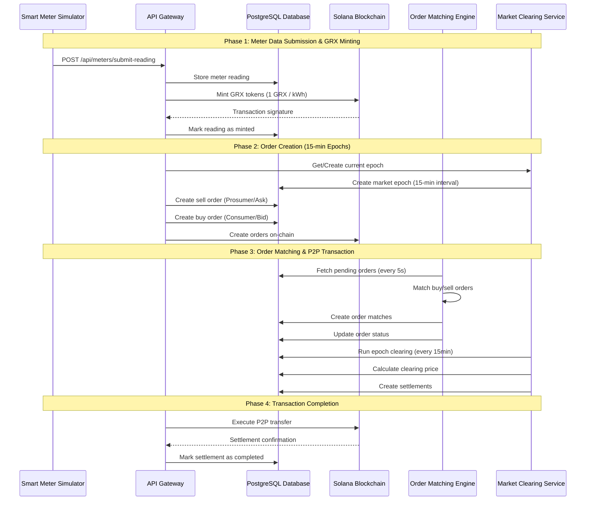

# GridTokenX P2P Energy Trading Flow Documentation

## Overview

This document provides a comprehensive overview of the GridTokenX P2P energy trading flow, detailing how prosumers and consumers interact with the platform to trade energy in a decentralized manner.

## Trading Flow Architecture

The GridTokenX platform implements a 4-phase P2P energy trading system with automated order matching and settlement.



## Phase 1: Prosumer/Consumer Meter Data Submission

### 1.1 Smart Meter Data Collection

**Component**: `gridtokenx-smartmeter-simulator`

The smart meter simulator generates realistic energy production/consumption data:

- **Prosumers** (energy producers): Generate positive kWh readings from solar panels, wind turbines, etc.
- **Consumers** (energy buyers): Generate negative kWh readings representing consumption

**Implementation**:

- File: `gridtokenx-smartmeter-simulator/src/smart_meter_simulator/transport/http.py`
- Endpoint: `POST /api/meters/submit-reading`
- Payload:
  ```json
  {
    "kwh_amount": 10.5,
    "reading_timestamp": "2025-12-01T01:00:00Z",
    "meter_signature": "optional_signature",
    "meter_id": "uuid-of-verified-meter",
    "wallet_address": "solana_wallet_address"
  }
  ```

### 1.2 GRX Token Minting (1 GRX per kWh)

**Component**: `gridtokenx-apigateway`

When a prosumer submits a meter reading, the system automatically mints GRX tokens:

**Implementation**:

- File: `gridtokenx-apigateway/src/handlers/meters.rs` (Lines 201-328)
- Process:
  1. Validate meter reading and user role (prosumer/ami)
  2. Verify meter ownership (if meter_id provided)
  3. Store reading in database
  4. Mint GRX tokens on Solana blockchain (1 GRX = 1 kWh)
  5. Mark reading as minted with transaction signature

**Blockchain Integration**:

- File: `gridtokenx-apigateway/src/services/blockchain_service.rs`
- Function: `mint_energy_tokens()`
- Token: SPL Token on Solana
- Ratio: 1 GRX token per 1 kWh of energy

## Phase 2: Trading and Order Creation (15-minute Intervals)

### 2.1 Market Epochs

**Component**: `MarketClearingService`

The platform operates on 15-minute trading epochs:

**Implementation**:

- File: `gridtokenx-apigateway/src/services/market_clearing_service.rs` (Lines 95-179)
- Epoch Structure:
  - **Start Time**: Rounded to 15-minute intervals (e.g., 01:00, 01:15, 01:30)
  - **Duration**: 15 minutes
  - **Epoch Number**: `YYYYMMDDHHMM` format
  - **Status**: Pending → Active → Cleared → Settled

### 2.2 Order Creation

**Prosumer (Ask/Sell Order)**:

- Prosumers create sell orders to offer their excess energy
- Orders include: energy amount (kWh), price per kWh, epoch_id
- Optional: ERC (Energy Renewable Certificate) validation

**Consumer (Bid/Buy Order)**:

- Consumers create buy orders to purchase energy
- Orders include: energy amount (kWh), max price per kWh, epoch_id

**Implementation**:

- **API Gateway**: `gridtokenx-apigateway/src/handlers/energy_trading.rs`
- **Blockchain**: `gridtokenx-anchor/programs/trading/src/lib.rs`
  - `create_sell_order()`: Lines 57-153
  - `create_buy_order()`: Lines 156-211

**Database Schema**:

```sql
trading_orders (
  id UUID,
  user_id UUID,
  epoch_id UUID,
  side ENUM('buy', 'sell'),
  energy_amount DECIMAL,
  price_per_kwh DECIMAL,
  filled_amount DECIMAL,
  status ENUM('pending', 'active', 'partially_filled', 'filled', 'settled')
)
```

## Phase 3: Order Matching & P2P Transaction Initialization

### 3.1 Automated Order Matching Engine

**Component**: `OrderMatchingEngine`

Runs continuously in the background, matching orders every 5 seconds:

**Implementation**:

- File: `gridtokenx-apigateway/src/services/order_matching_engine.rs`
- Interval: 5 seconds
- Algorithm: Price-time priority matching
  1. Fetch all pending buy orders (sorted by price DESC, time ASC)
  2. Fetch all pending sell orders (sorted by price ASC, time ASC)
  3. Match orders where `buy_price >= sell_price`
  4. Create order matches for compatible orders
  5. Update order filled amounts and status

**Matching Logic**:

```rust
// Match if buy price >= sell price
if buy_order.price_per_kwh >= sell_order.price_per_kwh {
    // Calculate match amount (minimum of remaining amounts)
    let match_amount = min(buy_remaining, sell_remaining);

    // Use sell price (market maker advantage)
    let match_price = sell_order.price_per_kwh;

    // Create order match
    create_order_match(buy_order_id, sell_order_id, match_amount, match_price);
}
```

### 3.2 Market Clearing (15-minute Intervals)

**Component**: `MarketClearingService`

Runs at the end of each 15-minute epoch to finalize matches:

**Implementation**:

- File: `gridtokenx-apigateway/src/services/market_clearing_service.rs` (Lines 254-417)
- Process:
  1. Get order book for current epoch
  2. Run price-time priority matching algorithm
  3. Calculate clearing price (volume-weighted average)
  4. Create settlements for all matches
  5. Update epoch statistics

**Clearing Price Calculation**:

```rust
// Volume-weighted average price
let total_match_value = sum(match_amount * match_price);
let clearing_price = total_match_value / total_volume;
```

### 3.3 Settlement Creation

**Implementation**:

- File: `gridtokenx-apigateway/src/services/market_clearing_service.rs` (Lines 521-589)
- Settlement includes:
  - Buyer and seller IDs
  - Energy amount (kWh)
  - Price per kWh
  - Total amount
  - Fee amount (1% platform fee)
  - Net amount (total - fee)

## Phase 4: Transaction Completion (Optional Business Logic)

### 4.1 On-Chain Settlement

**Component**: Solana Blockchain (Trading Program)

**Implementation**:

- File: `gridtokenx-anchor/programs/trading/src/lib.rs` (Lines 214-316)
- Function: `match_orders()`
- Process:
  1. Validate buy and sell orders
  2. Calculate match amount and clearing price
  3. Create trade record on-chain
  4. Update order statuses (Active → PartiallyFilled → Completed)
  5. Update market statistics

### 4.2 Token Transfer

The actual GRX token transfer occurs on the Solana blockchain:

1. **Buyer** pays GRX tokens to **Seller**
2. **Platform** collects fee (0.25% default, configurable)
3. **Trade Record** is created on-chain for transparency

### 4.3 Business Logic Extensions

The platform supports optional business logic implementations:

**Possible Extensions**:

- **Dynamic Pricing**: Adjust prices based on grid load, time of day, weather
- **Priority Matching**: Give priority to renewable energy sources
- **Grid Balancing**: Incentivize consumption during high production periods
- **Demand Response**: Automated load shifting based on price signals
- **Carbon Credits**: Track and trade carbon offset certificates

## System Components Overview

### Backend Services

| Component                   | Purpose                     | Interval   |
| --------------------------- | --------------------------- | ---------- |
| **Smart Meter Simulator**   | Generate energy readings    | Continuous |
| **API Gateway**             | REST API for all operations | On-demand  |
| **Order Matching Engine**   | Match buy/sell orders       | 5 seconds  |
| **Market Clearing Service** | Finalize epoch settlements  | 15 minutes |
| **Blockchain Service**      | Interact with Solana        | On-demand  |

### Blockchain Programs (Solana/Anchor)

| Program          | Address                                        | Purpose                       |
| ---------------- | ---------------------------------------------- | ----------------------------- |
| **Energy Token** | `94G1r674LmRDmLN2UPjDFD8Eh7zT8JaSaxv9v68GyEur` | GRX token minting             |
| **Trading**      | `GZnqNTJsre6qB4pWCQRE9FiJU2GUeBtBDPp6s7zosctk` | Order matching & settlement   |
| **Registry**     | `2XPQmFYMdXjP7ffoBB3mXeCdboSFg5Yeb6QmTSGbW8a7` | User & meter registration     |
| **Governance**   | `4DY97YYBt4bxvG7xaSmWy3MhYhmA6HoMajBHVqhySvXe` | ERC certificates & governance |
| **Oracle**       | `DvdtU4quEbuxUY2FckmvcXwTpC9qp4HLJKb1PMLaqAoE` | Price feeds & data            |

### Database Schema

**Key Tables**:

- `meter_readings`: Store energy production/consumption data
- `market_epochs`: 15-minute trading intervals
- `trading_orders`: Buy/sell orders from users
- `order_matches`: Matched order pairs
- `settlements`: Final transaction settlements
- `users`: User accounts with wallet addresses
- `meter_registry`: Verified smart meters

## Data Flow Example

### Example: Prosumer Sells 10 kWh to Consumer

1. **Meter Reading** (Phase 1):

   ```
   Prosumer submits: 10 kWh @ 01:00:00
   → API mints 10 GRX tokens
   → Prosumer receives 10 GRX in wallet
   ```

2. **Order Creation** (Phase 2):

   ```
   Epoch: 2025-12-01 01:00-01:15
   Prosumer creates sell order: 10 kWh @ $0.15/kWh
   Consumer creates buy order: 10 kWh @ $0.20/kWh (max)
   ```

3. **Order Matching** (Phase 3):

   ```
   Matching Engine (01:00:05):
   → Match found: buy_price ($0.20) >= sell_price ($0.15)
   → Match amount: 10 kWh
   → Match price: $0.15 (seller's price)
   → Total value: $1.50
   → Create order match record
   ```

4. **Market Clearing** (Phase 3):

   ```
   Epoch End (01:15:00):
   → Calculate clearing price: $0.15
   → Create settlement:
     - Energy: 10 kWh
     - Price: $0.15/kWh
     - Total: $1.50
     - Fee: $0.015 (1%)
     - Net to seller: $1.485
   ```

5. **Settlement** (Phase 4):
   ```
   Blockchain Transaction:
   → Consumer pays 1.5 GRX to Prosumer
   → Platform collects 0.015 GRX fee
   → Trade record created on-chain
   → Settlement marked as completed
   ```

## Key Features

### 1. Automated Matching

- **5-second interval**: Continuous order matching
- **Price-time priority**: Best price first, then earliest order
- **Partial fills**: Orders can be partially filled across multiple matches

### 2. Market Epochs

- **15-minute intervals**: Structured trading periods
- **Clearing price**: Volume-weighted average price per epoch
- **Statistics**: Track volume, trades, and price history

### 3. Blockchain Integration

- **Transparent**: All trades recorded on Solana blockchain
- **Decentralized**: No central authority controls trades
- **Immutable**: Trade records cannot be altered

### 4. Real-time Updates

- **WebSocket**: Live updates for order matches and settlements
- **Event Broadcasting**: Notify users of trading activity
- **Market Data**: Real-time price and volume information

## Configuration

### Market Parameters

```rust
// Trading Program (Solana)
market_fee_bps: 25,  // 0.25% platform fee
clearing_enabled: true,
batch_config: {
    enabled: false,
    max_batch_size: 100,
    batch_timeout_seconds: 300
}

// Order Matching Engine (API Gateway)
match_interval_secs: 5,  // Check every 5 seconds

// Market Clearing Service
epoch_duration: 15 minutes,
fee_rate: 0.01  // 1% settlement fee
```

## Future Enhancements

### Potential Improvements:

1. **Dynamic Epoch Duration**: Adjust based on market activity
2. **Advanced Matching Algorithms**: Implement more sophisticated price discovery
3. **Grid Load Balancing**: Integrate with grid operators for demand response
4. **Renewable Energy Premiums**: Higher prices for certified renewable energy
5. **Automated Market Making**: Liquidity provision for thin markets
6. **Cross-Border Trading**: Enable energy trading across different grids
7. **Energy Storage Integration**: Include battery storage in trading logic
