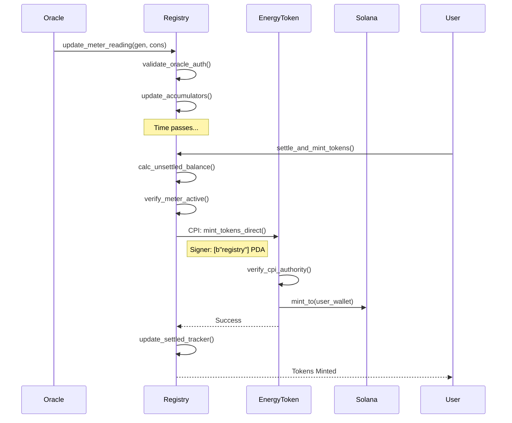
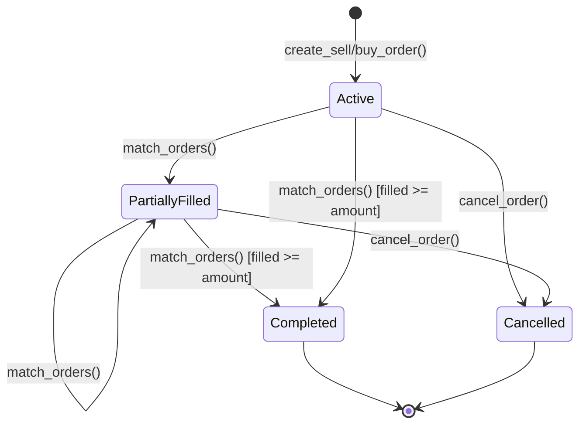

# TPC Benchmark Methodology for GridTokenX

## Research Context

This document describes the TPC benchmarking methodology adapted for the GridTokenX blockchain platform, following the "blockchainification" approach established at TPC Technology Conferences (TPCTC).

## TPC-C to Energy Trading Mapping

### Transaction Profile Mapping

| TPC-C Transaction | Frequency | GridTokenX Equivalent | Chaincode Function |
|-------------------|-----------|----------------------|-------------------|
| New Order | 45% | Create Energy Order | `create_sell_order` / `create_buy_order` |
| Payment | 43% | Token Transfer | `transfer` (SPL Token) |
| Order Status | 4% | Check Order | `get_order` (RPC Read) |
| Delivery | 4% | Match Orders | `match_orders` |
| Stock Level | 4% | Energy Balance | `get_token_account_balance` |

### Rationale

The mapping preserves TPC-C's essential characteristics:

1. **High Contention (New Order)**: Energy order creation updates district counters, mimicking warehouse/district contention in TPC-C
2. **Asset Transfer (Payment)**: Token transfers are the blockchain equivalent of balance updates
3. **Read-Only Operations**: Order Status and Balance checks test read performance without consensus overhead
4. **Batch Processing (Delivery)**: Trade execution processes multiple orders atomically

## Schema Transformation

### Relational → Key-Value

Following the methodology from "Porting TPC-C to Hyperledger Fabric":

| TPC-C Table | Composite Key Format | Value Payload |
|-------------|---------------------|---------------|
| WAREHOUSE | `W:{W_ID}` | Name, Tax, YTD Balance |
| DISTRICT | `W:{W_ID}_D:{D_ID}` | Name, Tax, Next_Order_ID |
| CUSTOMER | `W:{W_ID}_D:{D_ID}_C:{C_ID}` | Name, Balance, Credit |
| ORDER | `W:{W_ID}_D:{D_ID}_O:{O_ID}` | Date, CarrierID, LineCount |
| ITEM | `I:{I_ID}` | Name, Price, Data |

### GridTokenX Adaptation

| Energy Trading Entity | Key Format (PDA Seeds) | Payload |
|----------------------|------------|---------|
| Producer | `[b"user", public_key]` | User Profile, Role |
| Market | `[b"market"]` | State, Stats, Config |
| Order | `[b"order", auth_key, id_bytes]` | Type, Amount, Price, Status |
| Trade | `[b"trade", buy_key, sell_key]` | Buyer, Seller, Amount, Timestamp |

## Mathematical Models

### Pricing Mechanism (VWAP)

The `trading` program implements a Volume-Weighted Average Price (VWAP) discovery mechanism to ensure fair market value. The clearing price $P_{clearing}$ is calculated as:

$$
P_{base} = \frac{P_{bid} + P_{ask}}{2}
$$

$$
P_{clearing} = P_{base} + \left( P_{base} \times \min\left(\frac{V_{trade}}{V_{total}}, 1.0\right) \times \delta_{max} \right)
$$

Where:
- $V_{trade}$: Volume of the current trade match
- $V_{total}$: Total volume traded in the market history (historical context)
- $\delta_{max}$: Maximum price adjustment factor (set to 0.1 or 10% in code)

**Source**: `programs/trading/src/lib.rs:calculate_volume_weighted_price`

### Token Supply Invariant

The `registry` program enforces a strict conservation of energy implementation for the `GRID` token supply. Tokens can only be minted when net generation is settled:

$$
\Delta Supply_{GRID} = \max(0, (E_{produced} - E_{consumed}) - E_{settled})
$$

Where $E_{settled}$ tracks the cumulative amount already tokenized to prevent double-spending of energy credits.

**Source**: `programs/registry/src/lib.rs:settle_meter_balance`

## Architectural Diagrams

### Settlement & Minting Flow

The following sequence diagram illustrates the trustless interaction between the Oracle, Registry, and Energy Token programs during the settlement process.



### Order Lifecycle State Machine

The local order book in the `trading` program manages orders through the following state transitions:



## Program Logic & Safety

### Oracle Data Validation

The `oracle` program enforces strict data quality rules before accepting meter readings. To prevent erratic sensor data or manipulation, the anomaly detection logic enforces:

$$
\frac{E_{produced}}{E_{consumed}} \times 100 \le 1000.0
$$

This ensures production never exceeds 1000% of consumption (10x ratio) in a single reporting interval, filtering out hardware glitches or potential attack vectors.

**Source**: `programs/oracle/src/lib.rs:validate_meter_reading`

### Trustless CPI Minting

The system uses Program Derived Addresses (PDAs) to eliminate central authority risks. The `energy-token` program only allows minting via Cross-Program Invocation (CPI) from the canonical `registry` program.

**Security Check**:
```rust
// programs/energy-token/src/lib.rs
require!(
    ctx.accounts.authority.key() == token_info.authority,
    ErrorCode::UnauthorizedAuthority
);
```

This ensures only the mathematically proven `registry` logic can trigger token creation.

## Concurrency Control Analysis

### Sealevel Parallel Runtime

**Traditional RDBMS (TPC-C Standard)**:
- Row-level locking
- Serializable isolation
- Blocking waits for locks

**Solana Blockchain**:
- **Sealevel Runtime**: Parallel smart contract execution
- **Deterministic Concurrency**: Transactions specify all account dependencies upfront
- **Write-Lock Contention**: Sequential execution only for transactions writing to the same account

### Conflict Handling

```
Transaction Flow:
1. Client constructs transaction with required accounts
2. Leader schedules non-overlapping transactions in parallel
3. Overlapping write-accounts caused linearized (sequential) scheduling
4. Execution results committed to entry
```

**Measured Contention Effects**:
- Non-overlapping: Near-0% delay (Parallel)
- High contention (Same Market): Linear execution (Sequential throughput limited by single-thread performance)

## Blockchainification Overhead

The "Trust Premium" quantifies the performance cost of decentralization:

### Overhead Components

| Component | Contribution | Description |
|-----------|-------------|-------------|
| Cryptographic Signing | ~15% | Ed25519 signature per transaction |
| Consensus Latency | ~40% | Leader rotation, vote propagation |
| State Hashing | ~20% | Merkle tree updates |
| Redundant Execution | ~25% | Validator verification |

### Trust Premium Formula

```
Trust Premium = Blockchain Latency / Centralized Baseline Latency

Example:
- GridTokenX avg latency (confirmed): ~400ms - 800ms
- PostgreSQL baseline: 2ms
- Trust Premium: ~200x - 400x
```

## Statistical Methodology

### TPC Compliance

Following TPC-C Specification v5.11, Section 5:

1. **Warmup Period**: Discard first 10% of measurements
2. **Steady State**: Measure during stable operation
3. **Outlier Handling**: Exclude samples >3σ from mean
4. **Confidence Intervals**: Report 95% CI for all metrics

### Sample Size Requirements

| Metric | Minimum Samples | Recommended |
|--------|-----------------|-------------|
| tpmC | 5 minutes of data | 30+ minutes |
| Latency percentiles | 1,000 transactions | 10,000+ |
| Conflict rate | 500 transactions | 5,000+ |

## Running TPC Benchmarks

```bash
# TPC-C style workload
pnpm benchmark:tpc-c

# Smallbank baseline
pnpm benchmark:smallbank

# Full research analysis
pnpm performance:research
```

## References

1. **TPC Specifications**: Transaction Processing Performance Council (TPC). (2010). *TPC Benchmark C Standard Specification, Revision 5.11*.
2. **Blockchain Energy**: Mengelkamp, E., Gärttner, J., Rock, K., Kessler, S., Orsini, L., & Weinhardt, C. (2018). *Designing microgrid energy markets: A case study: The Brooklyn Microgrid*. Applied Energy, 210, 870-880.
3. **Benchmarking Frameworks**: Dinh, T. T. A., Wang, J., Chen, G., Liu, R., Ooi, B. C., & Tan, K. L. (2017). *Blockbench: A framework for analyzing private blockchains*. Proceedings of the 2017 ACM International Conference on Management of Data, 1085-1100.
4. **Solana Architecture**: Yakovenko, A. (2018). *Solana: A new architecture for a high performance blockchain v0.8.13*. Whitepaper.
5. **TPC on Blockchain**: Nasir, Q., Qasse, I. A., Abu Talib, M., & Nassif, A. B. (2018). *Performance Analysis of Hyperledger Fabric Platforms*. Security and Communication Networks.
