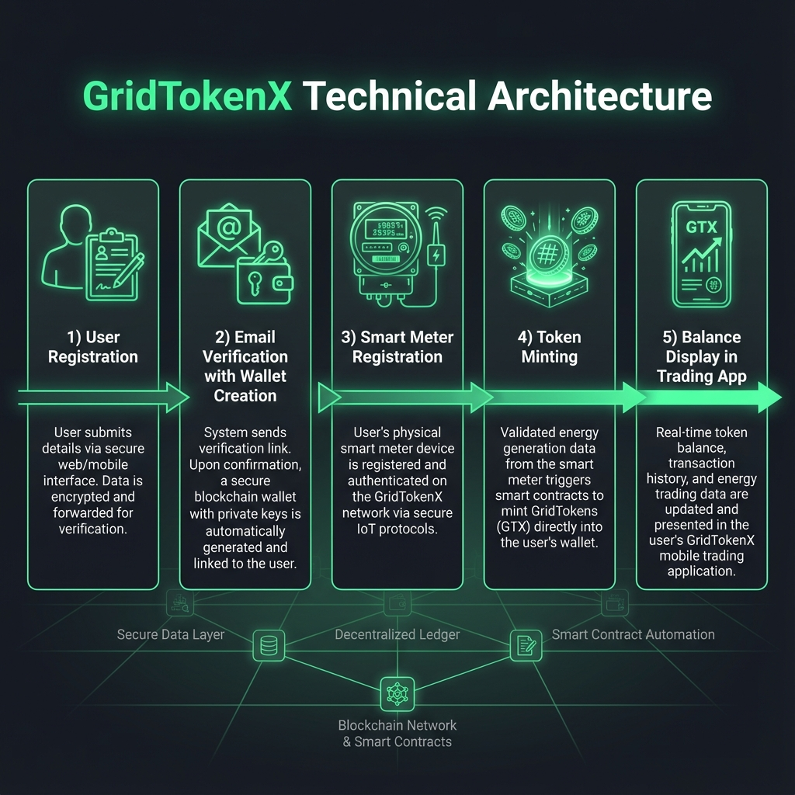
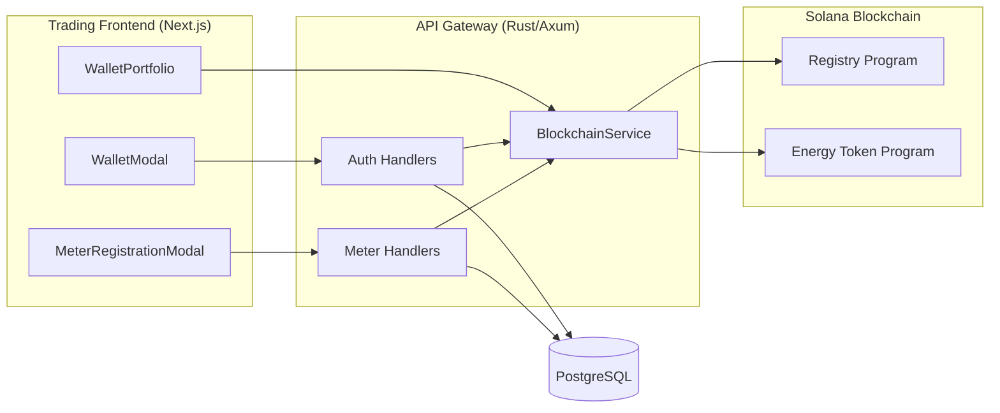
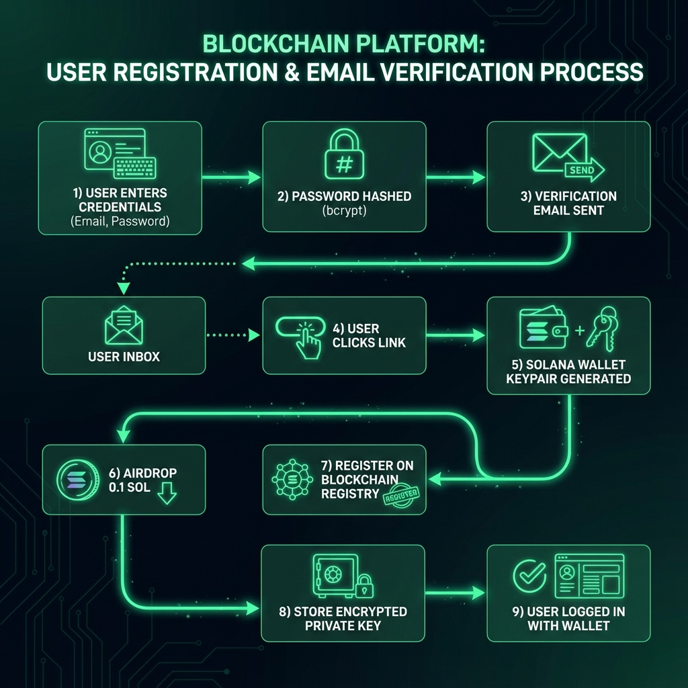
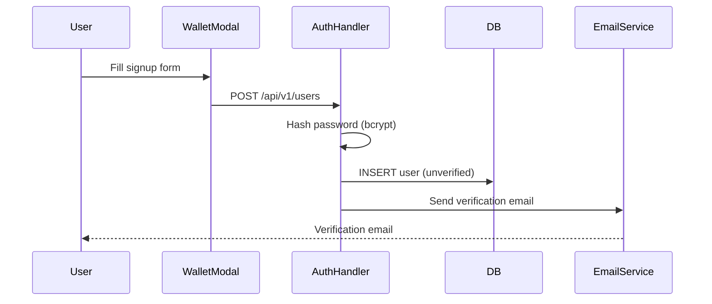
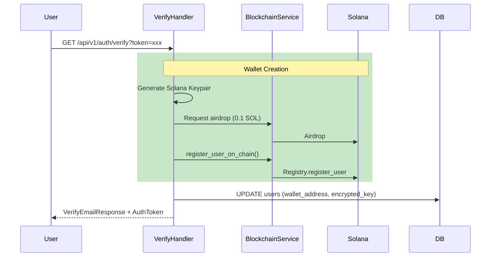
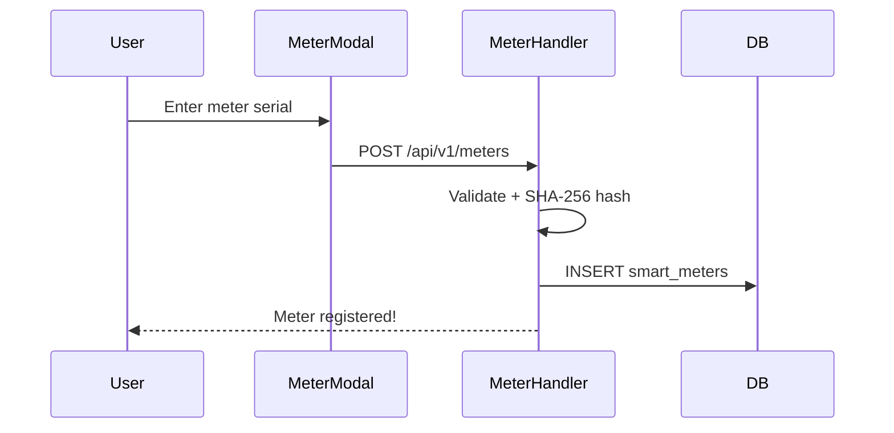
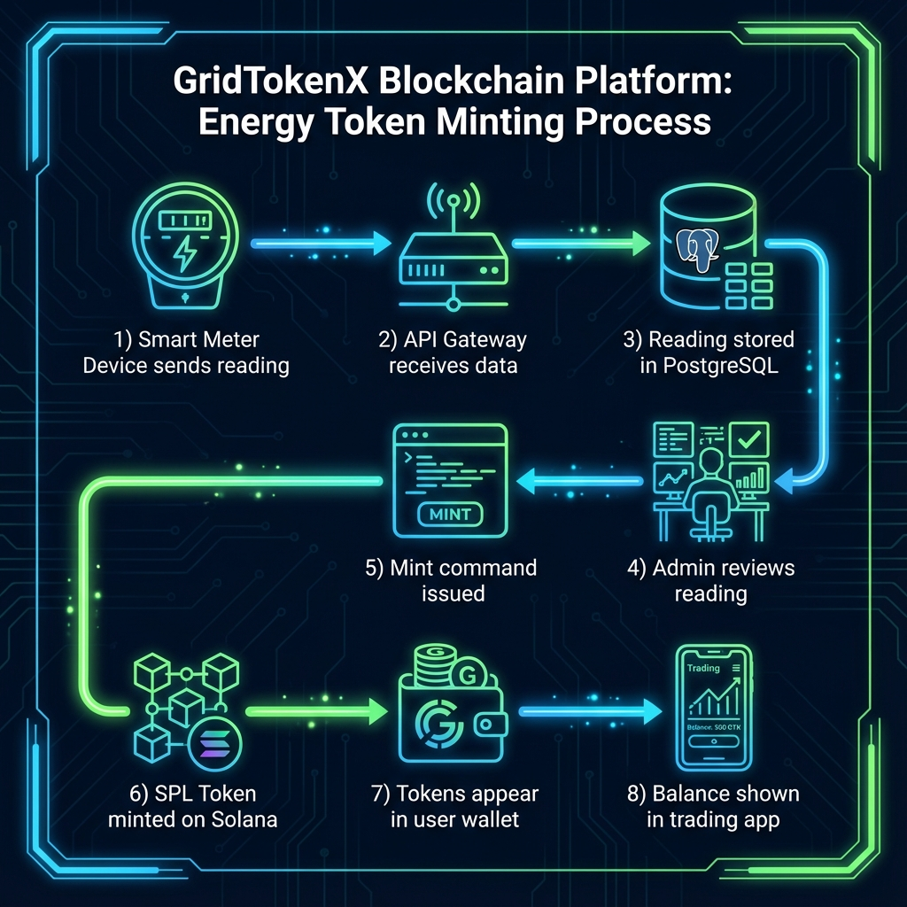
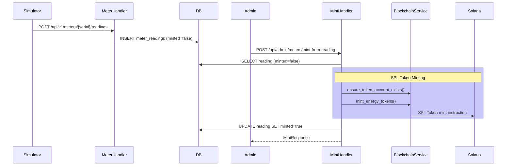
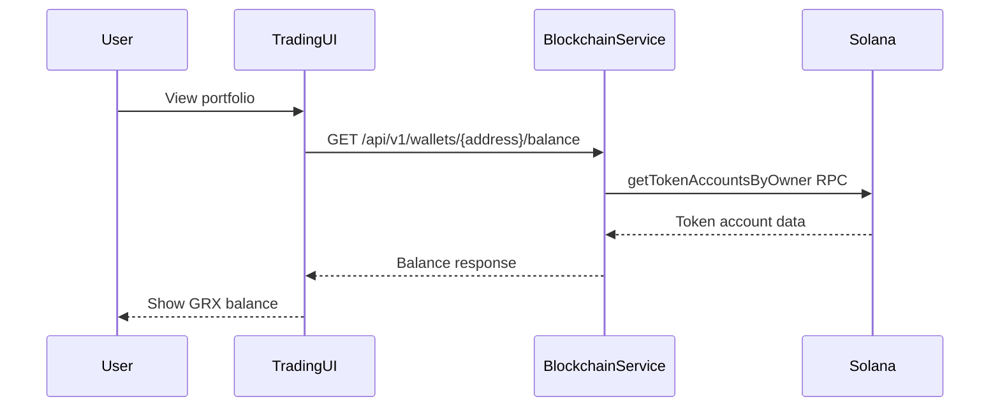
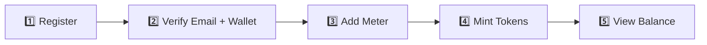

# GridTokenX Platform - Complete Dataflow Documentation

This document describes the full data flow from user registration through email verification, meter registration, token minting, and balance display in the trading frontend.

---

## Visual Overview



---

## Architecture Diagram



### Technology Stack

| Layer | Technology | Purpose |
|-------|------------|---------|
| Frontend | Next.js 14 + TypeScript | Trading UI, wallet management |
| API Gateway | Rust + Axum | REST API, business logic |
| Database | PostgreSQL | User data, meter readings |
| Blockchain | Solana (Devnet) | Token minting, user registry |
| Smart Contracts | Anchor Framework | Registry, Energy Token programs |

---

## Phase 1: Registration & Email Verification



### 1.1 Registration Flow



#### Key Components

| Component | File | Function |
|-----------|------|----------|
| Frontend Modal | [WalletModal.tsx](file:///Users/chanthawat/Developments/gridtokenx-platform-infa/gridtokenx-trading/components/WalletModal.tsx#L270-L425) | `handleEmailSignUp()` |
| API Client | [api-client.ts](file:///Users/chanthawat/Developments/gridtokenx-platform-infa/gridtokenx-trading/lib/api-client.ts#L141-L148) | `register()` |
| Backend Handler | [registration.rs](file:///Users/chanthawat/Developments/gridtokenx-platform-infa/gridtokenx-apigateway/src/handlers/auth/registration.rs#L24-L151) | `register()` |

#### Request: `POST /api/v1/users`
```json
{
  "username": "string",
  "email": "string", 
  "password": "string",
  "first_name": "string",
  "last_name": "string"
}
```

#### Database Changes
- `email_verified = false`, `email_verification_token = <uuid>`, `wallet_address = NULL`

---

### 1.2 Email Verification (Critical!)

> [!IMPORTANT]
> This is where **on-chain wallet creation** happens automatically.



#### Key Components

| Component | File | Function |
|-----------|------|----------|
| Backend Handler | [login.rs](file:///Users/chanthawat/Developments/gridtokenx-platform-infa/gridtokenx-apigateway/src/handlers/auth/login.rs#L187-L440) | `verify_email()` |
| Wallet Encryption | [WalletService](file:///Users/chanthawat/Developments/gridtokenx-platform-infa/gridtokenx-apigateway/src/services/wallet) | `encrypt_private_key()` |
| Blockchain Reg | [BlockchainService](file:///Users/chanthawat/Developments/gridtokenx-platform-infa/gridtokenx-apigateway/src/services/blockchain/service.rs) | `register_user_on_chain()` |

#### Response
```json
{
  "success": true,
  "message": "Email verified successfully!",
  "wallet_address": "7xKXtg2CW87d97TXJSDpbD5jBkheTqA83TZRuJosgAue",
  "auth": { "access_token": "eyJ...", "expires_in": 86400 }
}
```

#### Database Changes
- `email_verified = true`
- `wallet_address = <solana_pubkey>`
- `encrypted_private_key = <AES-256-GCM encrypted>`
- `blockchain_registered = true`

---

## Phase 2: Meter Registration

### 2.1 Add Meter to Account



#### Key Components

| Component | File | Function |
|-----------|------|----------|
| Frontend Modal | [MeterRegistrationModal.tsx](file:///Users/chanthawat/Developments/gridtokenx-platform-infa/gridtokenx-trading/components/MeterRegistrationModal.tsx#L31-L79) | `handleSubmit()` |
| Backend Handler | [registration.rs](file:///Users/chanthawat/Developments/gridtokenx-platform-infa/gridtokenx-apigateway/src/handlers/meter/registration.rs#L19-L185) | `register_meter()` |

#### Request: `POST /api/v1/meters` (Bearer token required)
```json
{
  "serial_number": "bb6052e6-1234-5678-abcd-ef1234567890",
  "meter_type": "Solar_Prosumer",
  "location": "Home Roof A"
}
```

### 2.2 Admin Verification
- **Endpoint**: `POST /api/admin/meters/{meter_id}/verify`
- Updates `smart_meters.is_verified = true`

---

## Phase 3: Minting Process





#### Key Components

| Component | File | Function |
|-----------|------|----------|
| Minting Handler | [minting.rs](file:///Users/chanthawat/Developments/gridtokenx-platform-infa/gridtokenx-apigateway/src/handlers/meter/minting.rs#L17-L141) | `mint_from_reading()` |
| Token Service | [BlockchainService](file:///Users/chanthawat/Developments/gridtokenx-platform-infa/gridtokenx-apigateway/src/services/blockchain/service.rs) | `mint_energy_tokens()` |

#### Request: `POST /api/admin/meters/mint-from-reading` (Admin only)
```json
{ "reading_id": "uuid-of-meter-reading" }
```

#### Response
```json
{
  "message": "Tokens minted successfully",
  "transaction_signature": "5xKXt...abc",
  "kwh_amount": "150.00",
  "wallet_address": "7xKXtg..."
}
```

---

## Phase 4: Balance Display



#### Key Components

| Component | File | Function |
|-----------|------|----------|
| API Client | [api-client.ts](file:///Users/chanthawat/Developments/gridtokenx-platform-infa/gridtokenx-trading/lib/api-client.ts#L340-L349) | `getBalance()` |
| Balance Service | [BlockchainService](file:///Users/chanthawat/Developments/gridtokenx-platform-infa/gridtokenx-apigateway/src/services/blockchain/service.rs) | `get_token_balance()` |

#### Response: `GET /api/v1/wallets/{address}/balance`
```json
{ "sol_balance": 0.1, "token_balance": 150.0, "token_symbol": "GRX" }
```

---

## Complete Flow Summary



---

## API Endpoints Summary

| Phase | Endpoint | Method | Auth |
|-------|----------|--------|------|
| Register | `/api/v1/users` | POST | None |
| Verify | `/api/v1/auth/verify` | GET | None |
| Login | `/api/v1/auth/token` | POST | None |
| Register Meter | `/api/v1/meters` | POST | Bearer |
| Submit Reading | `/api/v1/meters/{serial}/readings` | POST | Bearer |
| Mint Tokens | `/api/admin/meters/mint-from-reading` | POST | Admin |
| Get Balance | `/api/v1/wallets/{address}/balance` | GET | Bearer |

---

## Security Notes

> [!IMPORTANT]
> **Custodial Wallet**: Platform stores encrypted private keys (AES-256-GCM). Users trust platform to secure keys.

> [!WARNING]
> **Admin-Only Minting**: Token minting restricted to admin users only.
