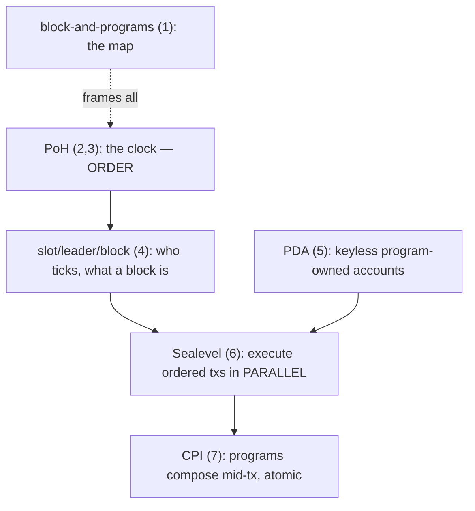

# Solana Internals — Learning Path

Bottom-up explainers for how Solana works, tied to the **GridTokenX** programs in this repo.
Read top to bottom; each builds on the last. Every doc ends with a one-paragraph recall + a
repo tie-in (what in `programs/` exists *because* of that mechanism).

## Order

1. **[solana-block-and-programs.md](solana-block-and-programs.md)** — big picture. Block ≠
   Bitcoin header. 5 layers: slot metadata → tx → account discriminator → 7 programs + CPI
   graph → hot-path PDAs. Start here for the map.

2. **[proof-of-history.md](proof-of-history.md)** — PoH = the clock. Why a hash chain proves
   time, how tx hashes get pinned, why this removes order-voting → speed. Conceptual.

3. **[poh-math.md](poh-math.md)** — PoH, precisely. `h_i=sha256(h_{i-1})`, mixing,
   `hashes_per_tick`/`ticks_per_slot`, worked numbers, serial-produce/parallel-verify asymmetry.

4. **[slot-leader-block.md](slot-leader-block.md)** — who runs the clock. Slots, leader
   schedule (stake-weighted, pre-computed), entries, replay+vote, the real "header" fields.

5. **[pda-derivation.md](pda-derivation.md)** — program-owned addresses. Off-curve derivation,
   canonical bump, `invoke_signed`, why keyless. Repo vaults + per-entity PDAs.

6. **[sealevel-scheduling.md](sealevel-scheduling.md)** — parallel execution. Accounts declared
   upfront → read/write lock model → non-overlapping txs run parallel. Why shard writes.

7. **[cpi-flow.md](cpi-flow.md)** — program calls program. `invoke`/`invoke_signed`, privilege
   propagation (no escalation), depth-4/atomic, repo CPI graph.

### Tier A — repo internals (why the code looks like it does)

8. **[zero-copy-accounts.md](zero-copy-accounts.md)** — `#[account(zero_copy)]` Pod, `_paddingN`,
   `AccountLoader`. SKILL #1.
9. **[off-chain-settlement.md](off-chain-settlement.md)** — the novel mechanism: Ed25519-signed
   matches, OrderNullifier, 1-match/tx batch, treasury CPI.
10. **[compute-units-budget.md](compute-units-budget.md)** — 200k/1.4M CU, `compute_fn!`, the
    constraint behind every design choice. SKILL #4.
11. **[sharding-aggregation.md](sharding-aggregation.md)** — 16 shards, `addr[0]%16`,
    `aggregate_*`, stale-on-purpose totals. SKILL #3.
12. **[bpf-stack-limits.md](bpf-stack-limits.md)** — 4KB stack, fat-context overflow,
    `remaining_accounts` escape.

### Tier B — Solana platform (fills the gaps)

13. **[tower-bft-consensus.md](tower-bft-consensus.md)** — votes, lockouts, rooting; how forks
    finalize on the PoH-ordered stream.
14. **[account-model-rent.md](account-model-rent.md)** — ownership, rent-exemption, `space` as a
    cost, realloc, close.
15. **[discriminator-type-safety.md](discriminator-type-safety.md)** — the 8-byte tag,
    type-confusion defense, ix selectors. Disc proves type, not identity.
16. **[transaction-anatomy.md](transaction-anatomy.md)** — message/signatures/ALT/v0,
    `recent_blockhash` TTL, 1232-byte cap.
17. **[turbine-gossip.md](turbine-gossip.md)** — shreds tree + gossip; how blocks/state propagate.

### Tier C — domain & token mechanics

18. **[spl-token-2022.md](spl-token-2022.md)** — energy mint is Token-2022; ATA, mint-authority
    PDA, REC-gating.
19. **[treasury-peg-mechanics.md](treasury-peg-mechanics.md)** — THBG swap/redeem math,
    attestation, MasterChef staking, 3 vaults.
20. **[oracle-epochs.md](oracle-epochs.md)** — AMI bridge, per-meter PDA, 15-min clearing,
    AggregatorEntry validation (no CPI).
21. **[registry-staking-slash.md](registry-staking-slash.md)** — validator bond vs yield staking,
    slash guards, slash→treasury redistribution.

## How they connect

**Mental model:** PoH decides **when** (order), slot/leader decide **who produces**, Sealevel
decides **how parallel** (per-account locks), PDAs give **keyless state + vaults**, CPI lets
programs **compose atomically**. The repo's design — per-entity PDAs, 16-way shards, read-only
hot-path config, acyclic CPI graph — falls directly out of these five mechanisms.

## Repo anchors referenced throughout

- `SKILL.md` invariants: #3 (Sealevel sharding), #4 (compute-debug CU), #5 (hoist `Clock::get`).
- CPI graph: `registry→energy-token`, `trading→governance`, `trading→treasury` (optional /
  THBG-mandatory), `oracle→governance` (**types-only, not invoke**).
- Program IDs: `Anchor.toml [programs.localnet]` (source of truth, not SKILL's stale table).
