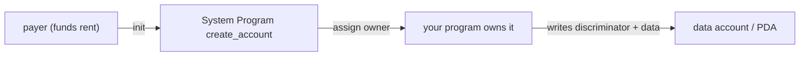

# Account Model & Rent — Storage Costs Money (Up Front)

> Deep-dive. Account ownership, rent-exemption, `space`, realloc, close. Why `space` is a dollar
> decision, not just a number. (Verify init/close patterns in `programs/*/src/`.)

---

## 0. TL;DR

On Solana **everything is an account** — a fixed-size byte buffer with an owner program, a
lamport balance, and flags. To persist, an account must be **rent-exempt**: hold ≥ ~2 years of
rent in lamports, proportional to its **byte size**. So `space = 8 + size_of::<T>()` is a
**cost** — bigger accounts cost more lamports to create. Accounts can `realloc` (grow/shrink) and
`close` (reclaim the rent lamports). The owner program is the **only** thing allowed to mutate an
account's data.

---

## 1. What an account is

Every account (program, data, token, PDA, wallet) has:

```text
Account {
  lamports:   u64,        // balance (also pays rent-exemption)
  data:       [u8; N],    // N fixed at creation (the "space")
  owner:      Pubkey,     // the PROGRAM that may mutate data
  executable: bool,       // true = it's a program (code), false = data
  rent_epoch: u64,        // legacy rent bookkeeping
}
```

Key rule: **only the `owner` program can change `data` (and decrease lamports).** Anyone can send
lamports *to* an account, but only the owner mutates its bytes. A user "wallet" is just an account
owned by the System Program.

---

## 2. Ownership and the System Program

- A brand-new account is created by the **System Program** (`create_account`), which sets size,
  funds rent, and assigns an **owner program**.
- Once owned by your program, your program controls its data. Anchor's `init` wraps this:
  `create_account` + assign owner + write the 8-byte discriminator.
- **PDAs** (`pda-derivation.md`) are accounts owned by your program with no private key — created
  via `init` with `seeds`, funded by a `payer`.



---

## 3. Rent and rent-exemption

Solana charges **rent** for storage. In practice every account is made **rent-exempt**:

- Deposit ≥ ~**2 years** worth of rent in lamports at creation → account never gets collected.
- The required balance is **proportional to byte size**: `rent_exempt_minimum =
  f(account_size)`. More bytes → more lamports locked.
- Anchor computes this automatically for `init` (`Rent::get()` → minimum balance for `space`).

So `space` is a **financial decision**:

```text
space = 8 (discriminator) + size_of::<T>()      ← zero-copy
            ↑ every byte adds to the rent-exempt deposit
```

A bloated struct (unused fields, oversized arrays) **locks more lamports per account** — across
thousands of `MeterState`/`Order` accounts, that adds up. Right-size your structs.

---

## 4. Realloc — growing / shrinking

Accounts can change size after creation via `realloc`:

```rust
#[account(mut, realloc = 8 + new_size, realloc::payer = payer, realloc::zero = true)]
pub acct: Account<'info, Thing>,
```

- **Grow** → payer tops up rent for the added bytes; new bytes zeroed (`realloc::zero`).
- **Shrink** → excess rent lamports can be returned.
- Bounded: realloc per-ix is capped (~10KB increase per instruction).
- Zero-copy structs are **fixed-layout**, so realloc is rare here — you'd only realloc
  variable-tail data, not a Pod struct (changing a Pod struct's size = layout change, see
  `zero-copy-accounts.md`).

---

## 5. Close — reclaiming rent

When an account is no longer needed, **close** it to recover the locked lamports:

```rust
#[account(mut, close = destination)]   // send all lamports to `destination`, wipe data
pub acct: Account<'info, Thing>,
```

- Transfers the account's lamports to `destination`, sets data to zero/length 0, and
  effectively deletes it (owner → System, no rent → collectable).
- **Security:** zero the discriminator on close so the account can't be "revived" and
  re-interpreted (Anchor's `close` handles this). A stale closed account that still deserializes
  is a **revival attack** vector.
- Relevant here for transient accounts — e.g. nullifiers or expired orders could be closed to
  reclaim rent (verify which the repo closes).

---

## 6. Why this matters for the repo

- **`space` discipline.** Thousands of per-entity PDAs (`MeterState`, `Order`, `*Shard`,
  `OrderNullifier`) each lock rent proportional to size. Padding counts (it's part of
  `size_of`). Keep structs tight — rent scales with the account count × size.
- **Init payer.** Every `init` needs a funding `payer`; scripts (`bootstrap.ts`, `init-*.ts`)
  fund these. On a real cluster that's real SOL.
- **Close to reclaim.** Short-lived accounts (nullifiers for settled matches, filled orders)
  are candidates for `close` to recycle rent — confirm lifecycle in the trading program.
- **Owner enforcement = security.** Only the owning program mutates `MeterState`/`Order` — a
  different program can't write them even via CPI without the owner authorizing. Pair with
  discriminator checks (`discriminator-type-safety.md`).

---

## 7. Pitfalls

- **Oversized `space`** → wastes rent lamports across every instance.
- **Undersized `space`** → can't fit the struct; init fails or writes truncate. `8 + size_of`
  for zero-copy is exact.
- **Not closing transient accounts** → rent lamports stranded; account litter.
- **Revival after close** → if discriminator isn't zeroed, a closed account can be reinterpreted
  (use Anchor `close`, never just drain lamports).
- **Assuming rent recurs** → rent-exempt accounts don't pay ongoing rent; it's a one-time
  locked deposit, returned on close.

---

## 8. One-paragraph recall

Everything is an **account**: a fixed-size byte buffer with a lamport balance, an **owner
program** (the only mutator), and an executable flag. Persistence requires **rent-exemption** — a
lamport deposit proportional to byte size — so `space = 8 + size_of::<T>()` is a real cost
multiplied across thousands of per-entity PDAs; right-size structs (padding counts). Accounts can
`realloc` (grow/shrink, payer-funded, capped per ix) and `close` (reclaim rent, must zero the
discriminator to block revival). Owner-only mutation is a core security guarantee — pair it with
discriminator checks, fund inits via a payer, and close transient accounts (nullifiers, filled
orders) to recycle rent.
