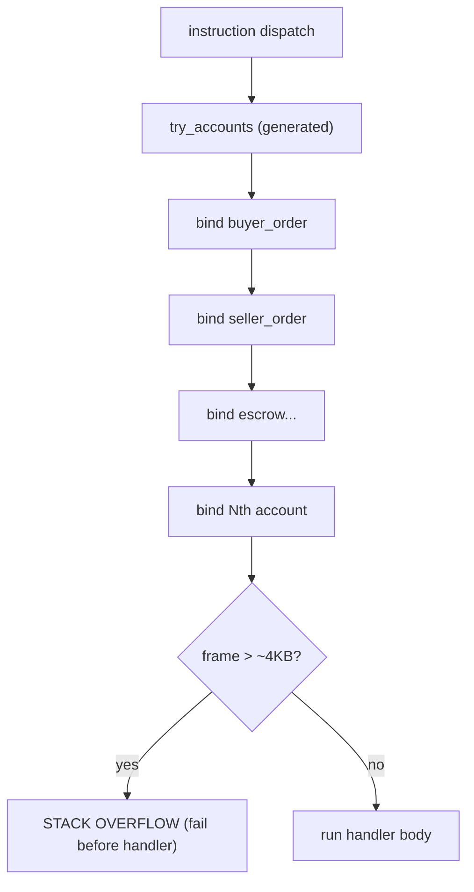

# BPF Stack Limits — The 4KB Ceiling That Bites Fat Contexts

> Deep-dive. SBF/BPF 4KB stack frames, fat-context overflow in `try_accounts`,
> `remaining_accounts` escape hatch. Memory: `settle-context-stack-limit`.
> (Verify against `programs/trading/src/` settle context.)

---

## 0. TL;DR

Solana's SBF VM gives each call frame a **fixed ~4KB stack**. Anchor's `#[derive(Accounts)]`
generates a `try_accounts` that **materializes every named account on the stack** while
validating the context. A context with many named accounts (especially big `AccountInfo` / loaded
structs) can **overflow 4KB → stack-overflow error** at deserialization, before your handler even
runs. Fix: stop adding **named** accounts; pass extra/variable accounts through
`remaining_accounts` (a slice, not stack-materialized fields).

---

## 1. The constraint

The SBF (Solana BPF) virtual machine:

- Stack is **not** one big region — it's **frames of ~4KB** each, with limited frame depth.
- Large stack-allocated values (big structs, arrays, many locals) eat the frame fast.
- Overflow isn't graceful — the program **fails** (stack access violation).

This is *separate* from:
- **Heap** (~32KB default via the bump allocator),
- **CU budget** (`compute-units-budget.md`),
- **account data size** (lives in account buffers, not stack).

A handler can be well under CU and still **blow the stack**.

---

## 2. Where the stack goes: try_accounts

When you write:

```rust
#[derive(Accounts)]
pub struct SettleOffchainMatch<'info> {
    pub buyer_order: AccountLoader<'info, Order>,
    pub seller_order: AccountLoader<'info, Order>,
    pub buyer_escrow: Account<'info, TokenAccount>,
    pub seller_token: Account<'info, TokenAccount>,
    pub nullifier: AccountLoader<'info, OrderNullifier>,
    pub zone_market: AccountLoader<'info, ZoneMarket>,
    // ... many more ...
}
```

Anchor generates `try_accounts` that, for **each named field**, reads + validates + binds the
account — all on the **current stack frame**. Each `AccountInfo`, each loaded type, each
constraint check adds stack usage. Enough named fields → the generated function's frame
exceeds 4KB → overflow **during account validation**, before the handler body.



Memory `settle-context-stack-limit`: `SettleOffchainMatchContext` is **at this ceiling** — adding
one more **named** account overflows `try_accounts`.

---

## 3. The escape hatch: remaining_accounts

`ctx.remaining_accounts` is a **`&[AccountInfo]` slice** — accounts passed positionally, **not**
generated as named struct fields. They don't each get a stack-materialized binding in
`try_accounts`; you index the slice in the handler and validate manually.

```rust
// instead of adding named treasury accounts (would overflow), take them positionally:
let treasury_accounts = ctx.remaining_accounts;   // slice, cheap on stack
if !treasury_accounts.is_empty() {
    let treasury_state = &treasury_accounts[0];
    // ... manual validation + CPI ...
}
```

Trade-off: you lose Anchor's automatic constraint checking for those accounts → **validate by
hand** (owner, key, signer, writability). More code, but it fits the stack and supports
**variable-length** account sets (e.g. optional treasury CPI accounts in settle).

This is exactly how the off-chain settle path passes optional treasury accounts
(`off-chain-settlement.md` §4) without overflowing.

---

## 4. Other stack-savers

- **Zero-copy** (`zero-copy-accounts.md`) — big structs live in the **account buffer**, not on
  the stack; `load()` returns a reference. Borsh `#[account]` of a big struct would copy it onto
  the stack.
- **`Box<Account<...>>`** — moves a large account wrapper to the **heap**, freeing the stack
  frame. Common fix for "stack too big" on individual fat accounts.
- **Fewer locals / avoid large arrays on stack** — heavy `[T; N]` locals belong in accounts or
  heap.
- **Split instructions** — if one ix genuinely needs too many accounts, split the flow into two
  ixs.

---

## 5. Diagnosing

- Build warning: `Error: Function _ZN... Stack offset of N exceeded max offset of 4096 by ...` —
  the compiler tells you which function and by how much.
- Runtime: `Access violation in stack frame` / program fails before handler logic.
- If it appears after **adding an account/field**, that's the cause — revert to
  `remaining_accounts` or `Box` the heaviest field.

---

## 6. Pitfalls

- **Adding "just one more" named account** to a fat context → overflow in `try_accounts`
  (settle context is the canonical example).
- **Forgetting manual validation** on `remaining_accounts` → security hole (no auto constraint
  checks). Check owner/key/signer yourself.
- **Big struct via `#[account]` not zero-copy** → copied to stack; use zero-copy or `Box`.
- **Large stack arrays/locals** → move to account data or heap.
- **Confusing stack with CU/heap** → being under CU doesn't save you; it's a separate ceiling.

---

## 7. One-paragraph recall

SBF gives each call frame ~**4KB** of stack, and Anchor's generated `try_accounts` materializes
**every named account** of a context on that frame during validation — so a fat context (the
`settle_offchain_match` one is at the ceiling) overflows **before** the handler runs. The escape
is `remaining_accounts` (a `&[AccountInfo]` slice, not stack-materialized named fields) with
**manual** validation, which also enables variable-length account sets like the optional treasury
CPI. Complementary savers: zero-copy (structs stay in account buffers), `Box<Account>` (move to
heap), fewer locals. Stack is a ceiling separate from CU and heap — being cheap on compute won't
save you.
