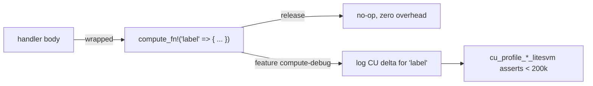

# Compute Units & Budget — The Constraint Behind Every Design Choice

> Deep-dive. 200k default / 1.4M max, `compute_fn!` profiling, why CU drives PDA/CPI/zero-copy/
> stack decisions. SKILL invariant #4. (Verify `compute_fn!` usage in handlers + `shared/compute-debug/`.)

---

## 0. TL;DR

Every Solana transaction has a **Compute Unit (CU) budget** — work meter, not gas-for-money.
Default **200,000 CU**/instruction; raisable to a max **1,400,000 CU** via
`ComputeBudgetProgram`. Exceed it → tx fails. Each syscall, hash, CPI, byte deserialized costs
CU. This repo's whole shape (zero-copy, stored bumps, sharding, one-CPI batch, `remaining_accounts`)
is CU/stack discipline. `compute_fn!` from `shared/compute-debug/` profiles each handler;
litesvm CU-profile tests assert **< 200k CU**.

---

## 1. What a CU is

A **Compute Unit** = a unit of execution work the runtime charges per operation:

- syscalls (log, `Clock::get`, sha256, ed25519 verify, CPI) — each a fixed/parameterized cost,
- BPF instructions executed,
- account data (de)serialization,
- CPI adds the callee's cost to the **same** budget.

Unlike Ethereum gas, CU is **not** paid per-unit in fees here — it's a **limit** to keep
execution bounded + schedulable. Fees are separate (per-signature + optional priority fee).

---

## 2. The budget numbers

| Limit | Value | Note |
|-------|-------|------|
| Default per-ix | **200,000 CU** | what you get with no request |
| Max requestable | **1,400,000 CU** | via `ComputeBudgetProgram::set_compute_unit_limit` |
| Per-tx (multi-ix) | sum bounded by max | the 1.4M is the ceiling |

```ts
// client: raise budget for a heavy ix
tx.add(ComputeBudgetProgram.setComputeUnitLimit({ units: 400_000 }));
```

This repo's CU-profile litesvm tests (`tests/cu_profile_*_litesvm.ts`, `npm run test:cu-profile`)
**assert each instruction stays < 200k** — i.e. fits the *default* budget, no raise needed. That's
a deliberate health bar: if a handler needs a raise, it regressed.

---

## 3. compute_fn! — profiling macro (SKILL #4)

Each handler wraps its body in `compute_fn!`:

```rust
pub fn submit_reading(ctx: Context<SubmitReading>, ...) -> Result<()> {
    compute_fn!("submit_reading" => {
        // ... handler body ...
        Ok(())
    })
}
```

- From `shared/compute-debug/`. **No-op in release** — zero cost in production.
- With the `compute-debug` feature on, it logs CU consumed for the labeled block (via
  `sol_remaining_compute_units` deltas).
- **Preserve it when adding instructions** — new handlers must wrap their body the same way so
  CU profiling stays complete.



---

## 4. What burns CU (and the repo's countermeasures)

| Cost source | Cheaper alternative used here |
|-------------|-------------------------------|
| Borsh (de)serialize big struct | **zero-copy** accounts (map, don't copy) — SKILL #1 |
| `find_program_address` (loops ≤255 hashes) | **store bump**, re-derive with `create_program_address` |
| `Clock::get()` syscall inside `emit!` | **hoist** `let now = Clock::get()?...` before emit — SKILL #5 |
| many CPIs | batch records to treasury with **one** CPI |
| ed25519 verify per match | unavoidable per match → caps batch at 1/tx, ~80-92k CU/match |
| writing many fields | only `mut` what you write; zero-copy in-place |
| logging large data | log sparingly; events over giant `msg!` |

---

## 5. CU shapes the whole architecture

CU isn't a micro-optimization here — it's a **design driver**:

- **Zero-copy** (`zero-copy-accounts.md`) — avoid deserialize CU + stack.
- **Stored bumps** (`pda-derivation.md`) — avoid 255-iteration search per ix.
- **Hoist `Clock::get`** (SKILL #5) — one syscall, outside macro expansion.
- **One-CPI batch** (`off-chain-settlement.md`) — record whole batch once, not per-match.
- **Sharding** (`sharding-aggregation.md`) — parallelism, but also keeps each ix's write-set
  small → less CU per ix.
- **`remaining_accounts`** (`bpf-stack-limits.md`) — fewer named accounts = less try_accounts
  cost + stack.

Known measured points (memory): batch settle ~80-92k CU/match; fraud-proof Merkle exclusion
verify ~3.6k CU (<2% of budget — §3 gate passed).

---

## 6. overflow-checks interacts with CU correctness

SKILL invariant #7: every program's `Cargo.toml` sets `[profile.release] overflow-checks = true`
because **cargo build-sbf defaults them OFF** → silent wrapping. Overflow checks add a little CU
but prevent silent-wrap bugs. Still prefer explicit `checked_*`/`saturating_*` on math — they're
clear *and* bounded. CU saved by skipping checks is never worth a wraparound exploit.

---

## 7. Pitfalls

- **Forgetting `compute_fn!`** on a new handler → profiling blind spot; CU regressions slip in.
- **Needing a budget raise** → usually a smell (deserialize-heavy / unsharded / search-on-hot-
  path); fix the cause before raising units.
- **CPI CU surprise** → callee spends YOUR budget; deep/fat CPI can exhaust 200k.
- **`Clock::get()` in `emit!`** → extra syscall per event; hoist it (SKILL #5).
- **Assuming release pays for `compute_fn!`** → it's a no-op in release, free.

---

## 8. One-paragraph recall

Each instruction gets **200k CU** by default (max **1.4M** via `ComputeBudgetProgram`); exceeding
it fails the tx, and CPIs spend from the same shared budget. CU is a hard *constraint*, not a
fee-per-unit, and it drives this repo's entire shape: zero-copy (no deserialize), stored bumps (no
PDA search), hoisted `Clock::get` (SKILL #5), one-CPI batch settle, sharded small write-sets, and
`remaining_accounts`. `compute_fn!` from `shared/compute-debug/` profiles each handler (no-op in
release) and the litesvm CU-profile suite asserts every ix stays **under the 200k default** — a
regression alarm. `overflow-checks=true` is mandatory (build-sbf defaults off) but prefer explicit
`checked_*`.
