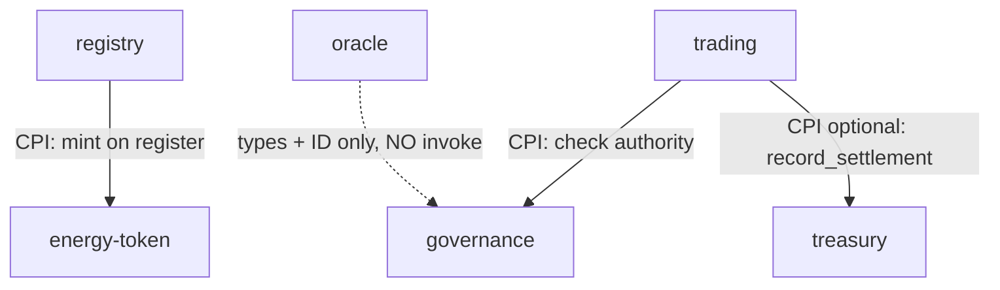

# CPI Flow — Cross-Program Invocation, Precisely

> Deep-dive. How one Solana program calls another mid-transaction, how accounts + signer seeds
> propagate, the privilege/depth rules, and this repo's CPI graph
> (`registry→energy-token`, `trading→governance`, `trading→treasury`, `oracle→governance`).

---

## 0. TL;DR

**CPI** = a program invokes another program *within the same transaction*. The caller passes a
subset of its own accounts to the callee via `invoke` (or `invoke_signed` to authorize a PDA the
caller owns). The callee runs with those accounts, can read/write them per the original tx's
privileges, and returns. Privileges (signer, writable) **flow down but can't be escalated**.
Max depth = 4. Anchor wraps this in `CpiContext` + generated `cpi` modules.

---

## 1. What CPI is and why

Programs are isolated — each runs in its own SVM sandbox, touching only declared accounts. But
real flows span programs: registering a user (registry) should **mint tokens** (energy-token);
settling a trade (trading) should **check authority** (governance) and **record settlement**
(treasury). CPI is the controlled bridge: program A calls into program B's instruction handler,
synchronously, mid-tx, sharing accounts.

Think function call across a security boundary: B executes with the accounts A hands it, under
the same transaction's atomicity (if B fails, the whole tx reverts).

---

## 2. The mechanics: invoke and invoke_signed

Low-level (what Anchor generates under the hood):

```rust
// Build the callee instruction: which program, which accounts, what data
let ix = Instruction {
    program_id: energy_token::ID,
    accounts: vec![/* AccountMetas: pubkey + is_signer + is_writable */],
    data: /* serialized energy_token instruction args */,
};

// Plain CPI — caller forwards existing signatures
invoke(&ix, &account_infos)?;

// Signed CPI — caller authorizes a PDA it owns by presenting seeds+bump
let seeds = &[b"treasury", &[treasury_bump]];
invoke_signed(&ix, &account_infos, &[&seeds[..]])?;
```

- **`invoke`**: use when the needed signers already signed the *outer* tx. Their signatures
  propagate to the callee.
- **`invoke_signed`**: use when a **PDA owned by the caller** must be a signer (no private key
  exists — see `pda-derivation.md`). The runtime recomputes the PDA from `seeds + caller
  program_id`; match ⇒ the PDA counts as a signer for the callee.

```mermaid
graph LR
    A["program A (caller)"] -->|invoke(_signed)| RT["runtime"]
    RT -->|pass account_infos + (recomputed PDA signer)| B["program B (callee) handler"]
    B -->|read/write shared accounts| ST["accounts"]
    B -->|return Ok/Err| A
    A -. tx atomic: B err ⇒ whole tx reverts .- A
```

---

## 3. Privilege propagation rules (the security model)

CPI **cannot escalate privileges**. The callee sees account flags **bounded by** what the outer
tx granted:

- An account **writable** to the callee only if it was writable in the outer tx (and A passes it
  as writable).
- An account is a **signer** to the callee only if (a) it signed the outer tx, or (b) it's a PDA
  the caller authorizes via `invoke_signed` with correct seeds.
- A can pass a **subset** of its accounts and can **downgrade** (writable→read-only) but never
  **upgrade**.

So a malicious A can't forge B into writing an account the user never authorized, nor sign for a
PDA A doesn't own (seeds won't recompute under A's program_id). This is what makes CPI safe to
compose.

---

## 4. Depth, atomicity, reentrancy

- **Max CPI depth = 4.** A→B→C→D allowed; one more level errors. Bounds stack/compute.
- **Atomic.** All CPIs share the transaction. Any failure anywhere → entire tx reverts, all
  state changes rolled back. No partial settlement.
- **Limited reentrancy.** Self-recursion / cycles are restricted by the runtime (a program
  generally can't be reentered mid-call in a way that breaks invariants). Design CPI as a DAG,
  not a cycle — this repo's CPI graph is acyclic.
- **Compute is shared.** The whole tx has one CU budget (default 200k, max 1.4M). CPIs spend
  from the *same* budget — deep/fat CPI chains can exhaust it. SKILL invariant #4 (compute-debug
  profiling) exists partly to watch CPI-heavy paths.

---

## 5. Anchor's wrapper: CpiContext + generated cpi module

With `features = ["cpi"]` on a path dependency, Anchor generates a typed `cpi` module for the
callee. The caller builds a `CpiContext` and calls the typed fn:

```rust
use energy_token::cpi::accounts::MintTokens;
use energy_token::cpi::mint_tokens;

let cpi_accounts = MintTokens { mint, to, authority, token_program };
let cpi_ctx = CpiContext::new(energy_token_program.to_account_info(), cpi_accounts);
// or, signing for a PDA authority:
let signer = &[&[b"registry", &[registry_bump]][..]];
let cpi_ctx = CpiContext::new_with_signer(prog, cpi_accounts, signer);
mint_tokens(cpi_ctx, amount)?;
```

`CpiContext::new` → `invoke`; `CpiContext::new_with_signer` → `invoke_signed`. Anchor serializes
args, builds AccountMetas with correct signer/writable flags, and forwards account_infos.

> Gotcha (memory `anchor-sbf-deploy-staleness`): `CpiContext` takes the program **Pubkey /
> AccountInfo**, and a stale deployed `.so` can mismatch account counts — rebuild + restage when
> CPI signatures change.

---

## 6. This repo's CPI graph

From `CLAUDE.md` + program map. Path deps with `features=["cpi"]`, **acyclic**:



- **`registry → energy-token`** — on user/meter registration, registry CPIs `energy-token` to
  mint GRID. registry signs via its own PDA authority (`invoke_signed`).
- **`trading → governance`** — settlement checks PoA authority / config in governance before
  acting.
- **`trading → treasury` (optional, non-custodial)** — `record_settlement` fires **only when
  treasury accounts are passed** to `settle_offchain_match` / `batch_settle_offchain_match`.
  Authorized by the `settlement_recorder` signer = trading's `market_authority` PDA
  (`invoke_signed`). For THBG markets it's **mandatory** — omitting treasury accounts when a
  `settlement_thbg_mint` is set → `TreasurySettlementRequired` (no silent skip). Batch records
  the whole batch with **one** CPI.
- **`oracle → governance` — NOT a CPI invoke.** Oracle imports governance's **types + program
  ID only**; it *validates* an admitted aggregator's `AggregatorEntry` PDA (reads/derives it) to
  authorize node-facing oracle instructions. No `invoke` crosses — important distinction: a
  dependency edge in Cargo ≠ a runtime CPI.

> Also cross-program but **not a CPI**: registry's `slash_validator` *transfers* slashed bonds
> to a configured `slash_destination` (e.g. treasury `reward_vault`) — a plain SPL token
> transfer, not an `invoke` into treasury. Token movement ≠ CPI into the program.

---

## 7. Pitfalls when writing CPI here

- **Wrong signer seeds** → `invoke_signed` PDA won't recompute → "missing signature" /
  privilege error. Seeds + bump must match the PDA the callee expects, under the *caller's*
  program_id.
- **Forgot to pass an account** → callee can't touch an undeclared account; pass the full set
  the callee's context needs.
- **CU blowout** → CPI spends the shared budget; batch settlement keeps it to one CPI for the
  whole batch to stay under budget (~80–92k CU/match; batch ≤4 by code, ~1/tx in practice).
- **Assuming optional CPI is optional everywhere** → THBG markets *require* the treasury CPI;
  the "optional" only holds for non-THBG currency.
- **Confusing dependency with invoke** → `oracle→governance` is types-only. Don't add an
  `invoke` expecting governance to "run" — it doesn't.
- **Stack/atomicity** → deep contexts + CPI can overflow BPF stack; if a tx fails inside a CPI,
  everything reverts (good — no partial settlement, but plan idempotency for retries).

---

## 8. One-paragraph recall

CPI lets program A synchronously call program B inside one atomic transaction: A forwards a
subset of its accounts via `invoke`, or `invoke_signed` to authorize a PDA it owns (runtime
recomputes the PDA from seeds + A's program_id). Privileges flow **down, never up** — the callee
can't gain signer/writable rights the outer tx didn't grant — depth caps at 4, and any failure
reverts the whole tx on one shared CU budget. Anchor wraps it as `CpiContext::new` (→`invoke`) /
`new_with_signer` (→`invoke_signed`) over generated `cpi` modules. This repo's acyclic graph:
`registry→energy-token` (mint), `trading→governance` (authority), `trading→treasury`
(optional/mandatory-for-THBG `record_settlement`, one CPI per batch), and `oracle→governance`
which is **types-only, not an invoke** — and registry's slash is a token transfer, not a CPI.
