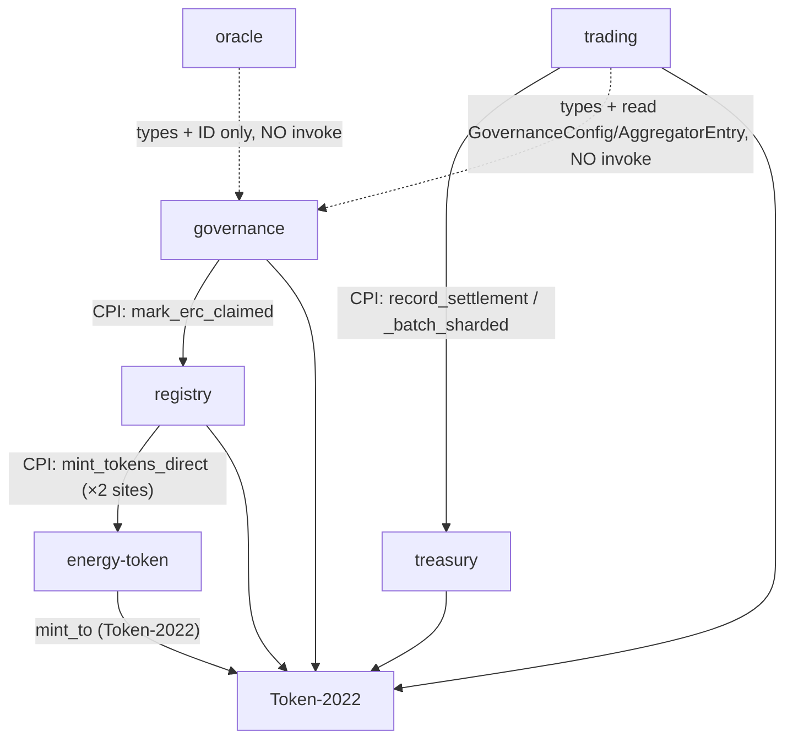

# CPI Flow — Cross-Program Invocation, Precisely

> Deep-dive. How one Solana program calls another mid-transaction, how accounts + signer seeds
> propagate, the privilege/depth rules, and this repo's CPI graph. **Three** runtime invoke
> edges — `governance→registry`, `registry→energy-token`, `trading→treasury` — plus two
> compile-time-only edges (`trading→governance`, `oracle→governance`) that share types and read
> PDAs but never `invoke`.

---

## 0. TL;DR

**CPI** = a program invokes another program *within the same transaction*. The caller passes a
subset of its own accounts to the callee via `invoke` (or `invoke_signed` to authorize a PDA the
caller owns). The callee runs with those accounts, can read/write them per the original tx's
privileges, and returns. Privileges (signer, writable) **flow down but can't be escalated**.
Max depth = 4. Anchor wraps this in `CpiContext` + generated `cpi` modules.

---

## 1. What CPI is and why

Programs are isolated — each runs in its own SVM sandbox, touching only declared accounts. But
real flows span programs: an airdrop / net-settlement in registry should **mint GRID**
(energy-token); certifying renewable generation in governance should **debit the meter's claimed
counter** (registry); settling a trade (trading) should **record settlement** (treasury). CPI is
the controlled bridge: program A calls into program B's instruction handler, synchronously,
mid-tx, sharing accounts. (Checking governance authority/config from trading and oracle is a
*read*, not a CPI — see §6.)

Think function call across a security boundary: B executes with the accounts A hands it, under
the same transaction's atomicity (if B fails, the whole tx reverts).

---

## 2. The mechanics: invoke and invoke_signed

Low-level (what Anchor generates under the hood):

```rust
// Build the callee instruction: which program, which accounts, what data
let ix = Instruction {
    program_id: energy_token::ID,
    accounts: vec![/* AccountMetas: pubkey + is_signer + is_writable */],
    data: /* serialized energy_token instruction args */,
};

// Plain CPI — caller forwards existing signatures
invoke(&ix, &account_infos)?;

// Signed CPI — caller authorizes a PDA it owns by presenting seeds+bump
let seeds = &[b"treasury", &[treasury_bump]];
invoke_signed(&ix, &account_infos, &[&seeds[..]])?;
```

- **`invoke`**: use when the needed signers already signed the *outer* tx. Their signatures
  propagate to the callee.
- **`invoke_signed`**: use when a **PDA owned by the caller** must be a signer (no private key
  exists — see `pda-derivation.md`). The runtime recomputes the PDA from `seeds + caller
  program_id`; match ⇒ the PDA counts as a signer for the callee.

```mermaid
graph LR
    A["program A (caller)"] -->|invoke(_signed)| RT["runtime"]
    RT -->|pass account_infos + (recomputed PDA signer)| B["program B (callee) handler"]
    B -->|read/write shared accounts| ST["accounts"]
    B -->|return Ok/Err| A
    A -. tx atomic: B err ⇒ whole tx reverts .- A
```

---

## 3. Privilege propagation rules (the security model)

CPI **cannot escalate privileges**. The callee sees account flags **bounded by** what the outer
tx granted:

- An account **writable** to the callee only if it was writable in the outer tx (and A passes it
  as writable).
- An account is a **signer** to the callee only if (a) it signed the outer tx, or (b) it's a PDA
  the caller authorizes via `invoke_signed` with correct seeds.
- A can pass a **subset** of its accounts and can **downgrade** (writable→read-only) but never
  **upgrade**.

So a malicious A can't forge B into writing an account the user never authorized, nor sign for a
PDA A doesn't own (seeds won't recompute under A's program_id). This is what makes CPI safe to
compose.

---

## 4. Depth, atomicity, reentrancy

- **Max CPI depth = 4.** A→B→C→D allowed; one more level errors. Bounds stack/compute.
- **Atomic.** All CPIs share the transaction. Any failure anywhere → entire tx reverts, all
  state changes rolled back. No partial settlement.
- **Limited reentrancy.** Self-recursion / cycles are restricted by the runtime (a program
  generally can't be reentered mid-call in a way that breaks invariants). Design CPI as a DAG,
  not a cycle — this repo's CPI graph is acyclic.
- **Compute is shared.** The whole tx has one CU budget (default 200k, max 1.4M). CPIs spend
  from the *same* budget — deep/fat CPI chains can exhaust it. SKILL invariant #4 (compute-debug
  profiling) exists partly to watch CPI-heavy paths.

---

## 5. Anchor's wrapper: CpiContext + generated cpi module

With `features = ["cpi"]` on a path dependency, Anchor generates a typed `cpi` module for the
callee. The caller builds a `CpiContext` and calls the typed fn:

Real call site — registry minting GRID via energy-token, signing as its own PDA
(`programs/registry/src/instructions/settle_and_mint_tokens.rs:61-72`):

```rust
use energy_token::cpi::accounts::MintTokensDirect;
use energy_token::cpi::mint_tokens_direct;

let cpi_accounts = MintTokensDirect { token_info, mint, recipient, registry_authority,
                                      rec_validator, token_program };
// registry PDA is the authority — invoke_signed with its seeds:
let signer = &[&[b"registry", &[registry_bump]][..]];
let cpi_ctx = CpiContext::new_with_signer(
    ctx.accounts.energy_token_program.key(),   // Anchor 1.0.0: takes Pubkey, not AccountInfo
    cpi_accounts, signer);
mint_tokens_direct(cpi_ctx, amount)?;
```

`CpiContext::new` → `invoke`; `CpiContext::new_with_signer` → `invoke_signed`. Anchor serializes
args, builds AccountMetas with correct signer/writable flags, and forwards account_infos.

> Anchor 1.0.0 gotcha: `CpiContext::new[_with_signer]` takes the program **`Pubkey`** (`.key()`),
> not `AccountInfo` — a breaking change from 0.30.x (memory `anchor-sbf-deploy-staleness`). A
> stale deployed `.so` can also mismatch account counts — rebuild + restage when CPI signatures
> change.

---

## 6. This repo's CPI graph

Verified against every `::cpi::` invoke site (`rg '::cpi::' programs/*/src`). Solid arrows =
runtime `invoke`; dotted = compile-time type/ID dependency with **no** invoke. **Acyclic:**


```mermaid
graph TD
    GOV["governance"] -->|"CPI: mark_erc_claimed"| REG["registry"]
    REG -->|"CPI: mint_tokens_direct (×2 sites)"| ET["energy-token"]
    TRD["trading"] -->|"CPI: record_settlement / _batch_sharded"| TRE["treasury"]
    TRD -.->|"types + read GovernanceConfig/AggregatorEntry, NO invoke"| GOV
    ORA["oracle"] -.->|"types + ID only, NO invoke"| GOV
    ET -->|"mint_to (Token-2022)"| T22["Token-2022"]
    GOV --> T22
    TRE --> T22
    TRD --> T22
    REG --> T22
```

- **`governance → registry`** :: `mark_erc_claimed(energy_amount)`
  (`programs/governance/src/instructions/issue_erc.rs:176`). Signed by governance `authority`
  (`invoke`, no PDA seeds — the outer signer propagates). Debits the meter's **net** claimed
  generation to close the double-claim window before REC issuance. Callee now accepts
  `authority`-only (`programs/registry/src/instructions/mark_erc_claimed.rs:26-30`).
- **`registry → energy-token`** :: `mint_tokens_direct(amount)` — **two sites**:
  `claim_airdrop.rs:94` (`AIRDROP_AMOUNT`) and `settle_and_mint_tokens.rs:72` (settled net).
  registry signs as its **own PDA** (`invoke_signed`, `settle_and_mint_tokens.rs:71`). The
  callee's REC co-sign gate is **exempt for the registry CPI**
  (`programs/energy-token/src/instructions/mint_tokens_direct.rs:80-86`); `energy_token_program`
  is pinned to `energy_token::ID` on the caller side (`InvalidEnergyTokenProgram`).
- **`trading → treasury` (non-custodial)** :: `record_settlement` (single,
  `settle_offchain.rs:914`) / `record_settlement_batch_sharded` (batch, `:1328`). Moves **no
  tokens** — only bumps `total_settled_thbc` on the GROSS value. Authorized by the
  `settlement_recorder` signer = trading's `market_authority` PDA (`invoke_signed`). For THBC
  markets **mandatory** — `has_settlement_thbc_mint==1` + omitted treasury accounts →
  `TreasurySettlementRequired` (no silent skip). Batch records the whole batch with **one** CPI.
- **`trading → governance` — NOT a CPI invoke.** Cargo dep with `features=["cpi"]`
  (`programs/trading/Cargo.toml:48`), but **zero** `governance::cpi::` calls: trading imports
  `ErcCertificate`/`ErcStatus`/`GovernanceConfig` and *reads* `GovernanceConfig.is_operational`
  + `AggregatorEntry` (raw byte, settle gate). A dependency edge ≠ a runtime CPI.
- **`oracle → governance` — NOT a CPI invoke.** Same pattern: imports **types + program ID
  only**, *validates* an admitted aggregator's `AggregatorEntry` PDA
  (`programs/oracle/src/instructions/trigger_market_clearing.rs:17`) to authorize node-facing
  instructions. No `invoke` crosses.

> Also cross-program but **not a CPI**: registry's `slash_validator` *transfers* slashed bonds
> to a configured `slash_destination` (e.g. treasury `rebate_vault`) — a plain Token-2022
> transfer (`programs/registry/src/instructions/slash_validator.rs:140`), not an `invoke` into
> treasury. Token movement ≠ CPI into the program.

> **External CPIs to Token-2022** (solid arrows to `T22` above) exist wherever value moves:
> energy-token/governance/treasury `mint_to`, all programs `transfer_checked`,
> energy-token/governance/treasury `burn`. These are real `invoke`s into the SPL Token-2022
> program — counted in CU and depth like any CPI — just not *inter-service* edges.

---

## 7. Pitfalls when writing CPI here

- **Wrong signer seeds** → `invoke_signed` PDA won't recompute → "missing signature" /
  privilege error. Seeds + bump must match the PDA the callee expects, under the *caller's*
  program_id.
- **Forgot to pass an account** → callee can't touch an undeclared account; pass the full set
  the callee's context needs.
- **CU blowout** → CPI spends the shared budget; batch settlement keeps it to one CPI for the
  whole batch to stay under budget (~80–92k CU/match; batch ≤4 by code, ~1/tx in practice).
- **Assuming optional CPI is optional everywhere** → THBC markets *require* the treasury CPI;
  the "optional" only holds for non-THBC currency.
- **Confusing dependency with invoke** → `oracle→governance` is types-only. Don't add an
  `invoke` expecting governance to "run" — it doesn't.
- **Stack/atomicity** → deep contexts + CPI can overflow BPF stack; if a tx fails inside a CPI,
  everything reverts (good — no partial settlement, but plan idempotency for retries).

---

## 8. One-paragraph recall

CPI lets program A synchronously call program B inside one atomic transaction: A forwards a
subset of its accounts via `invoke`, or `invoke_signed` to authorize a PDA it owns (runtime
recomputes the PDA from seeds + A's program_id). Privileges flow **down, never up** — the callee
can't gain signer/writable rights the outer tx didn't grant — depth caps at 4, and any failure
reverts the whole tx on one shared CU budget. Anchor wraps it as `CpiContext::new` (→`invoke`) /
`new_with_signer` (→`invoke_signed`) over generated `cpi` modules. This repo has exactly **three**
inter-program invoke edges — `governance→registry` (`mark_erc_claimed`), `registry→energy-token`
(`mint_tokens_direct`, ×2 sites), `trading→treasury` (`record_settlement`, mandatory for THBC,
one CPI per batch) — forming an acyclic chain. `trading→governance` and `oracle→governance` are
**types-only Cargo deps, not invokes** (they read `GovernanceConfig`/`AggregatorEntry`), and
registry's slash is a Token-2022 transfer, not a CPI. Plus external `invoke`s into Token-2022
wherever value moves.
