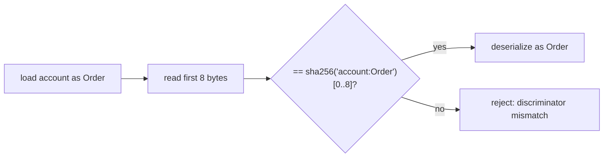

# Discriminator & Type Safety — The 8-Byte Header, Defended

> Deep-dive. The 8-byte account discriminator, type-confusion attacks, `#[account]` vs
> `zero_copy` space, instruction discriminators. The "block header" you originally asked about,
> at the account level. (Verify against any `programs/*/src/state.rs`.)

---

## 0. TL;DR

Anchor prefixes every account's data with an **8-byte discriminator** = first 8 bytes of
`sha256("account:<StructName>")`. On every load, Anchor checks the on-chain discriminator matches
the expected type — blocking **type-confusion attacks** (feeding a `MeterState` where an `Order`
is expected). Instructions have their **own** 8-byte discriminator
(`sha256("global:<ix_name>")`) for dispatch. This is the real "header" of a Solana account: a
type tag, not a mining puzzle.

---

## 1. The problem: accounts are just bytes

A program owns many account **types** (`MeterState`, `Order`, `OrderNullifier`, `ZoneMarket`...),
all stored as raw bytes owned by the same program. If an instruction expects an `Order` but the
caller passes a `MeterState` of the same owner, naive deserialization would **reinterpret one
struct's bytes as another** → **type confusion**: read garbage, or worse, let an attacker forge a
privileged account by supplying a different-typed account with attacker-controlled bytes.

```text
attacker passes MeterState bytes where Order expected
naive: deserialize as Order → fields misread → exploit
```

---

## 2. The fix: 8-byte discriminator prefix

Anchor writes an 8-byte tag at the **front** of every account's data at init:

```text
discriminator = sha256("account:" + StructName)[0..8]

 ┌──────────────┬──────────────────────────────────┐
 │ 8 bytes      │  struct data (Borsh or Pod)       │
 │ disc(Order)  │  buyer, seller, price, qty, ...    │
 └──────────────┴──────────────────────────────────┘
```

On every `Account::try_from` / `AccountLoader::load`, Anchor:
1. reads the first 8 bytes,
2. compares to the **expected** type's discriminator,
3. **rejects** (`AccountDiscriminatorMismatch`) if they differ.

So passing a `MeterState` where an `Order` is expected fails immediately — the disc tag doesn't
match. Type safety enforced at the byte level.



---

## 3. Why 8 bytes (collision safety)

8 bytes = 64 bits. Collision between two type names would require two distinct names whose
sha256 prefixes match in 64 bits — cryptographically negligible. It's enough to uniquely tag
every account type within a program (and effectively across programs) without bloating every
account. That's why `space = 8 + size_of::<T>()` always starts with 8.

---

## 4. Instruction discriminators (dispatch)

The same idea routes **instructions**:

```text
ix discriminator = sha256("global:" + instruction_name)[0..8]
```

- The first 8 bytes of an instruction's `data` select which handler runs.
- Anchor's generated dispatcher matches these to call the right function.
- This is why renaming an instruction changes its on-chain selector — clients/IDL must match.
- (Account disc uses `"account:"` prefix; ix disc uses `"global:"` — different namespaces.)

---

## 5. `#[account]` vs `#[account(zero_copy)]` — both carry the disc

| | `#[account]` (regular) | `#[account(zero_copy)]` |
|--|------------------------|--------------------------|
| Discriminator | yes (8 bytes) | yes (8 bytes) |
| Body encoding | Borsh (deserialized) | Pod (mapped in place) |
| Space | `8 + Borsh size` (manual `LEN`) | `8 + size_of::<T>()` |
| Load | `Account<T>` (copy) | `AccountLoader<T>` (`load`/`load_mut`/`load_init`) |
| Disc check on | `try_from` (deserialize) | `load*` |

Both get the 8-byte tag and the mismatch check. `load_init()` (zero-copy) **writes** the
discriminator at creation; `load()`/`load_mut()` **verify** it. (See `zero-copy-accounts.md`.)

---

## 6. Type confusion in the wild (why this matters)

Real exploit classes the discriminator defends against:

- **Account substitution** — pass a different-typed account the program owns; disc mismatch
  blocks it.
- **Revival after close** — a closed account whose disc wasn't zeroed could be reinterpreted;
  Anchor `close` zeroes it (`account-model-rent.md` §5).
- **Uninitialized read** — reading an all-zero (never-init) account: zero disc ≠ expected disc →
  rejected, so you don't read a zeroed struct as real data.

But the discriminator is **not** a complete auth check. It says "this is an `Order`," not "this is
**the right** `Order` for **this** user/market." You still need:
- **Owner check** (Anchor verifies the account owner = program),
- **PDA seed/`has_one` checks** (bind the account to the expected authority/market),
- **Signer checks**.

Wave-0 hardening in this repo (`db1caa8`, `0b470fa`, etc.) is largely about these **binding**
checks (e.g. "bind `user_account` in deactivate_meter", "bind `mint_tokens_direct` recipient") —
the disc proves *type*, the bindings prove *identity*.

---

## 7. Pitfalls

- **Thinking disc = authorization** → it's type-only; add owner/`has_one`/seed/signer binds.
- **Manual deserialization bypassing the check** → if you parse raw bytes yourself, you skip the
  disc check; use Anchor's loaders.
- **Not zeroing disc on close** → revival attack; use `close`.
- **Renaming a struct/instruction** → changes the discriminator → breaks existing accounts/clients
  (memory: `PoAConfig→GovernanceConfig` kept the **PDA seed** `poa_config`, but a *type* rename
  shifts the account disc — handle migrations).
- **Assuming cross-program uniqueness guarantees** → disc tags type by name; combine with the
  **owner** check (different program = different owner) for cross-program safety.

---

## 8. One-paragraph recall

Anchor prefixes every account with an **8-byte discriminator** = `sha256("account:<Struct>")[0..8]`,
checked on every load to reject **type-confusion** (wrong-typed account substitution, revival,
uninitialized reads) — this is the real account-level "header," a type tag, not a mining output.
Instructions get a parallel `sha256("global:<ix>")[0..8]` selector for dispatch. Both `#[account]`
and `zero_copy` carry and verify the tag (`load_init` writes it). Crucially, the discriminator
proves **type, not identity/authorization** — you still need owner, `has_one`/seed binding, and
signer checks (the repo's wave-0 hardening is exactly these binding fixes). Renaming a struct
shifts its disc → plan migrations.
