# Off-Chain Match Settlement — The Novel Mechanism

> Deep-dive. `trading/settle_offchain.rs`: Ed25519-signed matches, `OrderNullifier`,
> batch cap (code ≤4, ~1/tx in practice), ~80-92k CU/match, optional treasury CPI.
> Verified against `programs/trading/src/instructions/settle_offchain.rs` (line refs inline).

---

## 0. TL;DR

Matching happens **off-chain** (the trading-service CDA engine). The chain doesn't match — it
**settles** a match that an authorized matcher already computed and **Ed25519-signed**. The
on-chain instruction verifies the signature, checks a per-order **nullifier** to prevent double-
settlement, moves tokens, and optionally records the settlement in treasury. `batch_settle` caps
at **≤4 matches** in code (`BatchTooLarge`), but Ed25519 per-match data (uncompressible by ALT) +
the 1232-byte tx limit make 2+ overflow → **~1 match/tx in practice**. ~80-92k CU/match.

---

## 1. Why settle off-chain matches at all

On-chain CDA matching would mean every order book mutation hits chain → serializes on the book
account → slow + expensive. Instead:

- **Off-chain:** the trading-service matching engine (CDA, `crates/trading-engine`) computes
  matches fast, in memory, no chain contention.
- **On-chain:** only the **settlement** of an agreed match touches chain — token transfers +
  accounting. The chain is the *settlement layer*, not the *matching layer*.

Trust gap: if matching is off-chain, how does the chain know the match is legit? → **the matcher
signs it**, and the chain verifies the signature against an authorized key.

```mermaid
graph LR
    BOOK["off-chain CDA engine (trading-service)"] -->|computes match| SIG["matcher Ed25519-signs match data"]
    SIG -->|submit tx| CHAIN["trading::settle_offchain_match"]
    CHAIN --> VERIFY["verify Ed25519 sig"]
    VERIFY --> NULL["check + write OrderNullifier (anti-replay)"]
    NULL --> XFER["move tokens (buyer escrow → seller)"]
    XFER --> REC["optional: CPI treasury record_settlement"]
```



---

## 2. Ed25519 signature verification on-chain

Solana verifies Ed25519 via the **Ed25519 sysvar/precompile** (`ed25519_program`), not in-program
crypto. The settle tx includes an Ed25519 verify instruction; the runtime checks it; the program
reads the **instructions sysvar** to confirm the expected message/pubkey/signature were verified.

Security-critical detail (memory: regression test exists): the program must bind the verified
**offset/data** correctly — an attacker who can redirect which instruction's data is "verified"
(offset-redirection) could bypass. Commit `80c86a1` added a regression for exactly that ed25519
offset-redirection bypass. **Verify the offset binding when touching this path.**

---

## 3. OrderNullifier — anti-double-settlement

A signed match could be replayed (submit the same signed blob twice → settle twice). Prevented by
the **`OrderNullifier`** PDA — `init_if_needed` on first settle (`settle_offchain.rs:154`), with a
**`filled_amount`** field (`saturating_add`, `:557`) that also tracks **partial fills**, not just
existence.

```text
first settle:  init_if_needed creates OrderNullifier → filled_amount += this fill
re-settle:     PDA exists → filled_amount accumulates; over-fill / full replay blocked
```

`OrderNullifier` fields (`state/nullifier.rs:4`): `order_id: [u8;16]` (order UUID), `authority`,
`filled_amount: u64`, `bump`.

- Per-entity PDA (Sealevel-friendly — different orders don't contend).
- Address derives from order identity → same match maps to same nullifier deterministically.
- The on-chain "spent"/fill mark — analogous to a UTXO nullifier, but **accumulating** to support
  partial fills rather than a one-shot spend.

---

## 4. The settlement context + stack ceiling

`SettleOffchainMatchContext` is **at the BPF stack ceiling** (`settle_offchain.rs:148` comment).
Adding another **named** account overflows `try_accounts` → stack overflow. So extra accounts come
through **`remaining_accounts`** positionally, not new named fields:

- governance **`poa_config`** is the **first** remaining account (`:148`, accessed `:392`) — not a
  named field, precisely because the named context is full.
- treasury CPI accounts (for optional/THBG-mandatory `record_settlement`) likewise ride
  `remaining_accounts`; recording is gated on their presence.

---

## 5. Batch settlement — code ≤4, ~1/tx in practice

`batch_settle_offchain_match` **caps at 4 matches in code**:
`require!(match_count > 0 && match_count <= 4, BatchTooLarge)` (`settle_offchain.rs:642`). But the
**practical** limit is lower:

- Each match carries its **own Ed25519 signature data** (~fixed bytes/match).
- That signature data **can't be compressed by Address Lookup Tables** (ALT compresses *account
  keys*, not instruction data).
- 4 Ed25519 ixs (~760B) + match-pair data → blows the **1232-byte** tx limit at **2+ matches**, so
  in practice **~1 match/tx** fits (memory: `batch-settle-single-tx-cap`).

The "batch" still has value: it records the whole batch to treasury with **one** `record_settlement`
CPI (gross batch value), even though token settlement is per-match. Cost: **~80-92k CU/match**.

```text
batch_settle_offchain_match (match_count ≤ 4 by code; ~1 fits per tx):
  for each match in this tx:
     verify ed25519 → check/accumulate nullifier → transfer tokens
  record_settlement CPI once (batch gross → treasury.total_settled_thbg)
```

---

## 6. Treasury recording — optional vs mandatory

(From `cpi-flow.md` + CLAUDE.md treasury section.)

- **Non-custodial:** `record_settlement` only bumps treasury accounting (`total_settled_thbg` by
  GROSS settled value); it does **not** custody trade funds.
- **Optional in general:** fires only when treasury accounts are passed to settle.
- **Mandatory for THBG markets:** if a Market has `settlement_thbg_mint` set
  (`set_settlement_thbg_mint`), a match in that currency that **omits** treasury accounts is
  rejected → `TreasurySettlementRequired`. No silent skip.
- Authorized by `settlement_recorder` signer = trading's `market_authority` PDA (`invoke_signed`).

---

## 7. Settlement throughput reality (memory)

Measured: the real serializer is the **`zone_market` mutable lock**, not collectors/treasury
(memory: `settlement-tps-zone-market-lock`). §2c sharding is correct but TPS stays flat because
settlement is **latency-bound** on that lock, not throughput-bound on sharded accounts. Lesson:
sharding only helps the contended account — find the *actual* serializing write before optimizing.

litesvm full-settle harness exists (memory: `litesvm-full-match-settle-harness`) — first
in-process full `settle_offchain_match` test; gotchas: v0/ALT-in-litesvm 1232 limit, payer-derived
shard, error 6030 fires pre-CPI.

---

## 8. Pitfalls

- **Ed25519 offset binding** → verify the instruction-sysvar offset; offset-redirection = bypass
  (regression `80c86a1`).
- **Adding named account to settle context** → stack overflow; use `remaining_accounts`.
- **Expecting batch to pack 4 matches** → code allows ≤4, but ALT-uncompressible sig data + 1232B
  tx limit → ~1/tx in practice.
- **Omitting treasury accounts on THBG market** → `TreasurySettlementRequired`, not skip.
- **Assuming sharding fixes TPS** → `zone_market` lock is the serializer; latency-bound.

---

## 9. One-paragraph recall

Matching is off-chain (CDA engine); the chain only **settles** an authorized matcher's
**Ed25519-signed** match — verify the signature (via the ed25519 precompile + instructions
sysvar, binding the offset to avoid the redirection bypass), consume a per-order **OrderNullifier**
PDA for anti-replay, transfer tokens, and optionally (mandatory for THBG) CPI treasury
`record_settlement`. Batch caps at **≤4 in code** (`BatchTooLarge`) but per-match Ed25519 data
can't be ALT-compressed, so the 1232-byte tx limit makes it **~1 match/tx in practice**
(~80-92k CU/match); the real throughput limiter is the `zone_market` mut lock, not the sharded
collectors. The settle context sits at the BPF stack ceiling → governance `poa_config` + treasury
accounts ride `remaining_accounts`.
