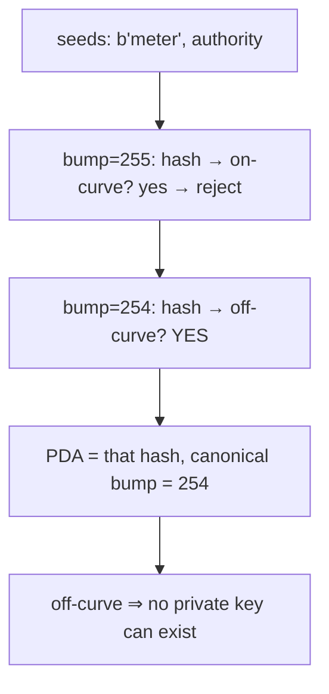
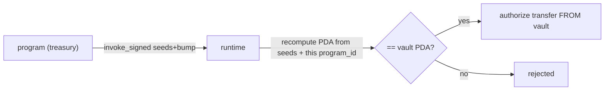

# PDA Derivation — Program-Owned Addresses, Precisely

> Deep-dive. How Program Derived Addresses are computed, why they have no private key, what the
> bump is, and how this repo uses them (`MeterState`, `Order`, treasury vaults, ...).

---

## 0. TL;DR

A **PDA** is an address derived from `seeds + program_id` that is **forced off the ed25519
curve**, so no private key can exist for it. The program that owns the seeds is the only thing
that can "sign" for it (via `invoke_signed`). Derivation = hash seeds + program_id + a **bump**
byte; decrement the bump from 255 until the result is off-curve. The first off-curve bump is the
**canonical bump** — store it, reuse it, never re-search on the hot path.

---

## 1. The problem PDAs solve

Two needs:

1. **Deterministic addresses.** Given a user pubkey, find *their* account with no lookup table —
   just derive `["user", user_pubkey]`. No registry of "which address holds Alice's data."
2. **Program-controlled assets.** A program needs to own a token vault / escrow and move funds
   *without a human holding the secret key.* A normal keypair would mean someone holds the
   secret = custodial risk. A PDA has **no secret key at all** — only the program can authorize
   it.

PDAs answer both: addresses are a pure function of seeds, and they're unspendable by any
external signer.

---

## 2. The derivation algorithm

```text
find_program_address(seeds, program_id):
    for bump in 255, 254, 253, ... :
        candidate = sha256( seeds || bump || program_id || "ProgramDerivedAddress" )
        if not on_ed25519_curve(candidate):
            return (candidate, bump)        # canonical = first (highest bump) off-curve
    # (astronomically unlikely to exhaust)
```

Key steps:

- **Seeds**: arbitrary byte slices you choose — e.g. `[b"meter", authority.as_ref()]`. Each
  seed ≤ 32 bytes, limited count.
- **Bump**: a single `u8` appended to push the hash off-curve. Search starts at 255 downward.
- **On-curve check**: a valid ed25519 *public* key lies on the curve (has a matching private
  key). PDAs must be **off** the curve → guaranteed **no** private key exists.
- **Canonical bump**: the **first** bump (highest value) that yields off-curve. Always use this
  one; accepting other bumps is a security bug (multiple valid addresses for "the same" PDA).



---

## 3. find vs create vs derive — three operations

| Op | Where | Cost | Use |
|----|-------|------|-----|
| `find_program_address(seeds, pid)` | client / on-chain | **expensive** (loops bumps) | discover the PDA + canonical bump when you don't know the bump |
| `create_program_address(seeds+bump, pid)` | on-chain | cheap (one hash) | re-derive when you ALREADY know the bump (no loop) |
| store the bump | in the account | — | so hot paths skip the search |

**Performance rule:** `find_program_address` loops (up to 255 hashes). On-chain, do it **once**
at init, **store the bump** in the account, then use `create_program_address` (or Anchor's
`seeds + bump = stored_bump`) afterward. Searching every instruction wastes compute units.

In Anchor:

```rust
#[account(
    init,
    seeds = [b"meter", authority.key().as_ref()],
    bump,                              // Anchor finds + stores canonical bump at init
    payer = authority,
    space = 8 + size_of::<MeterState>()
)]
pub meter: AccountLoader<'info, MeterState>,

// later instruction — reuse stored bump, no search:
#[account(seeds = [b"meter", authority.key().as_ref()], bump = meter.load()?.bump)]
pub meter: AccountLoader<'info, MeterState>,
```

---

## 4. Signing for a PDA: invoke_signed

A PDA can't sign with a secret (none exists). Instead, the **runtime** lets a program assert
authority over a PDA by re-presenting its seeds + bump during a CPI:

```rust
let seeds = &[b"treasury", &[treasury_bump]];
let signer = &[&seeds[..]];
token::transfer(
    CpiContext::new_with_signer(token_program, accounts, signer),
    amount,
)?;
```

The runtime recomputes the PDA from those seeds + the calling program_id. If it matches the
account, the program is allowed to act as that account's authority. **Only the program that owns
the seeds (knows them + has matching program_id) can do this.** That's how a treasury PDA moves
tokens from its own vault with no human key.



> Critical: only the **owning program** can sign — another program presenting the same seeds
> derives a *different* PDA because `program_id` differs. Seeds are namespaced by program.

---

## 5. Why off-curve = unspendable by outsiders

ed25519 signing needs a private scalar `s` with public key `P = s·B` (B = base point), and `P`
lies on the curve. A PDA is *chosen* to be a 32-byte value **not** on the curve → there is no
`s` such that `s·B` = PDA. So no signature can ever be produced the normal way. The *only* path
to authorize a PDA is `invoke_signed` by its owning program. No phishing a key, no leaked
secret — the secret doesn't exist.

---

## 6. How this repo uses PDAs

From `SKILL.md` invariant #3 + the program map:

- **Per-entity hot-path PDAs** — `MeterState` (`[b"meter", authority]`-style), `Order`,
  `OrderNullifier`, `*Shard`. Deterministic address per meter/order ⇒ no global index, and
  separate addresses ⇒ Sealevel parallelism (different PDAs don't conflict).
- **Program-controlled vaults** — treasury's **three** GRX vaults (`swap_vault`, `stake_vault`,
  `reward_vault`) + THBG mint authority = `[b"treasury"]` PDA. Registry's `grx_vault`
  (`[b"grx_vault"]`) for validator bonds. All moved via `invoke_signed`, no custodial key.
- **Config singletons** — e.g. governance `[b"poa_config"]` (PDA seed kept even after the
  `PoAConfig→GovernanceConfig` type rename, per memory). One canonical address per program.
- **Bump storage** — zero-copy structs store their bump field; hot instructions pass
  `bump = stored` to skip the 255-iteration search (compute-unit discipline, SKILL #4).
- **Stack caution** — adding a *named* PDA account to a fat context can overflow the BPF stack
  in `try_accounts` (memory: `settle-context-stack-limit`); use `remaining_accounts` instead of
  another named PDA when the context is already at the ceiling.

---

## 7. Common pitfalls

- **Non-canonical bump accepted** → two addresses for "one" PDA → state confusion / spoof.
  Always pin the canonical bump (Anchor `bump` w/o value at init, `bump = stored` after).
- **Searching on hot path** → `find_program_address` every ix burns CU. Store + reuse.
- **Seed collision across types** → if `[b"x", id]` is used for two account types, disc +
  distinct seed prefixes save you, but design distinct prefixes (`b"meter"` vs `b"order"`).
- **Forgetting program_id namespacing** → another program can't forge your PDA, but YOU must
  derive with the right `program_id` (CPI target's, when signing for a vault it owns).
- **Seed > 32 bytes** → invalid. This is why oracle uses meter-id-as-seed with a 32B limit (the
  `MeterIdTooLong` require is dead code — the 32B seed limit fires first, per memory).

---

## 8. One-paragraph recall

A PDA is `sha256(seeds || bump || program_id || "ProgramDerivedAddress")` forced **off the
ed25519 curve**, so no private key exists; the owning program authorizes it via `invoke_signed`
by re-presenting seeds + bump, which the runtime recomputes against the caller's program_id.
`find_program_address` loops bumps 255→down to the **canonical** (first off-curve) bump — do that
once at init, **store the bump**, and re-derive cheaply afterward. This repo uses PDAs for
deterministic per-entity hot accounts (`MeterState`/`Order`/`*Shard` → Sealevel parallelism),
keyless program vaults (treasury's three GRX vaults, registry bond vault), and config singletons
(`poa_config`) — with bump storage and `remaining_accounts` discipline to respect CU and BPF
stack limits.
