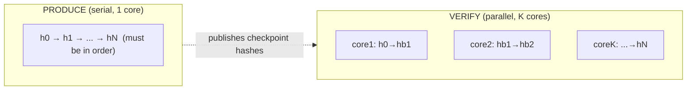

# PoH Math — The Hash Chain, Precisely

> Deep-dive. The exact mechanics behind `proof-of-history.md`. What is computed, what the
> constants mean, why it's secure, and how verification math works out.

---

## 0. TL;DR

PoH = iterated SHA-256: `h_{i} = sha256(h_{i-1})`. The **count** of iterations is a proof of
elapsed sequential time because SHA-256 is **not parallelizable in the forward direction** and
has no shortcut. Events are bound to a position by mixing: `h = sha256(h_prev || data)`.
Verification is parallel: split the chain into chunks, re-hash each chunk on its own core,
check endpoints. Producer cost O(N) serial; verifier cost O(N/K) on K cores.

---

## 1. The recurrence

Let `H(x)` = SHA-256 (256-bit output). Seed `h_0` (e.g. genesis hash). Then:

```text
h_i = H(h_{i-1})          for a plain tick
```

Define the **counter** `i` as the number of hashes performed. The pair `(h_0, i, h_i)` is a
claim: "I performed `i` sequential SHA-256 invocations starting from `h_0` and arrived at
`h_i`." Anyone can check it by recomputing.

### Mixing data (binding an event)

To pin event data `d` (e.g. a transaction hash) at step `i`:

```text
h_i = H(h_{i-1} || d)     // '||' = byte concatenation
```

Now `h_i` depends on **both** the prior chain state and `d`. You cannot have produced `h_i`
before knowing `d`, and everything after `h_i` is "after `d`." That's the timestamp.

> Subtlety: only the *hash* of the event is mixed, not the full payload. The chain proves
> *position*; the entry stream carries the *payload*. Commit-then-reveal in spirit.

---

## 2. Why it can't be parallelized (forward)

To compute `h_i` you need `h_{i-1}`. To compute `h_{i-1}` you need `h_{i-2}`. Strict data
dependency — a **chain**, not a tree. No amount of cores lets you compute `h_1000` before
`h_999`, because the input to step 1000 *is* the output of step 999.

This is the **inherently sequential** property. Compare a Merkle tree (parallelizable: leaves
independent) — PoH is deliberately the opposite. Sequentiality is the feature: it's what makes
"N hashes" mean "N units of real time on one core."

Security rests on: **SHA-256 has no known shortcut** (no way to jump K steps ahead cheaper
than doing K hashes) and is **preimage/collision resistant** (can't fabricate a `d` that lands
a chosen `h_i`, can't splice two chains together undetectably).

---

## 3. The constants: hashes_per_tick, ticks_per_slot

Real PoH isn't one hash per recorded entry — that'd be huge. It batches:

```text
hashes_per_tick   : how many raw H() iterations between recorded "tick" hashes
ticks_per_slot    : how many ticks make one slot (~400ms)
```

- A **tick** records `(num_hashes, hash)` — it compresses `hashes_per_tick` raw iterations into
  one logged checkpoint. Pure ticks advance the clock with no txs.
- `ticks_per_slot` reached → slot ends. This is what bounds a slot to ~400 ms: you can only fit
  so many sequential hashes into the wall-clock window at the hardware's hash rate.
- These live in the **genesis config** (`PohConfig` / `target_tick_duration`,
  `hashes_per_tick`). They're network parameters, not per-block choices.

```text
slot = ticks_per_slot ticks
tick = hashes_per_tick raw H() iterations
slot ≈ ticks_per_slot × hashes_per_tick raw hashes ≈ 400 ms of single-core hashing
```

---

## 4. Worked numbers

Assume (illustrative): hash rate R = 5,000,000 H()/s, `hashes_per_tick` = 12,500,
`ticks_per_slot` = 64.

- Time per tick = 12,500 / 5,000,000 = **2.5 ms**.
- Time per slot = 64 × 2.5 ms = **160 ms** of pure hashing.
  (Real mainnet targets ~400 ms with different constants + execution overhead.)
- A tx mixed at tick 30 of a slot is provably after tick 29's checkpoint and before tick 31's.
  Resolution of "when" = one tick = `hashes_per_tick` hashes.

The point: **time resolution is tunable** by the constants. Smaller `hashes_per_tick` → finer
timestamps but more logged checkpoints (bigger blocks). It's a precision/size tradeoff.

---

## 5. Verification math (the asymmetry)

Producer: O(N) **serial** — must do every hash in order. This is unavoidable and intentional.

Verifier with K cores: split `[h_0 .. h_N]` at boundaries `b_0=0 < b_1 < ... < b_K=N`. The
producer already published the checkpoint hashes at those boundaries (the tick hashes!). So
core `j` independently recomputes `[h_{b_j} .. h_{b_{j+1}}]` starting from the **published**
`h_{b_j}` and checks it reaches the **published** `h_{b_{j+1}}`.

```text
core 1: recompute h_0    → h_{b1}, assert == published h_{b1}
core 2: recompute h_{b1} → h_{b2}, assert == published h_{b2}
...
core K: recompute h_{b_{K-1}} → h_N, assert == published h_N
```

All chunks independent → wall-clock verify ≈ N/K hashes. A GPU with thousands of cores
verifies a chain a single CPU produced, far faster than it was produced. **This asymmetry is
why a slow sequential clock is cheap for the whole network to audit.**



---

## 6. What PoH does NOT prove

- **Not validity.** PoH says "this came before that," not "this tx is valid / well-funded."
  Validity = replay/execute the ordered txs.
- **Not uniqueness of fork.** Two leaders could each build a chain; PoH proves each one's
  internal order, not which fork wins. Fork choice = Tower BFT.
- **Not wall-clock accuracy.** PoH measures *its own hashing*, not UTC. `blockTime` is an
  estimate reconciled with validator clocks. PoH is a *relative* clock (ordering), good enough
  because order is what matters for a ledger.
- **Not VDF-grade.** PoH is a "delay-ish" function but assumes the leader is honestly hashing
  forward; it's not a full verifiable delay function with adversarial unforgeability of *length*
  beyond "you did the hashes." Security leans on the rest of consensus too.

---

## 7. Relation to this repo

Programs don't touch PoH math, but two artifacts are downstream of it:

- **`recent_blockhash`** = a published tick/slot hash. The ~150-slot TTL is "this many ticks of
  the clock," enforced by the runtime, visible in every `scripts/*.ts` tx build.
- **`Clock` sysvar** (`unix_timestamp`, `slot`) read by oracle epochs + treasury attestation
  freshness is the *reconciled* clock derived from PoH tick/slot progression — the `blockTime`
  estimate, not raw hash counts. SKILL invariant #5 minimizes how often you syscall it.

---

## 8. One-paragraph recall

PoH is `h_i = sha256(h_{i-1})`, made into a clock because SHA-256 forward iteration is strictly
sequential with no shortcut, so the iteration count proves elapsed single-core time; events are
pinned by mixing `sha256(h_prev || data)`. Constants `hashes_per_tick` and `ticks_per_slot`
(genesis config) set time resolution and the ~400 ms slot. Production is O(N) serial by design;
verification is O(N/K) parallel because the producer publishes checkpoint hashes that let K
cores re-hash chunks independently. PoH proves *order*, not validity, fork choice, or UTC — and
the repo only sees it as `recent_blockhash` TTL and the derived `Clock` sysvar.
