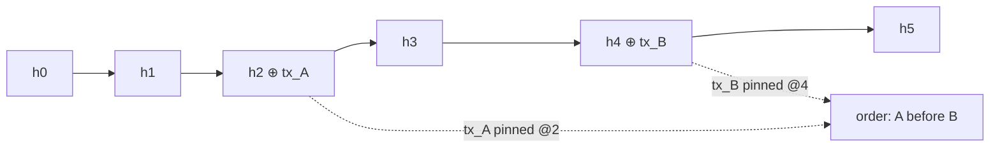
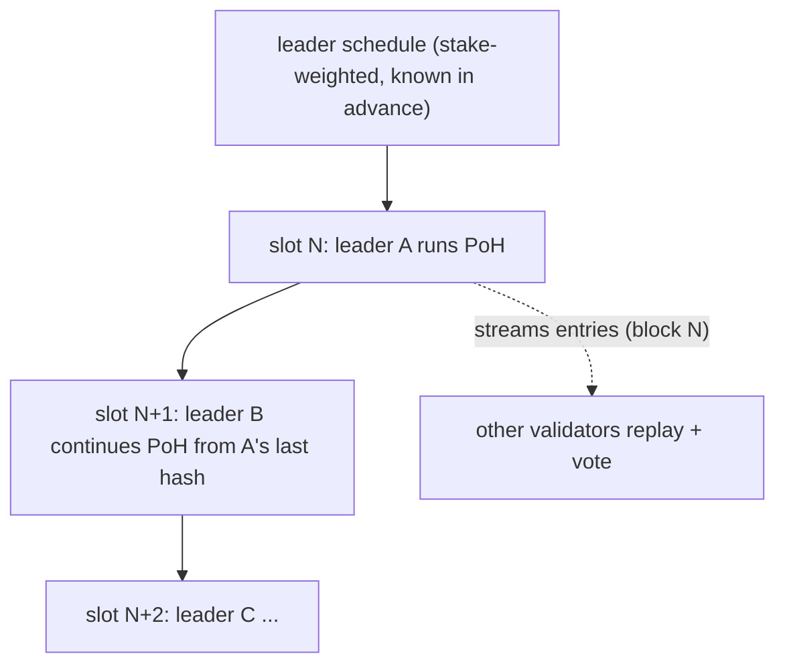

# Proof of History (PoH) — The Clock That Makes Solana Fast

> Deep-dive learning doc. PoH is the single idea that lets Solana order transactions
> **without validators voting on order first**. Everything fast about Solana traces back here.

---

## 0. TL;DR

PoH is a **verifiable clock built from a hash chain**. One validator (the slot leader)
runs SHA-256 in a tight, non-stop loop. Each output feeds the next input, so the chain
*cannot* be precomputed — producing N hashes proves N units of time elapsed, sequentially.
Transactions get mixed into the loop, which stamps them into a global, tamper-evident order.
Other validators replay the chain in **parallel** to verify it fast.

Result: ordering is decided by **one machine running a clock**, not by a network round of
votes. No back-and-forth consensus on "what came first." That removes the biggest latency
source in classic blockchains.

---

## 1. The problem PoH solves

In a distributed ledger, the hard question is not "is this transaction valid" — it's
**"in what ORDER did things happen?"**

- Bitcoin: order = whatever the next mined block contains. ~10 min/block. Order is slow and
  probabilistic (reorgs happen).
- Classic BFT (Tendermint, etc.): validators **message each other** every round to agree on
  order. O(n²) messages. Agreement is correct but chatty → latency grows with validator count.
- Ethereum (pre/post merge): global serial execution + slot voting. Still needs agreement on
  ordering before/around execution.

The shared cost: **agreeing on time/order requires communication.** Every validator must hear
from others before it knows the order. Communication = latency.

**PoH's bet:** if you can *prove* time passed and *prove* an event happened at a specific
point in that time — using only math, no messages — then you don't need to ask anyone.
Order becomes a verifiable fact baked into a hash chain.

---

## 2. The core trick: a hash chain is a clock

Take any pre-image-resistant hash (SHA-256). Feed its own output back in, forever:

```text
h0 = sha256(seed)
h1 = sha256(h0)
h2 = sha256(h1)
h3 = sha256(h2)
...
hN = sha256(h_{N-1})
```

Two properties make this a clock:

1. **Sequential / non-parallelizable.** You cannot compute `h3` without first computing `h2`.
   SHA-256 has no shortcut. So to reach `hN` you MUST perform N hashes one after another.
   N hashes = a fixed amount of wall-clock work = **a measure of time.**

2. **Verifiable.** Anyone given `h0` and `hN` (plus the count N) can check the chain. And —
   crucially — verification *can* be parallelized (see §6), even though *production* cannot.

So the count `N` is literally a **tick count**. The hash chain is a stopwatch nobody can
fast-forward. This is the "Proof of History": the chain *proves* a duration elapsed.

> Analogy: like being forced to count out loud 1, 2, 3, ... You can't skip to 1,000,000
> instantly. If I hear you reach 1,000,000, I know real time passed. And I can split the
> recording among friends to check you didn't cheat.

---

## 3. Stamping events into the clock

A clock alone isn't enough — you need to pin **transactions** to points on it.

To record that event `E` (a transaction, or a batch's hash) happened "now," **mix it into
the loop**:

```text
hk   = sha256(h_{k-1})              // normal tick
hk+1 = sha256(h_k || hash(E))       // tick that ALSO absorbs event E
hk+2 = sha256(h_{k+1})              // back to normal ticks
```

What this proves:

- `hash(E)` is now baked into the chain at position `k+1`.
- Everything before `k+1` was computed **before** E was known.
- Everything after `k+1` was computed **after**.

So E is provably **sandwiched** between two counts. Its position in the global order is now a
mathematical fact — no validator had to vote "E came before F." If `hash(E)` sits at count
`k+1` and `hash(F)` sits at count `k+9`, then **E strictly precedes F.** Done. No messages.



This is the sentence from the short version, expanded:
*"hash = sha256(prev_hash || tx_hash) → everyone knows tx happened BETWEEN two hash counts."*

---

## 4. Who runs the loop? The leader + slots

PoH is produced by **one validator at a time**, the **slot leader**.

- Time is chopped into **slots** (~400 ms each on mainnet).
- A **leader schedule** is computed ahead of time, stake-weighted, deterministic. Everyone
  knows who leads slot 12,345,678 before it arrives.
- During its slot, the leader:
  1. runs the PoH loop continuously (the ticking),
  2. pulls incoming transactions, executes them, mixes their hashes into the loop,
  3. packs the resulting ticks + transactions into **entries**,
  4. streams those entries (the "block" for that slot) to the rest of the cluster.

Because only the leader appends, there's **no contention over who writes next** during the
slot. The schedule already answered that question. When the slot ends, leadership passes to
the next scheduled validator, whose PoH continues from the previous blockhash.



> "Blockhash" in Solana = the **last PoH hash of a slot**. That's why a transaction carries a
> `recent_blockhash`: it's naming a recent point on the PoH clock. If that point is older than
> ~150 slots, the tx is too stale and gets rejected (built-in TTL + replay protection).

---

## 5. Why this makes Solana fast (the payoff)

Classic chains interleave **two** expensive things: *agreeing on order* and *agreeing on
validity*. PoH **separates** them.

- **Ordering** is produced unilaterally by the leader's clock — zero inter-validator messages
  to decide "what came first." It's just there, in the hash chain.
- **Consensus (voting)** still happens — validators vote on which fork to finalize via Tower
  BFT — but they vote on an **already-ordered** stream. They're confirming, not negotiating
  order. Votes can lag behind block production without stalling it.

Removing "negotiate the order" from the hot path is the whole game. Throughput stops being
bound by O(n²) ordering chatter and becomes bound by how fast a leader can hash + execute and
how fast others can replay.

Compare:

| Step                        | Bitcoin        | Classic BFT        | Solana (PoH)                 |
|-----------------------------|----------------|--------------------|------------------------------|
| Decide order of txs         | mined block    | multi-round voting | leader's hash chain (no msgs)|
| Cost of ordering            | ~10 min        | O(n²) messages     | O(1) per tick, local         |
| Verify order later          | re-check PoW   | re-check votes     | replay hash chain (parallel) |
| Time source                 | block interval | wall clocks + msgs | PoH tick count = the clock   |

---

## 6. Production is serial, verification is parallel

The asymmetry that makes PoH practical:

- **Producing** the chain is strictly sequential (one core, can't skip). That's the *point* —
  it's what proves elapsed time.
- **Verifying** it is **embarrassingly parallel.** Give the chain to a many-core / GPU
  validator. Split the chain into chunks `[h0..h1000]`, `[h1000..h2000]`, ... Each core
  re-hashes its chunk independently and checks the endpoints match. A leader spends, say, T
  time producing; a verifier with K cores spends ~T/K checking.

So one slow sequential producer is cheaply audited by fast parallel consumers. The network
can keep up with a leader that's hashing as fast as a single core allows, because everyone
else verifies in parallel.

```text
Producer (leader):   h0 → h1 → h2 → ... → hN        (serial, 1 core, IS the clock)
Verifier (others):   [h0..hk] [hk..h2k] [h2k..h3k]  (parallel, K cores, just checking)
                       core1     core2     core3
```

---

## 7. Common misconceptions

- **"PoH is the consensus algorithm."** No. PoH is a **clock / ordering** mechanism.
  Consensus (fork choice + finality) is **Tower BFT**, layered on top. PoH makes that voting
  cheap by pre-ordering everything.
- **"PoH replaces Proof of Stake."** No. Solana is **PoS** for who-gets-to-lead and
  voting weight. PoH is orthogonal — it's the timing layer. PoS picks leaders; PoH is what a
  leader produces.
- **"PoH prevents double-spends by itself."** No. PoH gives **order**. Validity (balances,
  signatures, double-spend) is decided by **executing** the ordered transactions. Order first,
  then execute deterministically.
- **"The hash chain stores the transactions."** Not exactly — it stores *commitments*
  (`hash(E)`) that pin position. The actual tx data rides alongside in entries. The chain
  proves *when/where*, the entries carry *what*.
- **"Faster CPU = cheat the clock."** A faster single core ticks faster, but the leader
  schedule + slot timing + the network's verification bound how this is used; you can't
  fabricate a *longer* history than you actually computed, and you can't parallelize
  production to leap ahead.

---

## 8. Worked micro-example (numbers made up for intuition)

Say a leader hashes at 5,000,000 SHA-256/sec, and a slot is 400 ms.

- Ticks per slot ≈ 5,000,000 × 0.4 = **2,000,000 hashes** worth of "time."
- A tx arriving 100 ms into the slot lands near count ≈ 1,250,000 / 2,000,000 of the way in.
- A tx arriving 300 ms in lands near count ≈ 1,500,000.
- The chain *proves* the first preceded the second — by 250,000 hashes — and any verifier can
  confirm by replaying just that chunk. No clocks compared, no messages exchanged.

(Real Solana inserts periodic ticks at a fixed `hashes_per_tick` and a fixed `ticks_per_slot`;
the exact constants live in the genesis config. Magnitudes above are illustrative.)

---

## 9. How this connects to the GridTokenX programs in this repo

PoH isn't something the Anchor programs *call* — it's the substrate they run on. But it
explains design choices you see across `programs/`:

- **`recent_blockhash` TTL.** Every script/test that builds a tx names a recent blockhash =
  a recent PoH point. Stale → rejected. The ~150-slot window is a PoH-clock distance.
- **`Clock::get()` and `unix_timestamp`.** The oracle's 15-min market-clearing epochs and
  treasury's attestation freshness (`now − attestation_ts ≤ ttl`) read the runtime `Clock`
  sysvar, whose `unix_timestamp`/slot are derived from PoH progression. SKILL invariant #5
  ("hoist `Clock::get()` before `emit!`") is about *reading that clock* efficiently.
- **Ordering is free, contention is not.** PoH gives a total order cheaply, but **execution**
  of that order still serializes any txs that touch the *same* account. That's exactly why the
  repo pushes hot writes to **per-entity PDAs** (`MeterState`, `Order`, `*Shard`) and keeps
  global config read-only on hot paths (SKILL invariant #3). PoH ordered them; Sealevel runs
  the non-overlapping ones in parallel. Funnel them to one account and you throw the parallel
  win away — order was never the bottleneck, the shared account is.

Mental bridge: **PoH decides *when*; the account model decides *how parallel*.** Both must
cooperate for the energy-trading throughput this repo targets.

---

## 10. One-paragraph recall

PoH is a SHA-256 hash chain that can't be precomputed, so its length proves elapsed time;
mixing transaction hashes into the chain pins them to exact points, producing a global order
*without any validator voting on order*. One scheduled leader produces the chain serially per
~400 ms slot; everyone else verifies it in parallel and votes (Tower BFT) on the
already-ordered stream. Removing order-negotiation from the hot path is why Solana is fast.
PoS picks leaders, PoH times them, Sealevel executes the ordered txs in parallel — and that
last step is why this repo shards state into per-entity PDAs instead of global counters.
