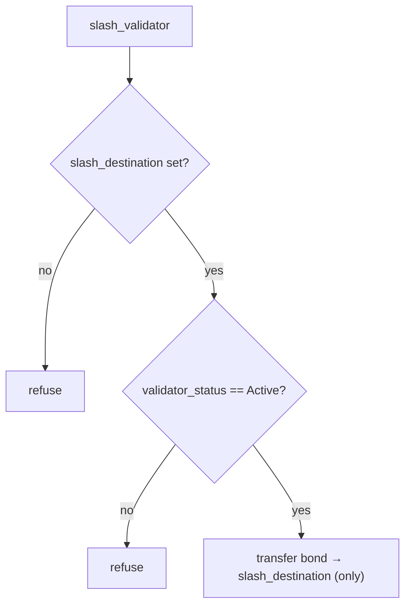

# Registry Staking & Slash — Validator Bonds, Not Yield

> Deep-dive. Registry's validator security-bond staking vs treasury yield staking, slashing,
> slash→treasury redistribution, the slash-destination guard. Source: CLAUDE.md.
> (Verify against `programs/registry/src/`.)

---

## 0. TL;DR

Registry staking is a **validator security bond**: GRX locked to back validator honesty, gated by
`MIN_VALIDATOR_STAKE`, **no yield**, **slashable** for misbehavior, held in `[b"grx_vault"]`,
tracked on `UserAccount.staked_grx`. It's **deliberately separate** from treasury's yield staking
(`treasury-peg-mechanics.md`) — same lock/unlock/slash plumbing, different product. Slashing sends
the bond to a configured `slash_destination` (the treasury `reward_vault`), and the registry
**refuses to slash until that destination is set**, only slashes **Active** validators, and only
sends to the configured destination — no misroute.

---

## 1. Purpose: skin in the game for validators

In a permissioned PoA cluster, validators are admitted — but admission alone doesn't deter
misbehavior. A **security bond** does: a validator must lock GRX; misbehave → lose it.

- Gated by **`MIN_VALIDATOR_STAKE`** = `10_000_000_000_000` base units = **10,000 GRX** (9-dec)
  (`registry/src/lib.rs:28`) — can't register as validator below the bond floor.
- **No reward** — this isn't an investment; it's collateral at risk. (Yield staking is a separate
  product in treasury.)
- **Slashable** — protocol can confiscate the bond for provable misbehavior.

```mermaid
graph LR
    V["user"] -->|stake_grx ≥ MIN_VALIDATOR_STAKE| GV["grx_vault [b'grx_vault']"]
    GV -. tracked on UserAccount.staked_grx .- V
    V -->|register_validator| ACTIVE["validator_status = Active"]
    ACTIVE -->|misbehavior| SLASH["slash_validator"]
```

---

## 2. Two staking systems — the critical distinction

(Mirror of `treasury-peg-mechanics.md` §5 — repeated because it's the #1 confusion.)

| | Registry staking (here) | Treasury staking |
|--|-------------------------|------------------|
| Product | **validator security bond** | **yield** staking |
| Reward | **none** | swap-fee yield |
| Gate | `MIN_VALIDATOR_STAKE` | open |
| Slash | **yes** | no |
| Vault | `[b"grx_vault"]` | `[b"stake_vault"]` |
| Tracked on | `UserAccount.staked_grx` | `StakePosition` |

**Same lock/unlock/slash plumbing, different products. A user may hold both. No shared vault or
position; not reconciled.** Do **not** merge them.

---

## 3. Slashing rules (the guards)

`slash_validator` confiscates a validator's bond. Hardened guards (CLAUDE.md):

1. **Destination must be set.** The registry **refuses to slash** until `slash_destination` is
   configured (via `set_slash_destination`). No slashing into the void.
2. **Only Active validators.** Slashes only accounts whose `validator_status == Active`. Can't
   slash an already-exited / inactive validator.
3. **Only to the configured destination.** Sends slashed GRX **only** to the set
   `slash_destination` — no misroute to an attacker-supplied account.

Slash paths were recently **deduped** (commit `0b470fa`: "dedup slash paths") and a user_account
binding added — so multiple code paths can't diverge in their checks.



---

## 4. Slash → treasury redistribution

The slashed bond doesn't vanish — it's **redistributed to honest stakers**:

- `init-treasury.ts` wires `registry::set_slash_destination` to point at the treasury
  **`reward_vault`**.
- `slash_validator` performs a **plain SPL token transfer** of the bond to that vault — **not** a
  CPI into treasury (`cpi-flow.md` §6: token movement ≠ CPI invoke).
- Afterward, redistribute to yield stakers via treasury **`fund_rewards`** (feeds the MasterChef
  accumulator, `treasury-peg-mechanics.md` §4).

```mermaid
graph LR
    SLASH["registry slash_validator"] -->|SPL transfer (not CPI)| RV["treasury reward_vault"]
    RV -->|fund_rewards| STAKERS["yield stakers earn the slashed GRX"]
```

So misbehavior penalty → honest-staker reward. Security bond economics close the loop.

---

## 5. Lifecycle

```text
stake_grx (≥ MIN_VALIDATOR_STAKE) → grx_vault, UserAccount.staked_grx ↑
register_validator → validator_status = Active
   ... misbehavior detected ...
slash_validator → bond → slash_destination (treasury reward_vault), status updated
   OR
unstake_grx (honest exit) → bond returned, status → inactive
```

Unlock/slash share plumbing with treasury staking but operate on registry's own vault + position.

---

## 6. Pitfalls

- **Confusing with yield staking** → registry bond has **no reward** and **is slashable**; don't
  reconcile with treasury `StakePosition`.
- **Slashing without a destination** → refused by design; set `slash_destination` first
  (`init-treasury.ts`).
- **Slashing inactive validators** → only `Active` are slashable.
- **Treating slash as a CPI** → it's a token transfer to `reward_vault`, not an `invoke` into
  treasury.
- **Below `MIN_VALIDATOR_STAKE`** → can't register as validator; bond floor enforced.
- **Forgetting redistribution** → slashed GRX sits in `reward_vault` until `fund_rewards`
  distributes it.

---

## 7. One-paragraph recall

Registry staking is a **validator security bond** — GRX locked (≥ `MIN_VALIDATOR_STAKE`) in
`[b"grx_vault"]`, tracked on `UserAccount.staked_grx`, **no yield**, **slashable** — deliberately
separate from treasury's yield staking (same plumbing, different product, never merged).
`slash_validator` is guarded: it **refuses until `slash_destination` is set**, slashes **only
Active** validators, and sends **only** to the configured destination (deduped in `0b470fa`). That
destination is the treasury **`reward_vault`** (wired by `init-treasury.ts`) via a plain **SPL
transfer, not a CPI**; slashed bonds are then redistributed to honest yield stakers through
treasury `fund_rewards` — turning a misbehavior penalty into staker reward.
