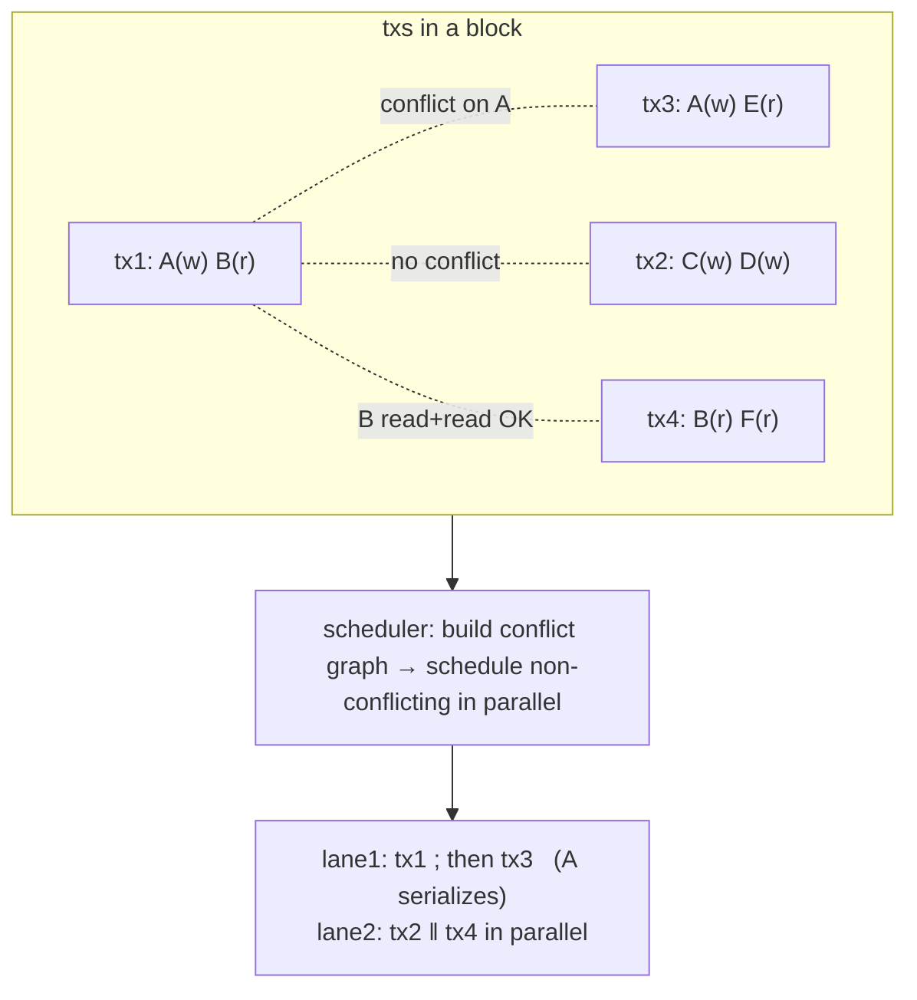
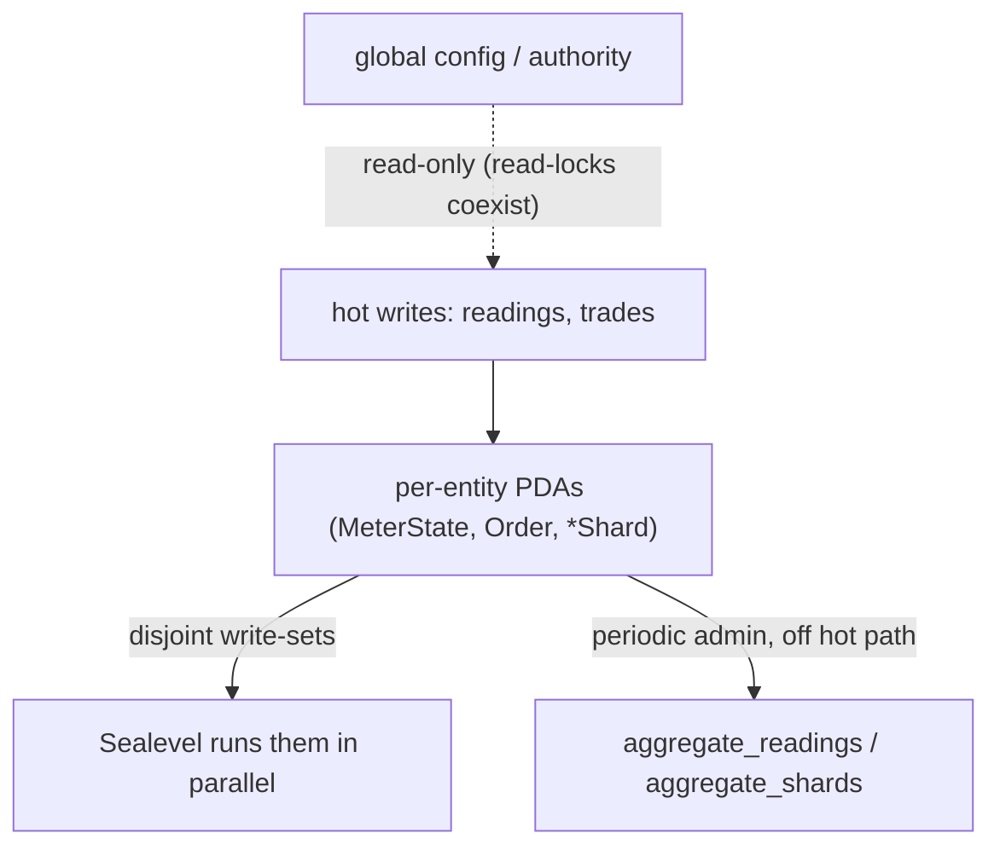

# Sealevel Scheduling — How Solana Runs Transactions in Parallel

> Deep-dive. Why declaring accounts upfront lets Solana parallelize execution, how the
> read/write lock model schedules txs, and why this repo shards state into per-entity PDAs.

---

## 0. TL;DR

Every Solana transaction **declares every account it will touch, and whether read or write,
upfront**. The runtime (**Sealevel**) treats accounts like a read/write lock table: txs whose
write-sets don't overlap run **in parallel** across cores; txs that contend on the same writable
account **serialize**. Order comes from PoH; *parallelism* comes from non-overlapping account
sets. So the way to scale is to **spread writes across many accounts** — exactly why this repo
uses per-entity PDAs and 16-way shards instead of global counters.

---

## 1. The enabling trick: accounts declared upfront

A Solana instruction is `{ program_id, accounts[], data }`. The `accounts[]` list is **complete
and explicit** — the tx names *every* account it reads or writes, each flagged:

- **writable** or **read-only**
- **signer** or not

This is unusual. Ethereum txs don't pre-declare touched storage — the EVM discovers it *during*
execution, so the runtime can't know in advance what conflicts, and must run serially. Solana
**requires** the declaration, so the scheduler knows the conflict graph **before** executing a
single instruction.

```text
tx1 accounts: [A(w), B(r), sysvar(r)]
tx2 accounts: [C(w), D(w)]
tx3 accounts: [A(w), E(r)]      # writes A → conflicts with tx1
```

---

## 2. The lock model

Sealevel acquires locks per account per tx, like a database:

| Access pattern on same account | Conflict? | Run together? |
|--------------------------------|-----------|---------------|
| read + read                    | no        | ✅ parallel    |
| read + write                   | yes       | ❌ serialize   |
| write + write                  | yes       | ❌ serialize   |

Rule: **multiple readers OK; any writer is exclusive.** A tx can run in parallel with another
iff their account sets don't have a read/write or write/write clash on any shared account.

From §1's example:
- tx1 (writes A) and tx2 (writes C,D) → disjoint → **parallel**.
- tx1 (writes A) and tx3 (writes A) → both write A → **serialize**.
- tx2 and tx3 → disjoint → **parallel**.



---

## 3. The scheduler pipeline (banking stage)

Inside the leader, executing a slot's txs:

1. **Read account lists.** For each tx, collect its writable + read-only keys.
2. **Acquire locks.** Try to lock all of a tx's accounts (write-lock writables, read-lock
   read-onlys). If any conflict with an already-locked account in the current batch → defer the
   tx to a later batch.
3. **Dispatch non-conflicting txs to threads.** A batch of mutually non-conflicting txs runs
   across worker threads simultaneously (one tx per core, many cores).
4. **Execute in the BPF VM.** Each tx's program runs in the sandboxed SVM; it can only touch the
   accounts it declared (runtime enforces — touching an undeclared account = error).
5. **Commit + release locks.** Apply state changes, drop locks, pull the next batch (deferred
   conflicting txs now get their turn).

The conflict graph is rebuilt per batch; high-contention accounts become the serialization
bottleneck.

---

## 4. Order vs parallelism — keep them separate

Two different guarantees, often confused:

- **Order** (from PoH): there is a single global sequence of txs. Deterministic.
- **Parallelism** (from Sealevel): *independent* txs in that sequence execute simultaneously,
  but the **result is as if they ran in the PoH order** (because non-conflicting txs can't
  observe each other's effects — that's the whole definition of non-conflicting).

So parallel execution doesn't change outcomes; it just uses idle cores on txs that provably
can't interfere. Conflicting txs still apply in PoH order, serially.

---

## 5. The contention failure mode (why global accounts kill throughput)

If many txs all **write the same account**, Sealevel must serialize all of them — no
parallelism, regardless of core count. The account becomes a global mutex.

```text
BAD:  10,000 trades all do `global_counter += 1`
      → all write `global_counter` → all serialize → throughput = 1 core's rate

GOOD: 10,000 trades each write their OWN `Order` PDA
      → disjoint write-sets → run across all cores → throughput scales
```

This is *the* Solana scaling lesson: **shard your writes.** Hot, frequently-written state must
live in many independent accounts, not one.

---

## 6. How this repo applies it (SKILL invariant #3)

The whole `programs/` layout is shaped by Sealevel:

- **Per-entity hot PDAs.** Meter readings → each meter's own `MeterState`. Trades → each order's
  own `Order` / `OrderNullifier`. Different entities ⇒ different accounts ⇒ parallel. Two meters
  reporting in the same block don't serialize.
- **16-way sharded counters.** Where a global total *is* needed, the registry splits it into 16
  `*Shard` accounts; shard select = `authority.to_bytes()[0] % num_shards`. A user's writes hit
  one shard; 16 shards ⇒ up to 16× the parallelism of a single counter. `aggregate_shards`
  later sums them (admin path, off the hot path).
- **Global config is read-only on hot paths.** Config/authority accounts are read (read-locks
  share fine), never written during trades/readings. Writing them would serialize everything
  that reads them.
- **Stale-on-purpose totals.** Global totals are reconciled periodically (`aggregate_readings`,
  `aggregate_shards`) precisely so the hot path never write-locks a shared total. Exactness is
  traded for parallelism, then restored off-band.



---

## 7. Practical rules for writing instructions here

- **Minimize writable accounts.** Mark accounts `mut` only when truly written. A needless `mut`
  takes a write-lock and serializes against every other toucher.
- **Never funnel hot writes to one PDA.** If a counter is hot, shard it. Use the
  `addr[0] % num_shards` pattern already in registry.
- **Keep config read-only on hot paths.** Read it, don't bump it per-tx. Reconcile later.
- **Declare exactly what you touch.** Undeclared account access errors out; over-declaring
  writables hurts parallelism. Tight account lists = better scheduling.
- **Watch account-list size + stack.** Fat contexts cost (and can overflow BPF stack —
  memory `settle-context-stack-limit`); `remaining_accounts` for variable/large sets.

---

## 8. One-paragraph recall

Solana txs declare every account they touch (read or write) upfront, so **Sealevel** builds the
conflict graph *before* executing: multiple readers of an account coexist, but any writer is
exclusive, so txs with disjoint write-sets run in parallel across cores while contending txs
serialize — all yielding the same result as PoH order. The scaling lesson is to **spread writes
across many accounts**; funneling many txs into one writable account makes it a global mutex and
kills throughput. This repo lives by that: per-entity hot PDAs (`MeterState`, `Order`), 16-way
sharded counters (`addr[0] % num_shards`), read-only global config on hot paths, and
periodic `aggregate_*` reconciliation of stale-on-purpose totals.
