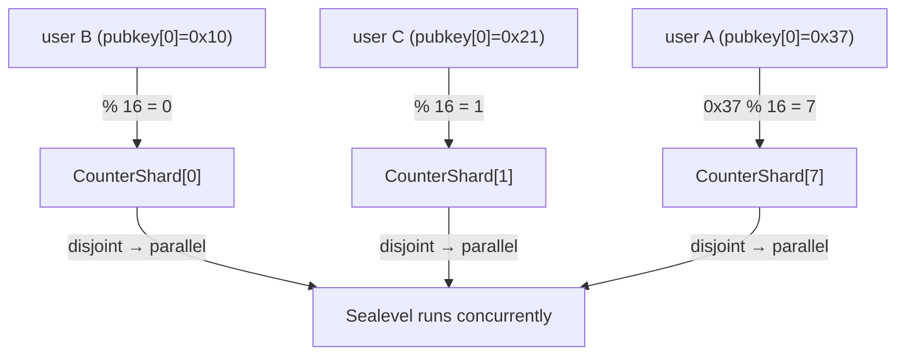
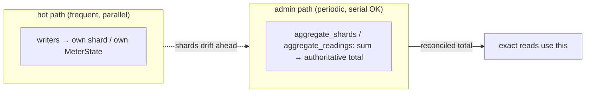

# Sharding & Aggregation — Stale-on-Purpose Totals

> Deep-dive. 16-shard counter, `authority.to_bytes()[0] % num_shards`, `aggregate_shards` /
> `aggregate_readings`, why global totals are intentionally stale. SKILL invariant #3 in depth.
> Builds on `sealevel-scheduling.md`. (Verify shard structs in `programs/registry/src/`.)

---

## 0. TL;DR

A global counter written by every tx is a **serialization bottleneck** (Sealevel must serialize
all writers of one account). Fix: split it into **N shards** (16 in registry), route each writer
to one shard by `authority.to_bytes()[0] % num_shards`, so up to N writers proceed in parallel.
The true total is then **spread across N accounts** — any single read is **stale by design**. A
periodic admin instruction (`aggregate_shards` / `aggregate_readings`) sums shards → the
authoritative total, **off the hot path**. Trade exact-now for parallel-now; reconcile later.

---

## 1. Why a global counter kills throughput

From `sealevel-scheduling.md`: any account written by a tx is **write-locked** for that tx; two
txs writing the same account **serialize**. A naive global counter:

```text
register_user:  global.user_count += 1     // every registration writes `global`
```

→ every registration write-locks `global` → all registrations serialize → throughput = one
core's rate, no matter how many cores. The counter becomes a global mutex.

---

## 2. The shard pattern

Split the one counter into N independent accounts, each a **per-shard PDA**:

```text
CounterShard[0], CounterShard[1], ..., CounterShard[15]   // 16 shards (registry)
```

Route each writer deterministically to one shard:

```rust
let shard_index = (authority.to_bytes()[0] as usize) % num_shards;   // 16
```

- `authority.to_bytes()[0]` = first byte of the writer's pubkey (uniformly distributed).
- `% 16` → shard 0..15. A given authority **always** hits the same shard (deterministic →
  derivable PDA, no lookup).
- Different authorities spread across shards → up to 16 writers run in parallel (disjoint
  write-sets).



16× the parallelism of a single counter (assuming even pubkey distribution).

---

## 3. The cost: no single source of truth on the hot path

Now "total users" isn't in one place — it's `sum(CounterShard[0..16])`. On the hot path you
**don't** compute the sum (that would read/lock all 16 → reintroduce contention). So:

- **Each shard is locally correct** for its slice.
- **The global total is stale** anywhere you look without summing — *on purpose*.
- Reads that need an exact total use the reconciled value, not a hot-path computation.

This is the SKILL #3 phrase "**global totals are stale on purpose**." You accepted staleness to
buy parallelism.

---

## 4. Reconciliation: aggregate_* (admin, off hot path)

A periodic, **non-hot-path** instruction sums the shards into an authoritative total:

- `aggregate_shards` — sum the 16 counter shards → global count.
- `aggregate_readings` — oracle-side: fold per-meter `MeterState` readings into aggregate
  energy totals for an epoch.

Run by an admin/cron, not per user action. It *does* touch many accounts (reads all shards), but
because it's infrequent and off the hot path, its serialization doesn't bottleneck normal traffic.



---

## 5. Choosing shard count

- **More shards** → more parallelism, but more accounts to create + a costlier aggregate.
- **16** (registry) balances parallelism vs aggregation cost for the expected writer rate.
- Shard key must be **uniform** — first pubkey byte is effectively random, so load spreads evenly.
  A skewed key (e.g. a low-entropy field) would hot-spot one shard, defeating the purpose.

---

## 6. When sharding does NOT help (important caveat)

Sharding only relieves the **specific** account that's contended. Memory
(`settlement-tps-zone-market-lock`): trading settlement TPS stayed flat despite §2c sharding
because the real serializer was the **`zone_market` mut lock**, not the sharded collectors —
settlement was **latency-bound** on that lock. Lesson: **profile to find the actual contended
write before sharding.** Sharding the wrong account adds complexity for zero gain.

---

## 7. Pitfalls

- **Summing shards on the hot path** → reintroduces the contention you sharded away. Don't.
- **Skewed shard key** → one hot shard; use a uniform field (pubkey byte).
- **Forgetting to aggregate** → the "total" drifts stale forever; schedule `aggregate_*`.
- **Assuming totals are exact mid-flight** → they're eventually-consistent; design reads around
  it.
- **Sharding the wrong account** → find the real serializer first (zone_market lesson).

---

## 8. One-paragraph recall

A global counter written by every tx serializes all writers (Sealevel write-lock), so this repo
**shards** it into N accounts (16 in registry), routing each writer by
`authority.to_bytes()[0] % num_shards` so up to N proceed in parallel — at the cost that the true
total is spread across shards and therefore **stale by design** on any hot-path read. Periodic
admin `aggregate_shards` / `aggregate_readings` sum the shards into an authoritative total off the
hot path. The shard key must be uniform, and — per the `zone_market` lesson — sharding only helps
the *actually* contended account, so profile before sharding.
