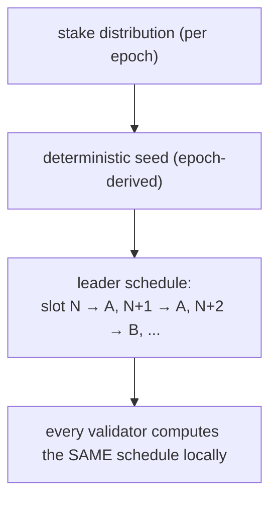
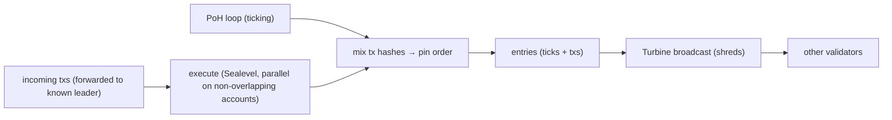
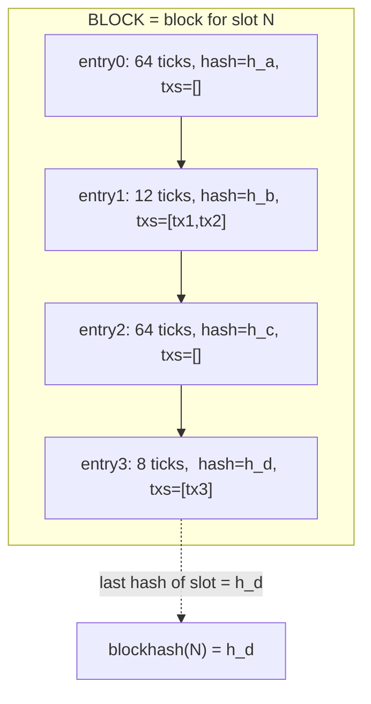
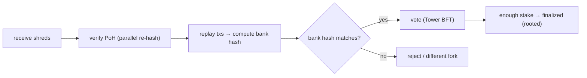
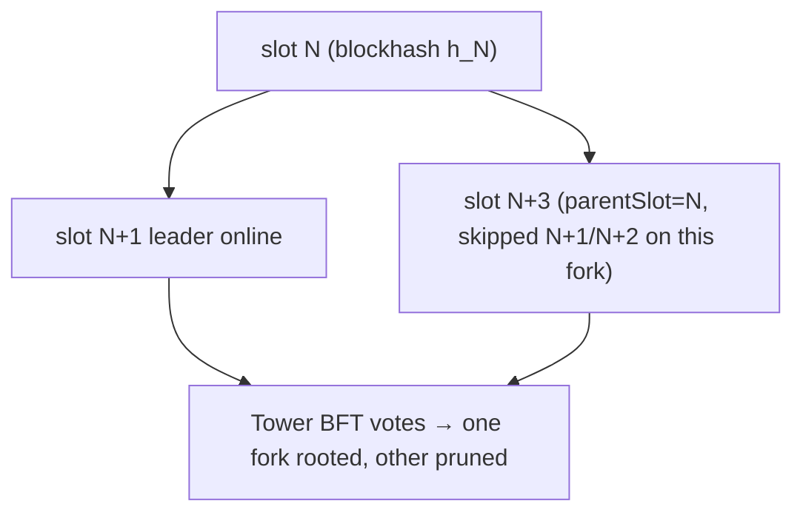

# Slot → Leader → Block — How a Solana Block Gets Built

> Deep-dive learning doc. Companion to `proof-of-history.md`. PoH gives the *clock*; this doc
> shows *who* runs it, *how* time is chopped, and *what* a "block" actually is on Solana.

---

## 0. TL;DR

Solana time is sliced into **slots** (~400 ms each). A **leader schedule**, computed ahead and
weighted by stake, assigns exactly one **leader validator** per slot. During its slot the
leader runs PoH, executes incoming transactions, packs them into **entries**, and streams that
bundle — the **block** for that slot — to everyone else. Other validators **replay** the block
to re-derive state and **vote** on it. There is **no Bitcoin-style block header struct**; the
"header" data (slot number, blockhash, parent_slot, block_time) is slot metadata, where
**blockhash = the last PoH hash produced in that slot.**

---

## 1. Slots: time is pre-chopped, not mined

A **slot** is a fixed ~400 ms window — the unit of "one turn to produce a block."

- Slots are numbered monotonically: ..., N, N+1, N+2, ... (`slot` = height).
- A slot is a **time box**, not a size box. Unlike Bitcoin (block = up to X bytes, arrives
  whenever PoW solved), a Solana slot ends when its time elapses — full, half-full, or empty.
- A slot **can be empty** (leader offline / skipped). The chain still advances; the next
  leader builds on the last *real* block.

```text
time ──────────────────────────────────────────────────────────►
 |  slot N  |  slot N+1 |  slot N+2 |  slot N+3 |  slot N+4 |
   ~400ms      ~400ms      ~400ms      ~400ms      ~400ms
   leaderA     leaderA     leaderB     (skipped)   leaderC
```

> Why ~400 ms? Short enough for low latency, long enough to amortize networking + leave PoH
> ticks for ordering. Leaders usually get a **run of consecutive slots** (a leader gets ~4 in
> a row) to avoid handoff overhead every 400 ms.

---

## 2. Leader schedule: who builds, decided in advance

Solana does **not** race to produce blocks. It **pre-assigns** producers.

- The **leader schedule** is computed **per epoch** (an epoch ≈ a couple days, many thousands
  of slots) *before the epoch begins*.
- It is **deterministic** and **stake-weighted**: more stake → more slots assigned. A validator
  with 2% of stake leads ~2% of slots.
- Because it's deterministic, **every node independently computes the same schedule** — no
  messaging needed to learn "who leads slot 12,345,678." Everyone already knows.



This is the second big latency win (PoH being the first): **no leader election round.** Classic
BFT spends messages picking a proposer each round. Solana looked it up.

> In this repo's permissioned **PoA** localnet cluster, the validator set is fixed/admitted,
> so the schedule is small and stable — but the mechanism is the same: deterministic,
> stake-/authority-weighted assignment, no election chatter.

---

## 3. Leader's job during its slot

When the clock enters a slot you lead, you do four things, continuously and in parallel:

1. **Tick PoH.** Run the SHA-256 loop non-stop (the clock from `proof-of-history.md`).
2. **Pull + execute transactions.** Take incoming txs (forwarded to you because you're the
   known leader), run them, mix their hashes into the PoH stream to pin their order.
3. **Pack entries.** Group ticks + executed transactions into **entries** (see §4).
4. **Broadcast.** Stream entries out via **Turbine** (Solana's block-propagation tree) so the
   cluster receives the block in shreds as it's produced — not all at once at slot end.



Key: production is **streaming**. The leader doesn't "finish a block then send." It emits
entries as it goes; the slot boundary just marks where this leader's contribution ends.

---

## 4. Entries: what a block is actually made of

A **block** is not one monolithic struct. It's the **ordered sequence of entries** produced
during the slot.

An **entry** is roughly:

```text
Entry {
  num_hashes: u64,   // how many PoH ticks since the previous entry (proves time gap)
  hash:       [u8;32], // the PoH hash at this point (the clock value)
  txs:        Vec<Transaction>, // 0..N transactions pinned at this hash (empty = a "tick entry")
}
```

- **Tick entries** (no txs) = pure clock advancement, inserted at a fixed `hashes_per_tick`
  rate. They guarantee the clock keeps moving even with no traffic.
- **Transaction entries** = a batch of txs whose hashes were mixed in at that PoH point.
- A slot has a fixed `ticks_per_slot`; reaching it ends the slot.

So "the block for slot N" = `[entry0, entry1, ..., entryK]`. Replaying them in order
reconstructs both **the PoH chain** (verify time/order) and **the state changes** (re-execute
txs). Two proofs in one stream.



---

## 5. Replay + vote: how others accept the block

Producing is one validator's job. **Accepting** is everyone's.

1. **Receive** shreds via Turbine, reassemble entries.
2. **Verify PoH.** Re-hash the chain (parallel, §6 of the PoH doc) — confirm `num_hashes` gaps
   and endpoint hashes are real. Catches a leader faking time/order.
3. **Replay txs.** Execute the transactions in the given order against local state. Because
   execution is deterministic, every honest validator lands on the **same resulting state /
   bank hash**. Mismatch → reject.
4. **Vote.** Cast a vote (a transaction itself) for this slot/fork under **Tower BFT**. Votes
   accumulate stake-weighted confirmations; enough → the block **finalizes** (rooted).



Note the order: **order is given (by PoH), validity is checked (by replay), then finality is
voted (by Tower BFT).** Three separated stages — that separation is the architecture's whole
point.

---

## 6. The "block header" — what it is and isn't

You asked about block headers. On Solana there is **no fixed header struct hashed by miners.**
The header-like metadata is **slot/bank metadata**, surfaced via RPC (`getBlock`):

| Field                | Meaning                                                                 |
|----------------------|-------------------------------------------------------------------------|
| `slot` / blockheight | the slot number — the block's position/height                           |
| `blockhash`          | **the last PoH hash produced in this slot** (NOT a hash of the header)  |
| `previousBlockhash`  | the blockhash of the parent block                                       |
| `parentSlot`         | the slot number this block builds on (may skip if slots were empty)     |
| `blockTime`          | estimated unix timestamp (derived from PoH + validator clocks)          |

Contrast with Bitcoin's header, field by field:

| Bitcoin header field | Solana equivalent                          |
|----------------------|--------------------------------------------|
| prev block hash      | `previousBlockhash` ✅ (similar idea)       |
| merkle root of txs   | ❌ none — txs live in entries, replayed     |
| timestamp            | `blockTime` (but real time comes from PoH)  |
| nonce / difficulty   | ❌ none — no PoW, no mining                  |
| bits (target)        | ❌ none                                      |

The deep difference: **Bitcoin's blockhash = SHA-256 of the header fields** (miners grind the
nonce to make it small). **Solana's blockhash = the last tick of the PoH clock** — it's a
*timestamp/ordering* value, not a mining puzzle output. That's why `recent_blockhash` in a
transaction works as a freshness/TTL token: it names a recent point on the clock, and the
runtime rejects txs whose named point is older than ~150 slots.

---

## 7. Forks, skips, and parent_slot

Because leaders stream optimistically and votes lag, **two valid blocks can briefly exist on
competing forks** (e.g., a leader didn't see the previous block in time). `parentSlot` records
which block this one extends. Tower BFT votes converge the network onto one fork; the others
are abandoned. `parentSlot` can be **non-consecutive** (e.g., parent = N, this = N+3) when
slots N+1/N+2 were skipped (leader offline). The chain is a tree until finality prunes it to a
line.



---

## 8. End-to-end: a transaction's ride through a block

1. Client builds tx with `recent_blockhash` = a recent PoH point (≤ ~150 slots old).
2. Tx forwarded to the **known upcoming leader** (no broadcast storm — schedule says who).
3. Leader **executes** it (Sealevel, parallel with non-conflicting txs), **mixes** its hash
   into PoH → order pinned.
4. Tx lands in an **entry**; entry streamed via **Turbine**.
5. Other validators **replay** the entry, recompute bank hash, **vote**.
6. Enough stake votes → slot **finalized**. Tx is now rooted, irreversible.
7. `getBlock(slot)` later shows the tx under that slot, with `blockhash` = the slot's last PoH
   hash.

---

## 9. How this maps to the GridTokenX programs in this repo

The Anchor programs in `programs/` are the **txs that ride inside entries** — they never see
slots/leaders directly, but the model explains their constraints:

- **`recent_blockhash` in every script/test.** `scripts/*.ts` and `tests/*.ts` fetch a recent
  blockhash before sending. That blockhash is a slot's last PoH hash; let it go stale (> ~150
  slots) and the tx is rejected — a slot-clock distance, not a wall clock.
- **`Clock` sysvar reads.** Oracle's 15-min clearing epochs and treasury's attestation
  freshness use `Clock::get()?.unix_timestamp` / slot — both produced by slot/PoH progression.
  SKILL invariant #5 (hoist `Clock::get()` before `emit!`) is about reading this slot clock
  without a syscall inside macro expansion.
- **Parallel execution is per-block, per-account.** Within a leader's slot, Sealevel runs
  non-overlapping txs in parallel. That's the runtime reason the repo shards hot writes into
  per-entity PDAs (`MeterState`, `Order`, `*Shard`) instead of a global counter (SKILL
  invariant #3). Two trades touching different `Order` PDAs can execute in the **same block**
  simultaneously; two trades hammering one global account serialize and waste the slot.
- **PoA cluster.** This repo runs a permissioned localnet — admitted validators, deterministic
  schedule, no public stake market — but slot → leader → block → replay → vote is the same
  pipeline, just with a fixed authority set.

---

## 10. One-paragraph recall

Solana chops time into ~400 ms **slots**; a deterministic, stake-weighted **leader schedule**
(computed per epoch, known to all) assigns one **leader** per slot. The leader ticks PoH,
executes txs, pins their order by mixing hashes into the clock, packs everything into **entries**,
and streams the bundle — the **block** — via Turbine. Others **replay** (verify PoH + re-execute
to match the bank hash) and **vote** (Tower BFT) to finalize. There's **no mined header**: the
"header" is slot metadata where **blockhash = the slot's last PoH hash**, `previousBlockhash`
links the parent, and `parentSlot` may skip empty slots. Order (PoH) → validity (replay) →
finality (vote) are three separated stages — and the parallel-execution stage is exactly why
this repo shards state into per-entity PDAs.
