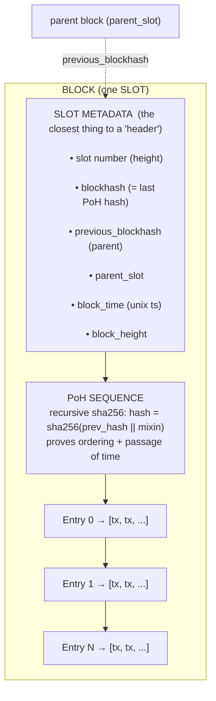
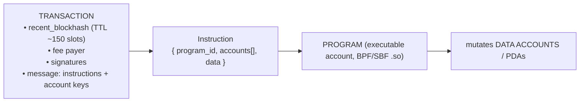
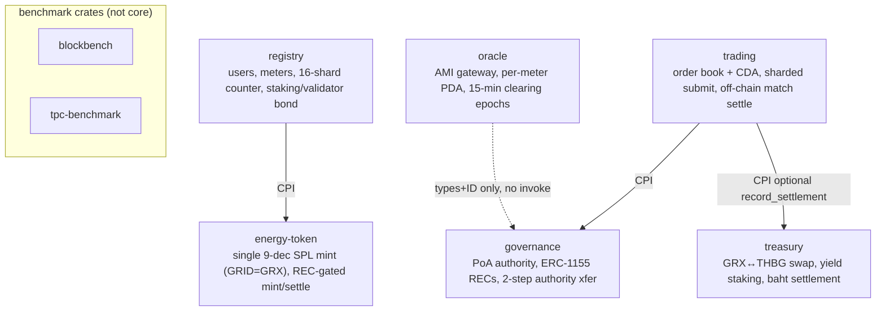
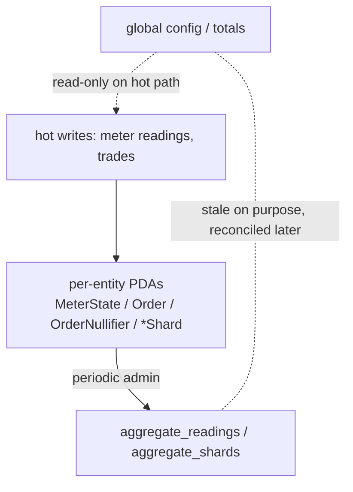

# Solana Block Anatomy + GridTokenX Programs

Solana has **no Bitcoin-style block header**. A "block" = the entries produced for one
**slot**, ordered by **Proof of History (PoH)**. The closest thing to a "header" at the
account level is Anchor's **8-byte discriminator** that prefixes every account's data.

---

## 1. Block / Slot structure (the "header" fields live in the slot metadata)



Key point: ordering/time come from **PoH**, not a nonce/difficulty header.
There is no mining header, no merkle-root-of-tx in a fixed header struct.

---

## 2. Transaction → invokes Programs (where YOUR code runs)



---

## 3. Account "header" — Anchor 8-byte discriminator

Every account this repo creates is prefixed by an 8-byte discriminator, then the struct.
Zero-copy state in this repo: `space = 8 + size_of::<T>()`.

```text
 ┌──────────────┬───────────────────────────────────────────┐
 │ 8-byte disc  │  account data (zero_copy #[repr(C)] Pod)   │
 │ sha256(...)  │  fields + manual _paddingN for alignment   │
 └──────────────┴───────────────────────────────────────────┘
   ^ the real "header"        ^ MeterState / Order / UserAccount / *Shard ...
```

---

## 4. GridTokenX programs in this repo (7) + CPI graph

5 core programs + 2 benchmark crates. IDs in `Anchor.toml [programs.localnet]`.



CPI edges (path deps, `features=["cpi"]`):
- `registry → energy-token`
- `trading → governance`
- `trading → treasury` (optional, fires only when treasury accounts passed)
- `oracle → governance` (validates AggregatorEntry PDA; **no** CPI invoke)

---

## 5. Hot-path parallelism (why per-entity PDAs, not global config)



Shard select: `authority.to_bytes()[0] % num_shards` (16 in registry).
Sealevel runs non-overlapping account sets in parallel → never funnel hot writes to one global account.
