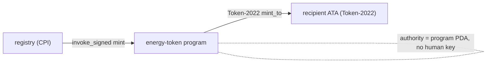

# SPL Token-2022 — The Energy Mint's Token Program

> Deep-dive. Token-2022 vs legacy SPL, ATAs, mint authority PDA, REC-gating, why tests must use
> `TOKEN_2022_PROGRAM_ID`. Memory: `integration-tests-token2022-ata`.
> (Verify mint/program ids in `programs/energy-token/src/` + bootstrap scripts.)

---

## 0. TL;DR

The energy mint (1 kWh = 1 GRID, 9 decimals) is an **SPL Token-2022** mint, not legacy SPL Token.
Token-2022 is a separate program (different program id) that is **mostly** API-compatible but
**not** drop-in: token accounts, ATAs, and the program id all differ. Mint authority is a
**program PDA**, and minting is **REC-validator-gated**. Tests/scripts must pass
`TOKEN_2022_PROGRAM_ID` (and the matching ATA derivation) or accounts won't resolve — a common
gotcha here.

---

## 1. Two token programs, pick one per mint

| | Legacy SPL Token | SPL Token-2022 (Token Extensions) |
|--|------------------|-----------------------------------|
| Program id | `Tokenkeg...` | `TokenzQd...` (different) |
| Extensions | none | transfer fees, hooks, metadata, confidential, etc. |
| Account layout | fixed | base + optional extension TLV |
| Compatibility | — | similar API, **different program id**, not byte-identical |

A mint is **owned by exactly one** of these programs. The energy mint is owned by **Token-2022**.
Every token account / ATA / CPI for it must target the **Token-2022** program — mixing legacy and
2022 fails (wrong owner).

---

## 2. Why it matters: program id flows everywhere

Because the program id differs, it propagates through every token operation:

- **Token accounts** are owned by Token-2022, not legacy → owner checks fail if you use the wrong
  program.
- **ATA derivation** includes the token program id as a seed → the Associated Token Account
  address is **different** under 2022 vs legacy. Derive with the 2022 id or you get the wrong
  address.
- **CPIs** (mint, transfer, burn) must invoke the Token-2022 program.

```text
ATA = find_pda(
  [ owner, TOKEN_PROGRAM_ID, mint ],          // ← TOKEN_PROGRAM_ID is a SEED
  ASSOCIATED_TOKEN_PROGRAM_ID
)
// legacy id vs 2022 id → DIFFERENT ATA address
```

Memory `integration-tests-token2022-ata`: tests need `TOKEN_2022_PROGRAM_ID`, their own
bootstrap, and a REC validator; `claim_airdrop` is a placeholder only at `count == 0`.

---

## 3. The energy mint specifics

From the program map:

- **One mint, two labels.** Single 9-decimal mint: **1 kWh = 1 GRID**; the same mint is also
  called **GRX** for its utility/collateral role (treasury consumes it as `grx_mint`). **One mint,
  not two** — don't create a second.
- **Mint authority = program PDA.** No human key mints; the energy-token program signs mints via
  `invoke_signed` over its authority PDA (`pda-derivation.md`).
- **9 decimals** → on-chain amounts are integer base units: 1 GRID = 1e9 base units. Math uses
  `checked_*` on `u64` base units.



---

## 4. REC-validator gating

Minting/settling energy tokens is **gated on REC-validator authorization** — you can't mint GRID
out of nothing; a registered REC (Renewable Energy Certificate) validator must authorize the
generation. The energy-token program checks this gate before minting (recently deduped — commit
`6d326be` "dedup REC-validator gate; bind mint_tokens_direct recipient").

- **`mint_tokens_direct`** binds the **recipient** (wave-0 hardening) so mint can't be redirected.
- The gate ties on-chain GRID issuance to **validated real-world generation**, not arbitrary
  minting — the economic integrity of "1 token = 1 kWh."

---

## 5. ATAs (Associated Token Accounts)

An **ATA** is the canonical token account for `(owner, mint)` — deterministic, so you always know
where someone's GRID balance lives:

- Derived from `[owner, token_program_id, mint]` under the ATA program.
- Created idempotently (`create_associated_token_account_idempotent`) — safe to "create" an
  existing one.
- **Must use the Token-2022 program id** for the energy mint (see §2).

This is why scripts pre-create ATAs and why a wrong program id silently derives a different
(empty) ATA → "account not found" / zero balance confusion.

---

## 6. Pitfalls (the repo's actual gotchas)

- **Using legacy `TOKEN_PROGRAM_ID`** for the energy mint → wrong ATA address, owner mismatch,
  failed CPI. Use `TOKEN_2022_PROGRAM_ID` everywhere for GRID.
- **Wrong ATA derivation** → token program id is a seed; legacy vs 2022 gives different addresses.
- **Assuming two tokens (GRID + GRX)** → it's **one** mint with two role-labels; treasury's
  `grx_mint` = the energy mint.
- **Minting without the REC gate** → blocked; mint is authorization-gated, not free.
- **Forgetting decimals** → 9 decimals; 1 GRID = 1e9 base units, do `checked_*` on base units.
- **Test bootstrap order** → Token-2022 integration tests need their own bootstrap + REC
  validator; `claim_airdrop` placeholder only at `count == 0` (memory).

---

## 7. One-paragraph recall

The energy mint (9-dec, 1 kWh = 1 GRID, also labeled **GRX** for its collateral role — **one**
mint) is an **SPL Token-2022** mint, owned by a different program than legacy SPL, so the
Token-2022 program id propagates into every token account, **ATA derivation** (program id is a
seed → different address), and CPI — use `TOKEN_2022_PROGRAM_ID` or accounts won't resolve. Mint
authority is a **program PDA** (no human key, `invoke_signed`), and minting is **REC-validator
gated** with a bound recipient, tying GRID issuance to validated generation. Tests need the 2022
id, their own bootstrap, and a REC validator — the canonical repo gotcha.
