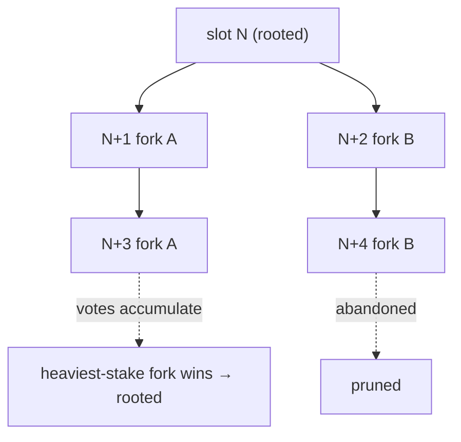
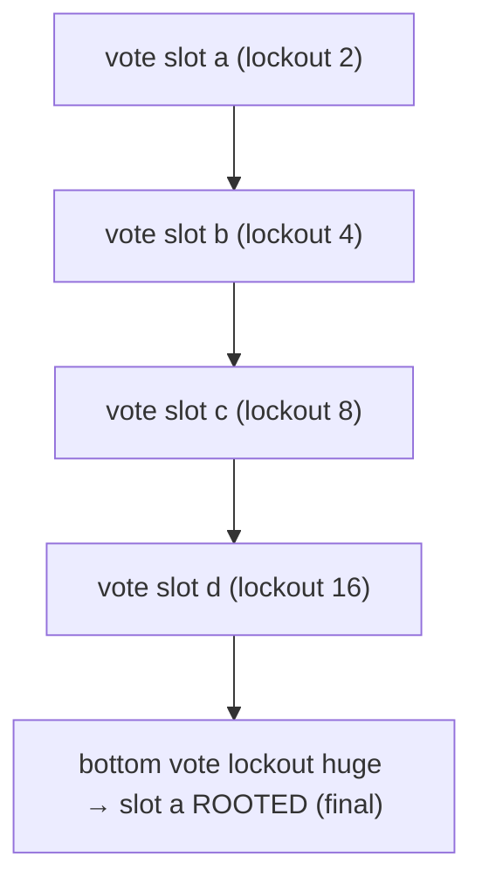

# Tower BFT — How Votes Finalize the PoH-Ordered Stream

> Deep-dive. Completes `proof-of-history.md` / `slot-leader-block.md`. PoH gives order; Tower BFT
> decides which **fork** finalizes. Lockouts, voting, rooting, optimistic confirmation.

---

## 0. TL;DR

PoH orders txs *within* a leader's stream, but leaders can produce **competing forks** (missed
blocks, network splits). **Tower BFT** is the consensus that picks the winning fork. Validators
**vote** on slots; each vote imposes an exponentially-growing **lockout** (commit to this fork or
lose stake), so the network rapidly converges. Enough stacked votes → a slot is **rooted**
(finalized, irreversible). PoH makes voting cheap because validators vote on an **already-ordered**
stream — they confirm, they don't negotiate order.

---

## 1. Why consensus is still needed after PoH

PoH proves "within this chain, A came before B." It does **not** prove "this chain is the one
everyone agrees on." Two situations create **forks**:

- A leader didn't receive the previous block in time → builds on an older parent.
- Network partition → two halves extend different tips.
- A slot was skipped → next leader picks which fork to extend.

So the cluster can momentarily hold a **tree** of valid forks. Consensus = choose one branch and
make it irreversible. That's Tower BFT (a PoH-optimized variant of PBFT).



---

## 2. Voting and the fork-choice rule

Validators continuously:

1. **Replay** blocks (verify PoH + re-execute txs → bank hash).
2. **Vote** for the tip of the fork they believe is heaviest. A vote is itself a transaction
   (signed by the validator's vote account).
3. Fork choice = **heaviest fork by stake-weighted votes** (descendant of the last root with the
   most accumulated vote stake). Validators switch to the fork the most stake is voting for.

Votes are stake-weighted: a validator's vote counts proportional to its delegated stake.

---

## 3. Lockouts — the commitment device

Naive voting could flip-flop forever. Tower BFT adds **lockouts**: each vote commits you to that
fork for a number of slots that **doubles** with each consecutive confirming vote.

```text
vote 1 on a fork → lockout 2 slots
vote 2 (same fork) → lockout 4 slots
vote 3 → lockout 8 slots
vote 4 → lockout 16 ...
vote N → lockout 2^N slots
```

- While locked out on fork X, you **cannot** vote for a competing fork (doing so risks slashing
  / is invalid) until the lockout expires.
- Each new confirming vote **deepens** commitment (bigger lockout) but also **rolls up** previous
  votes' confidence.
- The "tower" = the stack of votes with their increasing lockouts. Once votes pile high enough,
  the bottom vote's lockout is so long it's effectively permanent → that slot is **rooted**.

This makes equivocation expensive and convergence fast: stake commits harder the longer a fork
leads, so the network snaps to one branch.



---

## 4. Rooting = finality

When a slot has enough votes stacked beneath new votes that its lockout exceeds a threshold, it
becomes a **root**:

- **Rooted/finalized** = irreversible. State at that slot is permanent; earlier forks pruned.
- The validator's tower advances its root; old fork data can be cleaned up.
- Clients can ask for commitment levels:
  - **processed** — seen, not voted (can be dropped),
  - **confirmed** — optimistically confirmed (supermajority voted once),
  - **finalized** — rooted (irreversible).

---

## 5. Optimistic confirmation

Often a supermajority (≥ 2/3 stake) votes for a slot quickly → **optimistic confirmation**: in
practice irreversible within a slot or two, well before full rooting. This is why Solana feels
fast to confirm (~1-2 slots) even though deep finality (rooting) takes ~32 slots. Most apps treat
`confirmed` as good enough; high-value settlement waits for `finalized`.

---

## 6. How PoH makes this cheap

The payoff loop from the earlier docs:

- **Order is free** (PoH) → validators don't message-exchange to agree order; they vote on an
  already-ordered stream.
- **Voting is on bank hashes** → replaying the ordered txs deterministically yields the same bank
  hash; a vote is just "I got hash H for slot S."
- **Lockouts converge fast** → exponential commitment means few rounds to finality.

Classic PBFT spends O(n²) messages *per decision*; Tower BFT piggybacks votes as normal txs on a
PoH-ordered chain, so consensus throughput rides the same pipeline as everything else.

---

## 7. Relation to this repo

The Anchor programs don't implement consensus — they **rely on its commitment levels**:

- **Settlement finality.** `settle_offchain_match` token movements are only safe to treat as
  final at `finalized`/rooted. Off-chain services reading settlement should pick a commitment
  matching the value at risk (THBG settlement → `finalized`).
- **`recent_blockhash` + forks.** A tx's blockhash names a slot; if that slot's fork loses, the
  tx may need resubmission. Idempotency (OrderNullifier in `off-chain-settlement.md`) makes retry
  safe.
- **PoA cluster.** This repo's permissioned localnet has a fixed validator set, so fork
  contention is minimal, but the same vote/root machinery applies — admitted validators vote,
  slots root.

---

## 8. One-paragraph recall

PoH orders txs within a stream but leaders can produce competing **forks**; **Tower BFT** resolves
them by stake-weighted **voting** on the heaviest fork, where each consecutive vote imposes an
**exponentially doubling lockout** that commits stake to that branch — so the network converges
fast and, once votes stack high enough, a slot is **rooted** (irreversible). Commitment levels
expose this: `processed` < `confirmed` (optimistic supermajority, ~1-2 slots) < `finalized`
(rooted, ~32 slots). PoH makes it cheap because validators vote on an already-ordered stream
instead of negotiating order. This repo trusts those commitment levels — settlement should treat
THBG value as final only at `finalized`, and OrderNullifier makes fork-loss retries idempotent.
