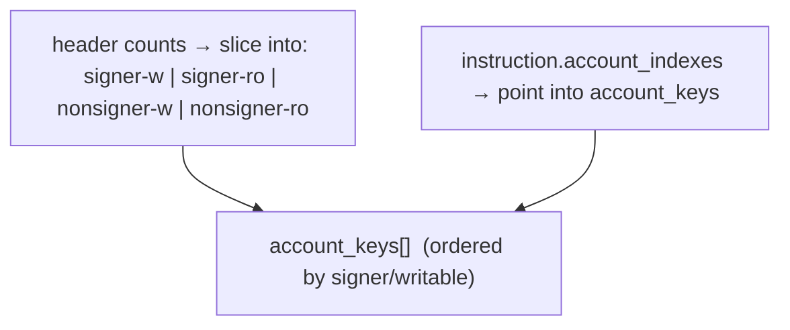
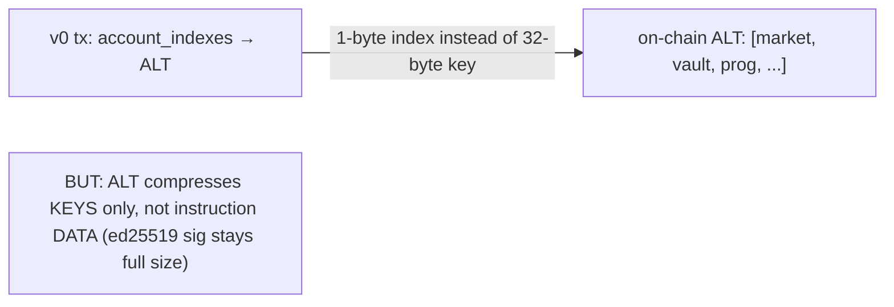

# Transaction Anatomy — Message, Signatures, ALT, v0

> Deep-dive. The wire format of a Solana transaction: message header, account keys, instructions,
> `recent_blockhash` TTL, Address Lookup Tables (ALT), legacy vs v0. (Ties to litesvm gotchas in
> this repo.)

---

## 0. TL;DR

A transaction = **signatures[]** + a **message**. The message lists a **header** (how many
signers/read-onlys), a flat **account keys** array, the **recent_blockhash** (TTL token), and
**instructions** that reference accounts **by index** into that array. The compact account list
is what lets Sealevel schedule (`sealevel-scheduling.md`). **Address Lookup Tables (ALT)** +
**v0** transactions let a tx reference many accounts by 1-byte index instead of 32-byte keys —
compressing big txs. Signature data (e.g. per-match Ed25519) is **not** ALT-compressible.

---

## 1. Top-level structure

```text
Transaction {
  signatures: [ [u8;64], ... ],   // one per required signer, in header order
  message:    Message { ... },    // the signed payload
}
```

The signatures sign the **serialized message**. The first signer is the **fee payer**.

---

## 2. The message

```text
Message {
  header: {
    num_required_signatures:        u8,   // first N keys must sign
    num_readonly_signed_accounts:   u8,   // of the signers, how many are read-only
    num_readonly_unsigned_accounts: u8,   // of the non-signers, how many are read-only
  },
  account_keys:     [Pubkey, ...],   // FLAT, ordered: signers-writable, signers-ro, nonsigners-writable, nonsigners-ro
  recent_blockhash: [u8;32],         // TTL + uniqueness
  instructions: [
    CompiledInstruction {
      program_id_index: u8,          // index into account_keys
      account_indexes:  [u8, ...],   // indexes into account_keys
      data:             [u8, ...],   // ix discriminator + args
    }, ...
  ],
}
```

The **ordering convention** of `account_keys` encodes signer/writable flags positionally (the
header counts slice the array). So an account's privileges are derived from **where** it sits.
Instructions never repeat pubkeys — they **index** the shared array (compact + lets the runtime
build the lock set, `sealevel-scheduling.md` §1).



---

## 3. recent_blockhash — TTL + replay protection

Every tx names a `recent_blockhash` (a recent slot's last PoH hash, `slot-leader-block.md`):

- **Freshness/TTL:** must be within ~**150 slots** (~60-90s). Older → "blockhash not found",
  rejected. Forces txs to be recent.
- **Replay protection / uniqueness:** the blockhash makes otherwise-identical txs distinct and
  bounds how long a signed tx is valid — you can't hoard a signed tx and replay it later.
- **Durable nonces** are the escape hatch for pre-signed/long-lived txs (replace blockhash with a
  nonce account). Not used on hot paths here.

This is why every `scripts/*.ts` / `tests/*.ts` fetches a fresh blockhash before send.

---

## 4. Legacy vs v0 transactions

| | Legacy | v0 (versioned) |
|--|--------|----------------|
| Account keys | all inline (32 bytes each) | inline **+ ALT references** |
| Max accounts | ~35 (1232-byte tx limit) | many more via ALT |
| Marker | none | version prefix byte |

**v0** added **Address Lookup Tables**. The 1232-byte hard cap on serialized tx size is the
constraint both fight against.

---

## 5. Address Lookup Tables (ALT)

An **ALT** is an on-chain account storing a list of pubkeys. A v0 tx references them by **index**:

```text
without ALT:  each account = 32 bytes in the tx
with ALT:     account = 1-byte index into a pre-published table
```

- Publish frequently-used accounts (programs, markets, vaults) to an ALT once.
- v0 txs then carry tiny indexes instead of full 32-byte keys → fit **far more** accounts under
  the 1232-byte limit.
- Trade-off: the ALT must exist on-chain first, and indices must be stable.

**Critical limit for this repo (memory):** ALT compresses **account keys**, NOT **instruction
data**. Per-match **Ed25519 signature bytes** are instruction data → uncompressible → that's why
`batch_settle_offchain_match`, though it allows **≤4 matches in code** (`BatchTooLarge`), fits only
**~1 match/tx in practice** under the 1232-byte cap (`off-chain-settlement.md` §5). ALT can't help
where the bloat is signature data, not keys.



---

## 6. litesvm / test gotchas in this repo

From memories:
- **litesvm full-settle harness** hits a **v0/ALT-in-litesvm 1232** limit
  (`litesvm-full-match-settle-harness`) — building the settle tx with ALT in-process bumps the
  size ceiling; payer-derived shard + error 6030 fires pre-CPI.
- Tests must fetch fresh blockhashes; clock warp in litesvm (`litesvm-test-harness`) changes
  effective slot/blockhash behavior.
- Token-2022 program id must be used where the energy mint is Token-2022
  (`integration-tests-token2022-ata`) — affects which accounts populate `account_keys`.

---

## 7. End-to-end build (client side)

```ts
const ix = await program.methods.settleOffchainMatch(...).accounts({...}).instruction();
const { blockhash } = await connection.getLatestBlockhash();      // TTL token
const msg = new TransactionMessage({
  payerKey, recentBlockhash: blockhash, instructions: [cuIx, ed25519Ix, ix],
}).compileToV0Message([lookupTable]);                              // v0 + ALT
const tx = new VersionedTransaction(msg);
tx.sign([payer]);                                                 // signatures over message
```

Note the `ed25519Ix` sits **alongside** the program ix (the precompile verify, read via the
instructions sysvar — `off-chain-settlement.md` §2).

---

## 8. One-paragraph recall

A Solana tx = **signatures** over a **message** containing a **header** (signer/read-only counts),
a flat **account_keys** array (ordered so position encodes signer/writable), a **recent_blockhash**
(≤~150-slot TTL + replay protection), and **instructions** that reference accounts by **index**
(compact, and what lets Sealevel build lock sets). **v0** transactions add **Address Lookup
Tables**, replacing 32-byte keys with 1-byte indices to fit more accounts under the 1232-byte
cap — but ALT compresses **keys only, not instruction data**, which is precisely why per-match
Ed25519 bytes hold batch settle to ~1 match/tx in practice (code allows ≤4). The repo's litesvm
settle harness runs into the v0/ALT 1232 boundary in-process.
