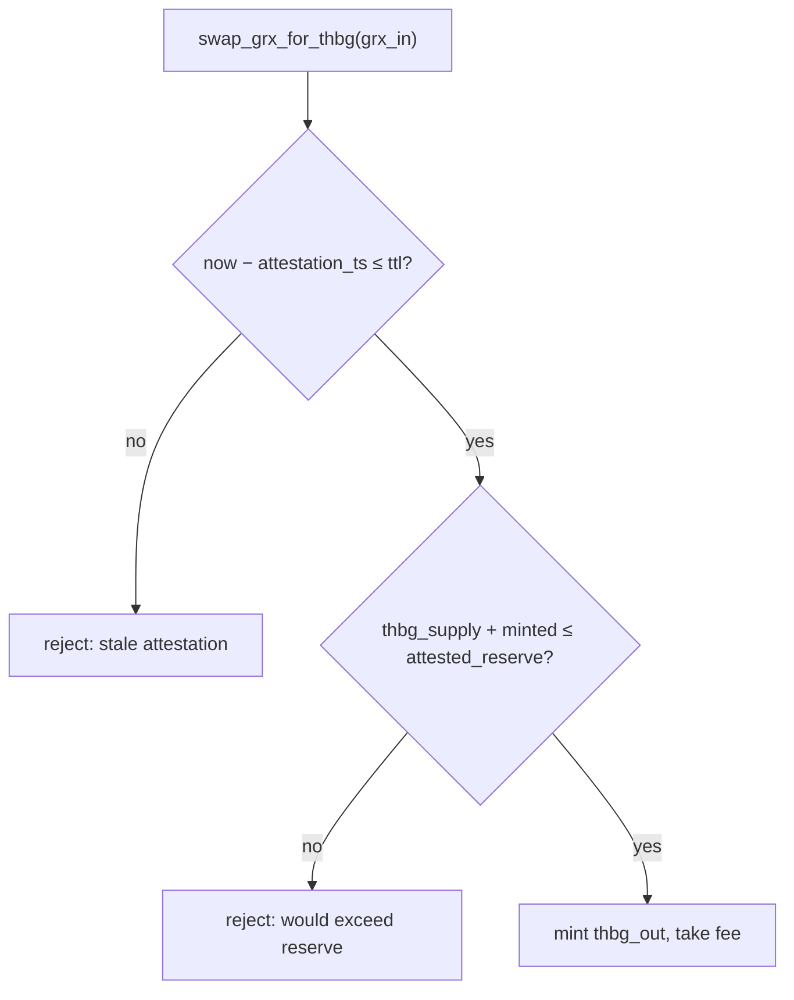
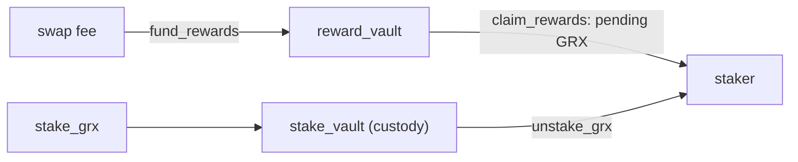

# Treasury Peg Mechanics — THBG Swap, Redeem, Staking

> Deep-dive. THBG stablecoin peg invariants, swap/redeem math, reserve attestation, MasterChef
> staking accumulator, the three GRX vaults. Source: CLAUDE.md treasury section.
> (Verify formulas in `programs/treasury/src/`.)

---

## 0. TL;DR

**THBG** = THB-pegged stablecoin (6 decimals), mint authority = `[b"treasury"]` PDA. **Swap**
turns GRX into THBG at an attested rate, guarded so minted THBG never exceeds attested reserve.
**Redeem** burns THBG for GRX from the `swap_vault`, guarded so a rate change can't drain more GRX
than the vault holds. **Staking** is a separate MasterChef-style yield system (its own vault,
funded by swap fees) — distinct from registry's validator bond. **Three separate GRX vaults**:
swap (collateral), stake (custody), reward (pool).

---

## 1. The peg primitive: swap_grx_for_thbg

```text
thbg_out = grx_in × grx_per_thbg_rate / 1e9 − fee
```

Two **peg invariants** enforced on every swap:

1. **Reserve freshness:** `now − attestation_ts ≤ attestation_ttl`. The reserve attestation
   (off-chain custodian's proof of THB reserve) must be recent, or swap halts. Stale attestation
   → no minting.
2. **Reserve coverage:** `thbg_supply + minted ≤ attested_reserve`. Never mint more THBG than the
   attested real-world reserve backs. This is the 1:1 peg guarantee.

The custodian refreshes via **`update_attestation`** (sets `attested_reserve`, `attestation_ts`).



---

## 2. The redeem path: redeem_thbg_for_grx

Burns THBG, returns GRX from `swap_vault` at the current rate. Two **collateral guards**:

1. `thbg_in ≤ thbg_supply` → `SupplyUnderflow` (can't burn more than exists).
2. `grx_out ≤ swap_vault.amount` → `InsufficientVault` (can't withdraw more GRX than the vault
   holds).

Why guard #2 matters: a **rate change** via `set_params` could otherwise let a redeemer compute a
`grx_out` larger than the vault balance and drain it. The guard caps withdrawal at actual vault
holdings → a rate change can **never** over-drain. Peg safety under parameter changes.

---

## 3. Three GRX vaults — never mix them

| Vault | PDA | Purpose |
|-------|-----|---------|
| `swap_vault` | redemption collateral | backs THBG→GRX redeem |
| `stake_vault` | staker custody | holds staked GRX (yield staking) |
| `reward_vault` | reward pool | pays GRX staking rewards |

Separate PDAs, separate balances. **Staked GRX (stake_vault) never backs the peg** — only
`swap_vault` is redemption collateral. Mixing them would let staking inflate apparent reserve.

---

## 4. Staking — MasterChef accumulator

`stake_grx` / `unstake_grx` / `claim_rewards` / `fund_rewards` implement a **MasterChef**-style
reward accumulator:

```text
acc_reward_per_share  (×1e12 fixed-point)
pending = staked × acc_reward_per_share / 1e12 − reward_debt
```

- Rewards paid in **GRX** from `reward_pool` / `reward_vault`.
- Funded by **swap fees** via `fund_rewards` (the fee from §1 swaps feeds staker yield).
- `×1e12` scaling avoids integer-truncation of per-share rewards.
- Tracked per staker on a **`StakePosition`** account.



---

## 5. Two GRX staking systems — DON'T merge

Critical design point (CLAUDE.md): there are **two** GRX staking systems, **on purpose**:

| | Treasury staking (here) | Registry staking |
|--|-------------------------|------------------|
| Type | **yield** staking (opt-in, reward-bearing) | **validator security bond** |
| Reward | yes (swap fees) | none |
| Gate | open | `MIN_VALIDATOR_STAKE` |
| Slash | no | yes (validator misbehavior) |
| Vault | `[b"stake_vault"]` | `[b"grx_vault"]` |
| Tracked on | `StakePosition` | `UserAccount.staked_grx` |

Same lock/unlock/slash **plumbing**, different **products**. A user can hold both. **No shared
vault or position; not reconciled.** (See `registry-staking-slash.md`.)

---

## 6. record_settlement — accounting hook

(Cross-ref `off-chain-settlement.md` / `cpi-flow.md`.) Trading CPIs `record_settlement` to bump
`total_settled_thbg` by the **gross** settled value — non-custodial accounting, authorized by the
`settlement_recorder` signer (= trading `market_authority` PDA). Mandatory for THBG markets. The
slash redistribution path points registry's `slash_destination` at the treasury `reward_vault`
(redistribute to stakers via `fund_rewards`).

---

## 7. Pitfalls

- **Stale attestation** → swap halts; custodian must `update_attestation` within the TTL.
- **Over-minting THBG** → blocked by `thbg_supply + minted ≤ attested_reserve`.
- **Rate-change drain** → blocked by `grx_out ≤ swap_vault.amount` (`InsufficientVault`).
- **Mixing vaults** → staked GRX must not count as peg reserve; three vaults stay separate.
- **Merging the two staking systems** → they're different products; never reconcile yield staking
  with validator bonds.
- **Reward truncation** → keep the `×1e12` accumulator scaling.

---

## 8. One-paragraph recall

**THBG** (6-dec, THB-pegged, mint authority `[b"treasury"]` PDA) swaps from GRX via
`thbg_out = grx_in × rate / 1e9 − fee`, guarded by **attestation freshness**
(`now − attestation_ts ≤ ttl`) and **reserve coverage** (`thbg_supply + minted ≤ attested_reserve`);
redeem burns THBG for GRX from `swap_vault` with `SupplyUnderflow` / `InsufficientVault` guards so
a `set_params` rate change can't over-drain. Yield **staking** is a separate MasterChef
accumulator (`acc_reward_per_share ×1e12`, funded by swap fees, `stake_vault` + `reward_vault`,
tracked on `StakePosition`) — distinct from registry's slashed validator bond, never merged.
**Three GRX vaults** (swap/stake/reward) stay separate; only `swap_vault` backs the peg.
