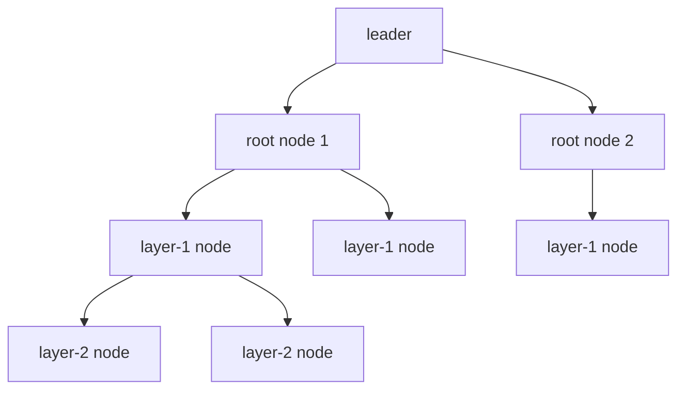

# Turbine & Gossip — How Blocks and Cluster State Propagate

> Deep-dive. Turbine (block propagation via shreds tree), gossip (cluster metadata), why
> streaming beats monolithic blocks. Fills the network layer under `slot-leader-block.md`.

---

## 0. TL;DR

A leader doesn't ship a finished block to everyone — bandwidth would explode (O(n) from one
node). **Turbine** breaks the block into small **shreds** and propagates them down a **stake-
weighted tree**: leader → small root set → fan out layer by layer, so each node forwards to only
a few others. **Gossip** is a separate, continuous protocol spreading cluster *metadata* (who's
online, votes, contact info, ledger tips) epidemically. Turbine moves *block data*; gossip moves
*control/state*.

---

## 1. The propagation problem

A leader producing ~400ms slots must get each block to **all** validators fast. Naive broadcast
(leader sends full block to every validator) = leader uploads `block_size × N` → the leader's
uplink is the bottleneck, and it gets worse as the validator set grows. Need to **distribute the
forwarding load**.

---

## 2. Shreds — blocks chopped for the network

The leader doesn't emit one big block blob. It emits **shreds**:

- A **shred** = a small fragment of the block's entries (fits in a UDP packet, ~1280 bytes).
- Shreds are produced **as the block is built** (streaming, `slot-leader-block.md` §3) — not at
  slot end.
- **Erasure coding (Reed-Solomon):** the leader adds redundant "coding" shreds so a node can
  reconstruct the block even if some data shreds are lost (UDP drops). Lose ≤ the redundancy and
  you still recover.

```text
block entries ──split──► [data shred 0][data shred 1]...[data shred k]
                          + [coding shred 0]...[coding shred m]   (erasure recovery)
```

---

## 3. Turbine — the propagation tree

Shreds flow down a **stake-weighted tree**, not a flat broadcast:



- Leader sends each shred to a small **root set**; each node forwards to its **children** in the
  tree; children forward to theirs. Like BitTorrent-ish fan-out.
- **Stake-weighted:** higher-stake (more reliable, more important) validators sit closer to the
  root → get data sooner, fewer hops.
- The tree is **deterministic per shred/slot** (seeded by slot/shred index) so nodes know their
  parent/children without negotiation.
- Result: leader uplink ≈ constant (only the root set), total bandwidth spread across the cluster.
  Propagation latency ≈ O(log N) hops, not O(N).

---

## 4. Gossip — the cluster's nervous system

Separate from block data, validators run a continuous **gossip** protocol (a
push/pull epidemic, SWIM-style) to share **metadata**:

- **Contact info** — IP/ports of validators (so Turbine knows where to send shreds).
- **Votes** — propagated as part of consensus visibility.
- **Ledger tips / slots** — what each node has, EpochSlots.
- **Snapshot hashes**, feature flags, etc.

Gossip is **eventually consistent** and **resilient**: messages spread node-to-node, no central
coordinator, tolerant of churn. It's how a node joining the cluster learns the topology that
Turbine then uses.

```text
Turbine:  block DATA   — structured tree, low latency, erasure-coded
Gossip:   META/control — epidemic spread, eventually consistent, churn-tolerant
```

---

## 5. Why streaming + tree = Solana throughput

- **Streaming shreds** → validators start replaying/verifying before the slot even ends
  (pipelined with production). No "wait for full block."
- **Tree fan-out** → no single uplink bottleneck; scales to large validator sets.
- **Erasure coding** → UDP packet loss doesn't force retransmit of whole blocks.
- Combined with PoH (order for free) + Sealevel (parallel execute), the **network** stops being
  the limiter; the pipeline is producer-hash-rate + replay-bound, not broadcast-bound.

---

## 6. Relation to this repo

The Anchor programs are above this layer, but it explains operational realities:

- **PoA localnet.** This repo's permissioned cluster has few validators, so Turbine's tree is
  shallow and gossip is small — but the mechanism is identical; the validator set is just fixed/
  admitted.
- **Confirmation latency.** Time-to-`confirmed` (`tower-bft-consensus.md`) includes shred
  propagation + replay + vote gossip. Settlement clients waiting on commitment are waiting on
  this pipeline.
- **Why direct RPC is centralized in Chain Bridge** (superproject rule): services don't each join
  gossip/Turbine; only Chain Bridge talks to the cluster. The gossip/Turbine complexity stays at
  the validator/RPC layer, not in every microservice.
- **litesvm tests skip all this.** In-process litesvm (`litesvm-test-harness`) has no network,
  no Turbine/gossip — it executes instructions directly. Fast, but it can't surface
  propagation/fork timing; those need a real validator (`anchor test` / `run-tests.sh`).

---

## 7. Pitfalls / mental-model traps

- **"Leader broadcasts the whole block to everyone"** → no, shreds down a tree; leader only seeds
  the root set.
- **Conflating Turbine and gossip** → Turbine = block data (structured tree); gossip = metadata
  (epidemic). Different protocols, different jobs.
- **Assuming reliable delivery** → it's UDP + erasure coding; designed for loss, not zero-loss.
- **Expecting litesvm to model propagation** → it doesn't; use a validator for timing/fork tests.

---

## 8. One-paragraph recall

A leader propagates a block not by broadcasting it whole but as small **shreds** (UDP-sized,
erasure-coded for loss recovery) streamed down **Turbine**, a deterministic **stake-weighted tree**
where each node forwards to a few children — so the leader's uplink stays ~constant and latency is
O(log N), not O(N). Separately, **gossip** spreads cluster *metadata* (contact info, votes, ledger
tips) epidemically and eventually-consistently, providing the topology Turbine uses. Streaming
shreds let validators pipeline replay with production. In this repo's PoA localnet the tree is
shallow and only Chain Bridge joins the cluster; litesvm tests bypass the network entirely, so
propagation/fork timing needs a real validator.
