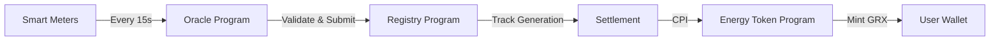
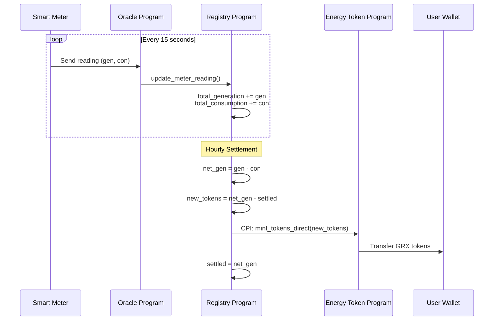
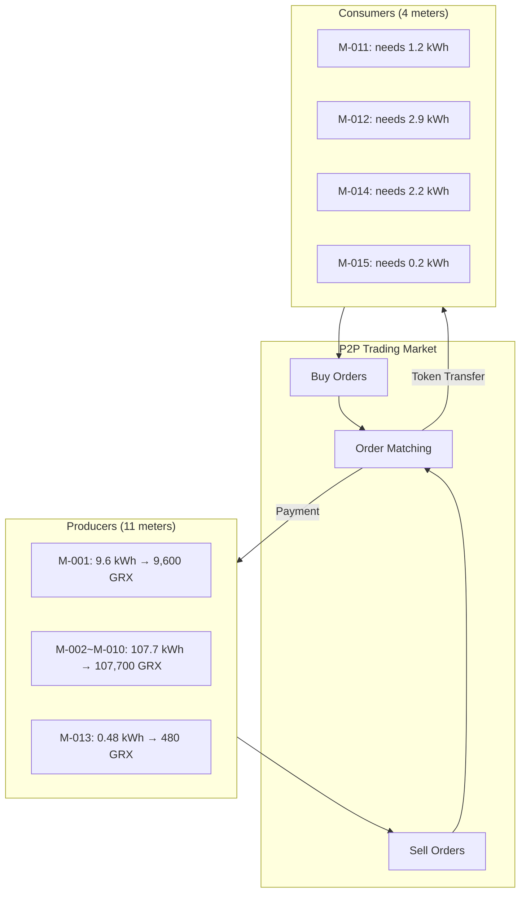

# Energy Token Flow: 15 Meters Example

## Overview

This document describes how energy readings from smart meters are converted to GRX tokens on the GridTokenX platform.

---

## System Architecture



---

## Meter Account State

Each meter maintains three key counters:

| Field | Description |
|-------|-------------|
| `total_generation` | Cumulative energy produced (Wh) |
| `total_consumption` | Cumulative energy consumed (Wh) |
| `settled_net_generation` | Already tokenized amount (high-water mark) |

---

## Token Minting Formula

```
Net Generation = total_generation - total_consumption
New Tokens = Net Generation - settled_net_generation
```

**After minting:** `settled_net_generation = Net Generation`

This prevents double-minting.

---

## Example: 15 Meters Solar Farm

### Meter Configuration

| Meter ID | Type | Location | Capacity |
|----------|------|----------|----------|
| M-001 to M-005 | Solar Panel | Zone A | 10 kW each |
| M-006 to M-010 | Solar Panel | Zone B | 15 kW each |
| M-011 to M-015 | Battery + Consumer | Zone C | 5 kW each |

---

### 1-Hour Energy Readings (240 readings per meter)

| Meter | Gen/15s | Con/15s | Total Gen (1hr) | Total Con (1hr) | Net Gen |
|-------|---------|---------|-----------------|-----------------|---------|
| M-001 | 40 Wh | 0 Wh | 9,600 Wh | 0 Wh | 9,600 Wh |
| M-002 | 38 Wh | 0 Wh | 9,120 Wh | 0 Wh | 9,120 Wh |
| M-003 | 42 Wh | 0 Wh | 10,080 Wh | 0 Wh | 10,080 Wh |
| M-004 | 35 Wh | 0 Wh | 8,400 Wh | 0 Wh | 8,400 Wh |
| M-005 | 41 Wh | 0 Wh | 9,840 Wh | 0 Wh | 9,840 Wh |
| M-006 | 60 Wh | 0 Wh | 14,400 Wh | 0 Wh | 14,400 Wh |
| M-007 | 58 Wh | 0 Wh | 13,920 Wh | 0 Wh | 13,920 Wh |
| M-008 | 62 Wh | 0 Wh | 14,880 Wh | 0 Wh | 14,880 Wh |
| M-009 | 55 Wh | 0 Wh | 13,200 Wh | 0 Wh | 13,200 Wh |
| M-010 | 59 Wh | 0 Wh | 14,160 Wh | 0 Wh | 14,160 Wh |
| M-011 | 20 Wh | 25 Wh | 4,800 Wh | 6,000 Wh | -1,200 Wh |
| M-012 | 18 Wh | 30 Wh | 4,320 Wh | 7,200 Wh | -2,880 Wh |
| M-013 | 22 Wh | 20 Wh | 5,280 Wh | 4,800 Wh | 480 Wh |
| M-014 | 19 Wh | 28 Wh | 4,560 Wh | 6,720 Wh | -2,160 Wh |
| M-015 | 21 Wh | 22 Wh | 5,040 Wh | 5,280 Wh | -240 Wh |

---

### Token Minting Results

| Meter | Net Gen | Tokens Minted | Status |
|-------|---------|---------------|--------|
| M-001 | 9,600 Wh | **9,600 GRX** | ✅ Producer |
| M-002 | 9,120 Wh | **9,120 GRX** | ✅ Producer |
| M-003 | 10,080 Wh | **10,080 GRX** | ✅ Producer |
| M-004 | 8,400 Wh | **8,400 GRX** | ✅ Producer |
| M-005 | 9,840 Wh | **9,840 GRX** | ✅ Producer |
| M-006 | 14,400 Wh | **14,400 GRX** | ✅ Producer |
| M-007 | 13,920 Wh | **13,920 GRX** | ✅ Producer |
| M-008 | 14,880 Wh | **14,880 GRX** | ✅ Producer |
| M-009 | 13,200 Wh | **13,200 GRX** | ✅ Producer |
| M-010 | 14,160 Wh | **14,160 GRX** | ✅ Producer |
| M-011 | -1,200 Wh | **0 GRX** | ❌ Consumer |
| M-012 | -2,880 Wh | **0 GRX** | ❌ Consumer |
| M-013 | 480 Wh | **480 GRX** | ✅ Producer |
| M-014 | -2,160 Wh | **0 GRX** | ❌ Consumer |
| M-015 | -240 Wh | **0 GRX** | ❌ Consumer |

---

### 1-Hour Summary

| Metric | Value |
|--------|-------|
| Readings Processed | 3,600 tx (15 × 240) |
| Total Generated | 141.6 kWh |
| Total Consumed | 30.0 kWh |
| Net Surplus | 111.6 kWh |
| **GRX Minted** | **117,600 GRX** |
| GRX Needed (consumers) | 6,480 GRX |
| Available for Trade | 111,120 GRX |

---

## Settlement Flow



---

## P2P Trading Flow



---

## Key Guarantees

| Guarantee | Mechanism |
|-----------|-----------|
| **No Double-Minting** | `settled_net_generation` high-water mark |
| **Net Metering** | Only surplus (gen - con) becomes tokens |
| **Auditable** | `MeterBalanceSettled` events on-chain |
| **Batch-Friendly** | Readings aggregate, settle on-demand |

---

## On-Chain Events

```rust
// Emitted for each meter reading
MeterReadingUpdated {
    meter_id: String,
    owner: Pubkey,
    energy_generated: u64,
    energy_consumed: u64,
    timestamp: i64,
}

// Emitted at settlement
MeterBalanceSettled {
    meter_id: String,
    owner: Pubkey,
    tokens_to_mint: u64,
    total_settled: u64,
    timestamp: i64,
}
```
