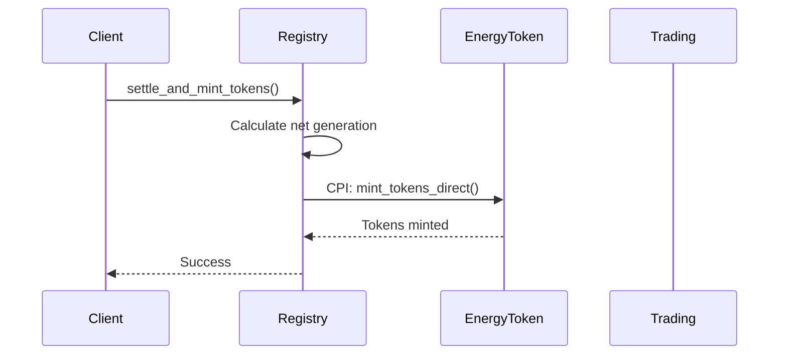
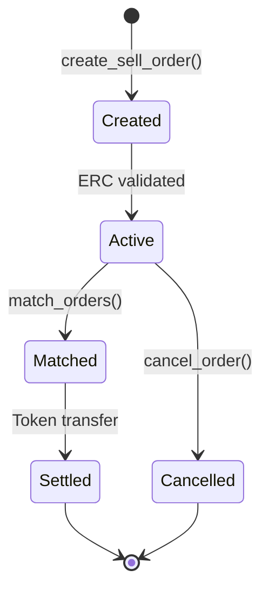
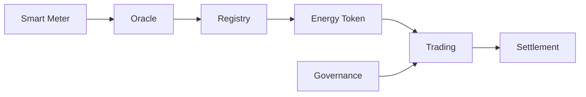

# GridTokenX
## Blockchain Performance Analysis for P2P Energy Trading

**Master's Thesis Defense**

*December 2024*

---

# Research Motivation

- Renewable energy adoption accelerating
- Prosumers need peer-to-peer trading capability
- Blockchain provides decentralized trust
- **Challenge**: Can blockchain meet performance requirements?

---

# Research Questions

1. Can blockchain achieve **production-level** performance for energy trading?
2. What is the **Trust Premium** (cost of decentralization)?
3. How does GridTokenX compare to **existing platforms**?

---

# Methodology

## BLOCKBENCH + TPC Benchmark Suite

| Layer | Benchmark | Purpose |
|-------|-----------|---------|
| Consensus | DoNothing | Measure pure consensus overhead |
| Execution | CPUHeavy | Smart contract computation |
| Data Model | IOHeavy | State read/write operations |
| Application | TPC-C/E/H, Smallbank, YCSB | Real workloads |

---

# Platform Architecture

## GridTokenX Technology Stack

- **Blockchain**: Solana-based
- **Consensus**: Proof of Authority (PoA)
- **Framework**: Anchor 0.32.1
- **Smart Contracts**: 5 programs + BLOCKBENCH
- **Testing**: LiteSVM in-process simulator

---

# Core Components

## 5 Smart Contract Programs

| Program | Lines | Purpose |
|---------|-------|---------|
| **Registry** | 782 | User & meter registration, balance settlement |
| **EnergyToken** | 441 | GRX token minting, transfer, burning |
| **Trading** | 879 | Order book, matching, batch execution |
| **Oracle** | 434 | AMI data ingestion, validation |
| **Governance** | 343 | PoA, ERC certification, emergency controls |

---

# How Anchor Programs Work

## Anchor Framework v0.32.1

| Feature | Description |
|---------|-------------|
| **IDL Generation** | Auto-generate TypeScript/Rust clients |
| **Account Validation** | Compile-time constraints (#[account]) |
| **Error Handling** | Custom error codes with messages |
| **Events** | On-chain event emission for indexers |
| **CPI Helpers** | Cross-program invocation wrappers |

---

# Account Model (PDAs)

## Program Derived Addresses

```rust
#[account(
    init,
    payer = payer,
    space = 8 + User::INIT_SPACE,
    seeds = [b"user", owner.key().as_ref()],
    bump
)]
pub user: Account<'info, User>,
```

- **Deterministic**: Derived from seeds + program ID
- **Keyless**: No private key required
- **Secure**: Only owning program can sign

---

# Cross-Program Invocation (CPI)

## Program Interaction Pattern



---

# CPI Implementation

## Registry → EnergyToken Mint

```rust
// Registry calls EnergyToken via CPI
let cpi_ctx = CpiContext::new_with_signer(
    ctx.accounts.energy_token_program.to_account_info(),
    MintTokensDirect {
        mint: ctx.accounts.grid_mint.to_account_info(),
        destination: ctx.accounts.user_token_account.to_account_info(),
        authority: ctx.accounts.registry_authority.to_account_info(),
    },
    signer_seeds, // PDA signs for registry
);
energy_token::cpi::mint_tokens_direct(cpi_ctx, mint_amount)?;
```

---

# Trading Workflow

## Order Lifecycle



---

# Program Dependencies

## Inter-Program Relationships

| Caller | Callee | CPI Purpose |
|--------|--------|-------------|
| Registry | EnergyToken | Mint GRX on settlement |
| Trading | Governance | Validate ERC for sell orders |
| Trading | EnergyToken | Transfer tokens on match |
| Oracle | Registry | Update meter readings |

---

# Registry Program

## User & Meter Management

- **User Registration**: Prosumer/Consumer classification
- **Meter Registration**: Smart meter linking with MeterType
- **Reading Updates**: Oracle-authorized energy data (kWh)
- **Balance Settlement**: Net generation → GRID token minting

```rust
settle_and_mint_tokens() // CPI to energy_token program
```

---

# Energy Token Program

## GRX Token Lifecycle

- **Token 2022**: Anchor SPL Token interface
- **Mint**: Authority-controlled for verified meters
- **Transfer**: P2P energy settlement
- **Burn**: Consumption tracking

```rust
mint_tokens_direct(amount: u64) // Verified meter → tokens
```

---

# Trading Program

## P2P Order Book Engine

| Feature | Implementation |
|---------|---------------|
| **Order Types** | Buy/Sell limit orders |
| **Matching** | Price-priority FIFO |
| **VWAP** | Integer-only calculation (~10K CU saved) |
| **Batch Execution** | ~40% overhead reduction |
| **Market Depth** | 10-level bid/ask tracking |

---

# Oracle Program

## AMI Data Bridge

- **API Gateway**: Authorized meter reading submission
- **Validation**: Anomaly detection, range checks
- **Market Trigger**: Automated clearing initiation
- **Quality Score**: Data reliability tracking

```rust
submit_meter_reading(meter_id, energy_produced, energy_consumed)
```

---

# Governance Program

## PoA & ERC Certification

- **Proof of Authority**: Single REC authority model
- **ERC Issuance**: Renewable certificate generation
- **ERC Validation**: Trading authorization
- **ERC Transfer**: Certificate ownership transfer
- **Emergency Controls**: Pause/unpause system

---

# Core Features Overview

## End-to-End Energy Trading Platform



---

# Feature 1: P2P Energy Trading

## Decentralized Order Matching

| Capability | Specification |
|------------|---------------|
| **Sell Orders** | ERC-validated producers only |
| **Buy Orders** | Registered consumers |
| **Matching** | Automatic price-priority |
| **Settlement** | Atomic token transfer |
| **Batch Processing** | Up to N orders per tx |

---

# Feature 2: ERC Certification

## Renewable Energy Certificates

1. **Meter Reading** → Oracle validates production
2. **ERC Issuance** → Governance mints certificate
3. **ERC Validation** → Trading authorization
4. **Trade Execution** → Only validated ERC holders

> Prevents double-claiming via `claimed_erc_generation` tracker

---

# Feature 3: Smart Metering Integration

## AMI Data Pipeline

- **Data Ingestion**: Real-time meter readings
- **Validation Rules**: Min/max bounds, deviation checks
- **Net Settlement**: Generation - Consumption = Mintable
- **Token Bridge**: Registry CPI → EnergyToken mint

---

# Feature 4: Market Clearing

## Automated Trading Operations

- **Trigger**: Oracle-initiated clearing cycles
- **Price Discovery**: VWAP from order book
- **Depth Tracking**: 10-level bid/ask updates
- **Fee Collection**: Configurable market fee (BPS)

---

# BLOCKBENCH Micro-benchmark Results

## Layer-by-Layer Analysis

| Layer | Benchmark | TPS | Latency |
|-------|-----------|-----|---------|
| Consensus | DoNothing | 225 | 2.5ms |
| Execution | CPUHeavy | 231 | 2.5ms |
| Data Model | IOHeavy-Write | 192 | 3.0ms |
| Data Model | IOHeavy-Mixed | 192 | 3.0ms |

---

# YCSB Workload Results

## Application Layer Performance

| Workload | Profile | ops/s | Latency |
|----------|---------|-------|---------|
| YCSB-A | 50% read, 50% update | 290 | 2.7ms |
| YCSB-B | 95% read, 5% update | 442 | 1.8ms |
| YCSB-C | 100% read | 391 | 2.1ms |

**Smallbank OLTP**: 1,714 TPS @ 5.8ms

---

# TPC Benchmark Results

## Industry-Standard Performance Metrics

| Benchmark | Primary Metric | Latency | p99 |
|-----------|---------------|---------|-----|
| **TPC-C** | 2,111 tpmC | 117ms | 216ms |
| **TPC-E** | 306 tpsE | 7.9ms | 17ms |
| **TPC-H** | 250,486 QphH | 71ms | 147ms |

---

# Comparative Analysis

## Platform Comparison

| Platform | Smallbank TPS | Latency | Trust Premium |
|----------|---------------|---------|---------------|
| **GridTokenX** | 1,714 | 5.8ms | 58x |
| Hyperledger Fabric | 400 | 150ms | 175x |
| Ethereum | 30 | 12,000ms | 6,000x |
| PostgreSQL | 5,000 | 2ms | 1x |

---

# Trust Premium Analysis

> **Trust Premium** = Blockchain Latency / Centralized Baseline Latency

- GridTokenX TPC-C: **58.28x** (117ms vs 2ms baseline)
- Hyperledger Fabric: 175x
- Ethereum: 6,000x

**GridTokenX achieves ~3x better Trust Premium than Hyperledger**

---

# Scalability Results

## Concurrency & Duration Tests

| Test | Result | Stability |
|------|--------|-----------|
| Peak TPS (1 thread) | 443 TPS | 100% |
| 32 concurrent threads | 398 TPS | 90% retained |
| 60-second sustained | 416 TPS | Stable |
| 1,000 accounts | 220 TPS | Linear degradation |

---

# Key Contributions

1. **BLOCKBENCH Layer Analysis** for Solana/Anchor
2. **TPC-C/E/H Adaptation** for blockchain
3. **Trust Premium Quantification**: 58x vs 175x (Fabric)
4. **Scalability Validation**: Stable under load

---

# Limitations

- LiteSVM simulation (not network)
- Single-validator PoA configuration
- No real smart meter integration
- Limited geographic distribution

---

# Future Work

- Multi-validator PoA cluster deployment
- Real network latency measurements
- Smart meter IoT integration
- Zero-knowledge privacy extensions

---

# Conclusion

- GridTokenX achieves **2,111 tpmC** TPC-C
- **1,714 TPS** Smallbank throughput
- **Trust Premium of 58x** vs PostgreSQL baseline
- **Stable performance** under concurrency

**Blockchain is viable for P2P energy trading**

---

# Thank You

## Questions?

📊 Benchmark Data: `test-results/`
📈 Charts: `test-results/charts/`
📄 Full Results: `docs/thesis/chapter4-results.tex`

---
