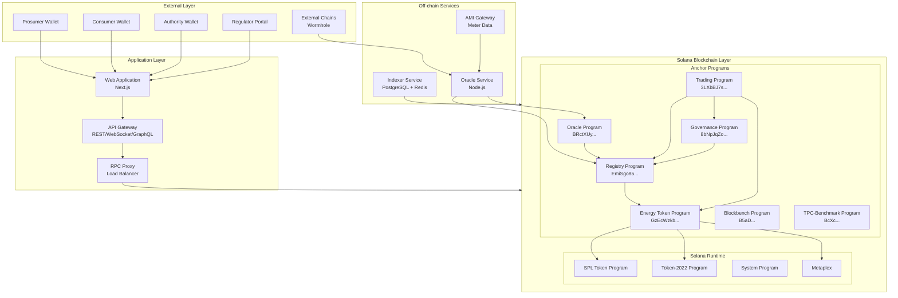
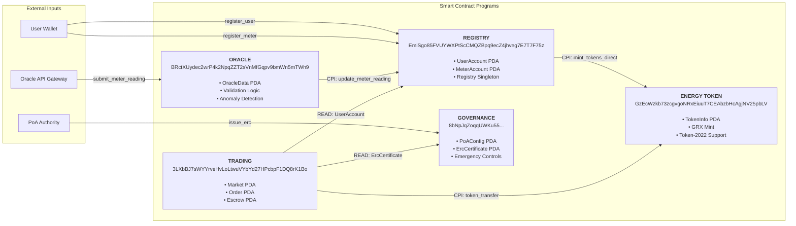
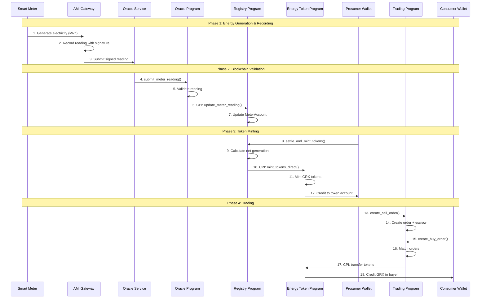
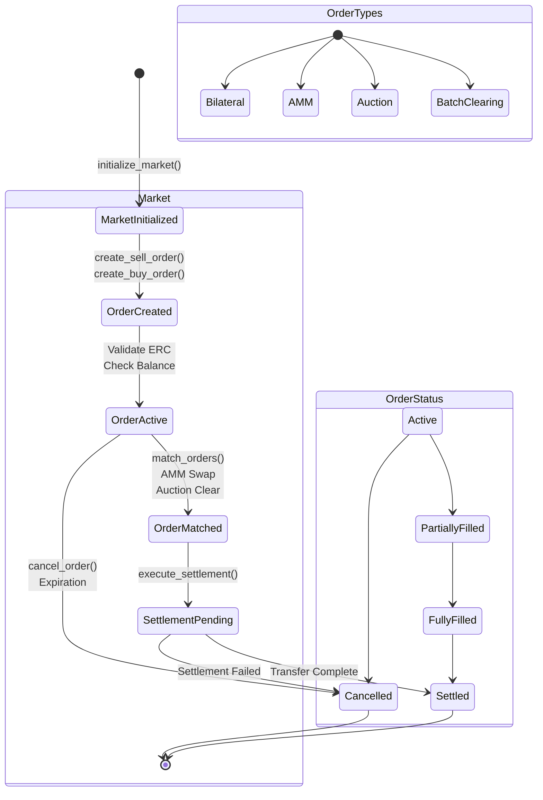
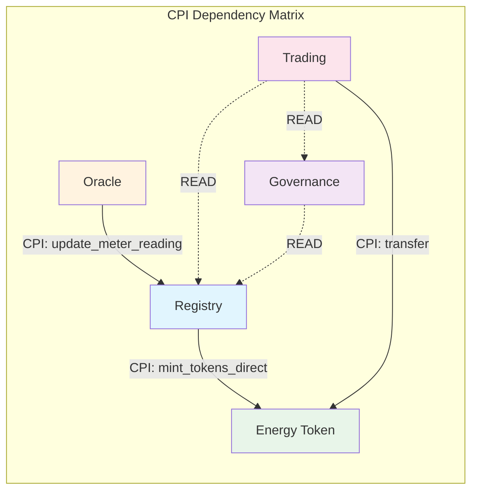
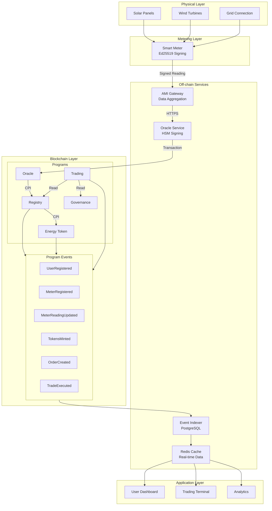
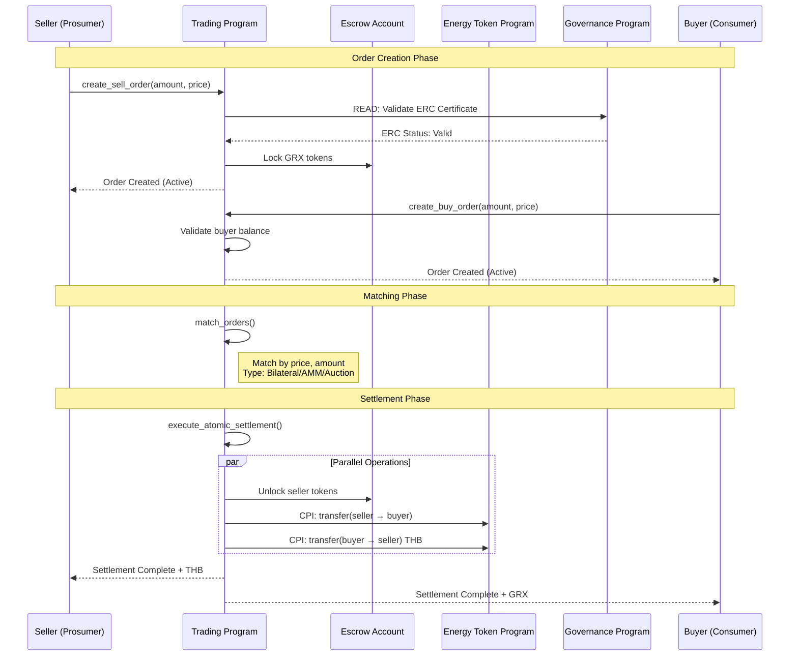
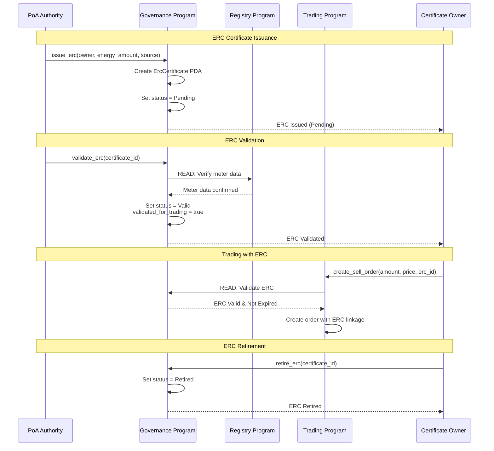
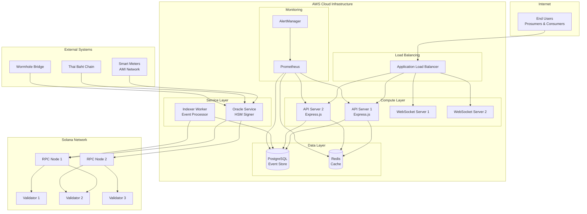

# GridTokenX Protocol Application Diagram

**Version:** 2.0.0  
**Last Updated:** February 2026

---

## 1. Complete Protocol Architecture Overview



---

## 2. Program Interaction Flow (CPI Diagram)



---

## 3. GRX Token Lifecycle Sequence



---

## 4. Trading Protocol State Machine



---

## 5. Account Hierarchy & PDA Structure

```mermaid
graph TB
    subgraph RegistryProgram["Registry Program (EmiSgo85...)"]
        RegPDA[Registry PDA<br/><b>Seeds:</b> ['registry']<br/>authority, user_count, meter_count]
        
        subgraph UserPDAs["User Accounts"]
            User1[UserAccount PDA<br/><b>Seeds:</b> ['user', wallet_pubkey]<br/>user_type, status, registered_at]
            User2[UserAccount PDA<br/><b>Seeds:</b> ['user', wallet_pubkey]<br/>...]
        end
        
        subgraph MeterPDAs["Meter Accounts"]
            Meter1[MeterAccount PDA<br/><b>Seeds:</b> ['meter', meter_id]<br/>total_generation, total_consumption<br/>settled_net_generation, claimed_erc_generation]
            Meter2[MeterAccount PDA<br/><b>Seeds:</b> ['meter', meter_id]<br/>...]
        end
    end
    
    subgraph EnergyTokenProgram["Energy Token Program (GzEcWzkb...)"]
        TokenInfoPDA[TokenInfo PDA<br/><b>Seeds:</b> ['token_info_2022']<br/>authority, mint, total_supply<br/>rec_validators[]]
        GRXMint[GRX Token Mint<br/>SPL Token-2022<br/>9 Decimals<br/>Metaplex Metadata]
    end
    
    subgraph OracleProgram["Oracle Program (BRctXUy...)"]
        OraclePDA[OracleData PDA<br/><b>Seeds:</b> ['oracle_data']<br/>api_gateway, total_readings<br/>quality_metrics]
    end
    
    subgraph TradingProgram["Trading Program (3LXbBJ7s...)"]
        MarketPDA[Market PDA<br/><b>Seeds:</b> ['market']<br/>authority, active_orders<br/>price_history, VWAP]
        
        subgraph OrderPDAs["Order Accounts"]
            Order1[Order PDA<br/><b>Seeds:</b> ['order', user, counter]<br/>amount, price_per_kwh, status<br/>erc_certificate_id]
            Order2[Order PDA<br/>...]
        end
        
        subgraph EscrowPDAs["Escrow Accounts"]
            Escrow1[Escrow PDA<br/><b>Seeds:</b> ['escrow', order_id]<br/>locked GRX tokens]
        end
    end
    
    subgraph GovernanceProgram["Governance Program (8bNpJqZo...)"]
        PoAConfigPDA[PoAConfig PDA<br/><b>Seeds:</b> ['poa_config']<br/>authority, required_signers]
        
        subgraph ERCPDAs["ERC Certificates"]
            ERC1[ErcCertificate PDA<br/><b>Seeds:</b> ['erc_certificate', cert_id]<br/>energy_amount, source, status<br/>validated_for_trading]
        end
    end
    
    RegPDA --> User1
    RegPDA --> Meter1
    User1 --> Meter1
    TokenInfoPDA --> GRXMint
    MarketPDA --> Order1
    Order1 --> Escrow1
    Order1 -.->|Optional ERC| ERC1
```

---

## 6. Cross-Program Invocation (CPI) Matrix



| From ↓ / To → | Registry | Oracle | Governance | Energy Token | Trading |
|---------------|----------|--------|------------|--------------|---------|
| **Registry** | - | - | - | **CPI ✓** | - |
| **Oracle** | **CPI ✓** | - | - | - | **CPI ✓** |
| **Governance** | READ ✓ | - | - | - | - |
| **Energy Token** | - | - | - | - | - |
| **Trading** | READ ✓ | READ ✓ | READ ✓ | **CPI ✓** | - |

- **CPI ✓** = Cross-Program Invocation (write operation)
- **READ ✓** = Account data read (no CPI needed)

---

## 7. Data Flow Architecture



---

## 8. Settlement Protocol Flow



---

## 9. Oracle Validation Protocol

```mermaid
flowchart TD
    subgraph Input["Meter Reading Input"]
        Reading[Meter Reading<br/>{meter_id, produced, consumed, timestamp}]
    end
    
    subgraph Validation["Validation Pipeline"]
        Auth{API Gateway<br/>Authorized?}
        Active{Oracle<br/>Active?}
        Timestamp{Timestamp<br/>Valid?}
        Range{Energy Value<br/>In Range?}
        Anomaly{Anomaly<br/>Detection}
        Ratio{Production/Consumption<br/>Ratio Check}
    end
    
    subgraph Success["Success Path"]
        UpdateGlobal[Update Global Counters]
        EmitEvent[Emit MeterReadingSubmitted]
        CPIRegistry[CPI: update_meter_reading<br/>→ Registry]
    end
    
    subgraph Failure["Failure Path"]
        RejectCounter[Increment Rejected Count]
        EmitReject[Emit MeterReadingRejected]
        Error[Return Error]
    end
    
    Reading --> Auth
    Auth -->|No| Error
    Auth -->|Yes| Active
    Active -->|No| Error
    Active -->|Yes| Timestamp
    Timestamp -->|Future Reading| Error
    Timestamp -->|Valid| Range
    Range -->|Out of Range| Error
    Range -->|Valid| Anomaly
    Anomaly -->|Anomaly Detected| Ratio
    Anomaly -->|OK| UpdateGlobal
    Ratio -->|Exceeds Max| EmitReject
    Ratio -->|OK| UpdateGlobal
    
    UpdateGlobal --> EmitEvent
    EmitEvent --> CPIRegistry
    
    EmitReject --> RejectCounter
    RejectCounter --> Error
```

---

## 10. Governance & ERC Certificate Flow



---

## 11. Module Architecture (Trading Program)

```mermaid
graph TB
    subgraph TradingProgram["Trading Program (3LXbBJ7s...)"]
        Entry[lib.rs<br/>Entry Point]
        
        subgraph Core["Core Modules"]
            State[state.rs<br/>Market, Order, Escrow]
            Error[error.rs<br/>TradingError]
            Events[events.rs<br/>OrderCreated, TradeExecuted]
        end
        
        subgraph Features["Feature Modules"]
            AMM[amm.rs<br/>AMM Pools<br/>Bonding Curves<br/>Swap Logic]
            Auction[auction.rs<br/>Periodic Auction<br/>Batch Orders<br/>Clearing]
            Pricing[pricing.rs<br/>TOU Rates<br/>Dynamic Pricing<br/>Urgency Multiplier]
            Payments[payments.rs<br/>Escrow<br/>Fee Collection<br/>Refunds]
            Stablecoin[stablecoin.rs<br/>THB Peg<br/>USDC/USDT Support<br/>FX Rates]
            Carbon[carbon.rs<br/>Carbon Credits<br/>Offset Tracking]
            Privacy[privacy.rs<br/>ZK Proofs<br/>Range Proofs<br/>Anonymous Trading]
            Confidential[confidential.rs<br/>Token-2022<br/>Confidential Transfers]
            MeterVerify[meter_verification.rs<br/>Verify Readings<br/>Cross-check Oracle]
        end
        
        subgraph Invariants["Security"]
            Inv[invariants.rs<br/>Protocol Invariants<br/>Validation Rules]
        end
    end
    
    Entry --> State
    Entry --> Error
    Entry --> Events
    Entry --> AMM
    Entry --> Auction
    Entry --> Pricing
    Entry --> Payments
    Entry --> Stablecoin
    Entry --> Carbon
    Entry --> Privacy
    Entry --> Confidential
    Entry --> MeterVerify
    
    AMM --> State
    Auction --> State
    Pricing --> State
    Payments --> State
    Stablecoin --> State
    Carbon --> State
    Privacy --> Confidential
    Confidential --> State
    MeterVerify --> State
    
    All Features --> Inv
```

---

## 12. Network Topology



---

## 13. Key Protocol Constants

| Constant | Value | Description |
|----------|-------|-------------|
| **GRX Decimals** | 9 | 1 GRX = 1,000,000,000 atomic units |
| **GRX to kWh** | 1:1 | 1 GRX minted per 1 kWh verified |
| **Airdrop Amount** | 20 GRX | New user registration bonus |
| **Order Expiry** | 86,400 sec | 24 hours default order lifetime |
| **Market Fee** | 25 bps | 0.25% trading fee |
| **Max Batch Size** | 100 orders | Maximum orders per batch |
| **Batch Timeout** | 300 sec | 5 minutes batch window |
| **Min Reading Interval** | 60 sec | Minimum time between readings |
| **Max Reading Deviation** | 50% | Anomaly detection threshold |
| **Max Prod/Cons Ratio** | 1000x | For solar farm validation |
| **Consensus Threshold** | 2 | Backup oracles needed |

---

## Related Documentation

- [Architecture Diagrams](./architecture.md) - Detailed system architecture
- [Sequence Diagrams](./sequences.md) - Transaction flow sequences
- [Entity Relationship](./entity-relationship.md) - Account data models
- [Network Topology](./network-topology.md) - Infrastructure layout
- [State Machines](./state-machines.md) - Account state transitions
