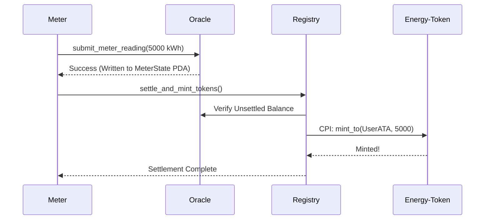

# System Architecture

GridTokenX is composed of five specialized Solana Anchor smart contracts that interoperate securely. By separating concerns, we achieve massive parallelization and minimize cross-program locking.

## The Five Pillars

1. **Oracle Program (`oracle`)**
   - **Role:** Ingests raw data from real-world IoT smart meters.
   - **Mechanism:** Stores state in individual `MeterState` Program Derived Addresses (PDAs). This avoids global write-locks during high-frequency data ingestion, fully utilizing Solana's Sealevel runtime.

2. **Registry Program (`registry`)**
   - **Role:** The canonical ledger of verified ecosystem participants.
   - **Mechanism:** Acts as the gateway for settlement. When a user requests to settle their meter balance, the Registry performs Cross-Program Invocations (CPI) to the Energy-Token program. It ensures that only registered meters can mint new GRX.

3. **Energy-Token Program (`energy-token`)**
   - **Role:** The SPL Token-2022 mint authority.
   - **Mechanism:** Securely locked behind CPIs. It exposes minting and burning logic but mathematically guarantees that `1 GRX = 1 kWh` of verified energy generation.

4. **Trading Program (`trading`)**
   - **Role:** Decentralized energy spot market.
   - **Mechanism:** Holds `BuyOrder` and `SellOrder` accounts. It exposes a `match_orders` instruction that allows off-chain cranks to intersect the order book at the equilibrium clearing price.

5. **Governance Program (`governance`)**
   - **Role:** Proof-of-Authority (PoA) configuration and parameter management.
   - **Mechanism:** Controls the global variables (like `min_energy_value` and trading fees) through a decentralized multisig or validator consensus structure.

## Transaction Flow

