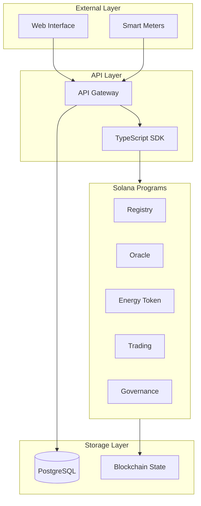
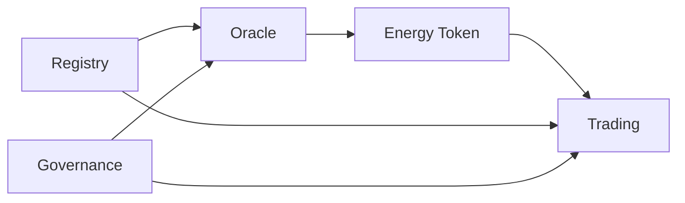

# Architecture Documentation

> **System design and architectural decisions for GridTokenX**

---

## Overview

GridTokenX is built on a modular architecture with 5 interconnected Solana programs that handle different aspects of the P2P energy trading platform.

### System Architecture

### Program Interactions

---

## Documents

### [System Overview](./system-overview.md)
High-level architecture covering all system components.

- Component interactions
- Data flow patterns
- Security model

### [P2P Trading Architecture](./p2p-trading.md)
Detailed trading system design.

- Order book structure
- Matching algorithm
- Settlement process

### [CPI Implementation](./cpi-implementation.md)
Cross-program invocation patterns.

- CPI security
- Account validation
- Error handling

---

## Design Principles

1. **Modularity** - Each program handles a single responsibility
2. **Security** - PDA-based access control, CPI validation
3. **Scalability** - Stateless design, parallel processing
4. **Transparency** - All transactions on-chain, auditable

---

## Related

- [Program Documentation](../programs/)
- [Process Flows](../flows/)
- [API Reference](../../api/)
