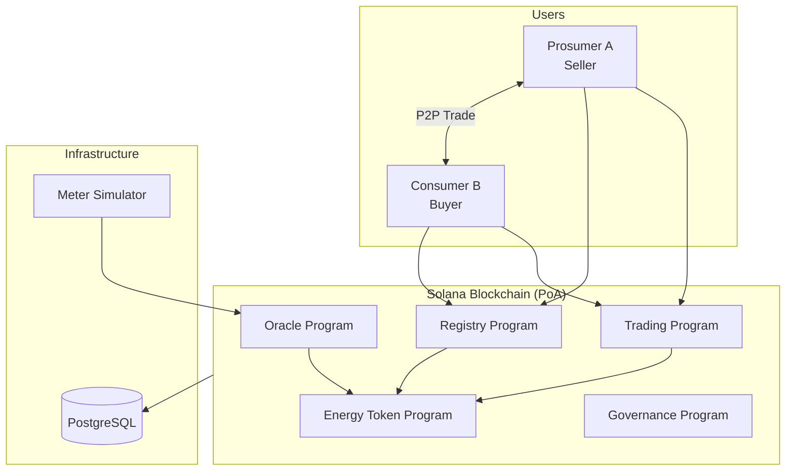
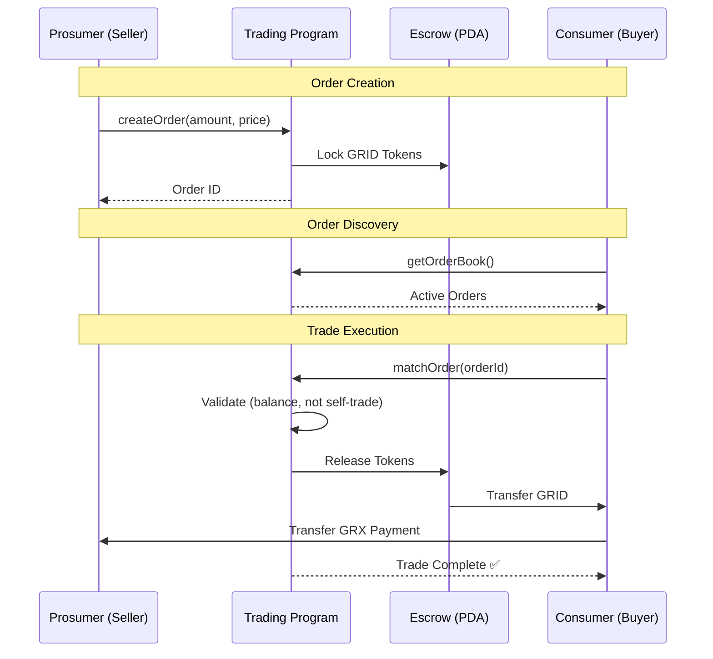
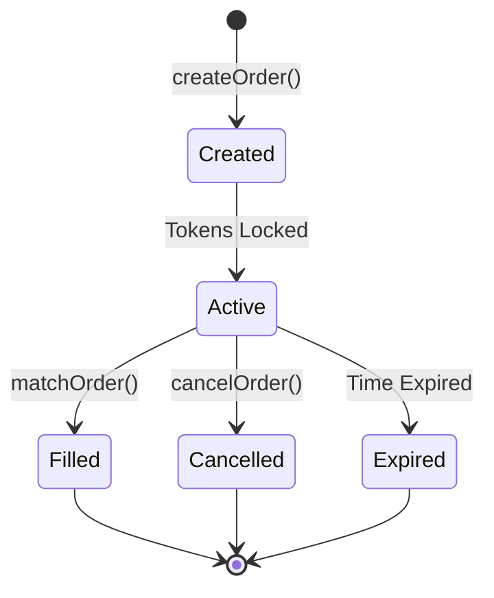

# GridTokenX - P2P Energy Trading Architecture

## 🎯 Executive Summary

A **Peer-to-Peer (P2P) Energy Trading** system built on Solana blockchain using **Proof of Authority (PoA)** consensus, emphasizing simplicity, real-world feasibility, and clear demonstrability.

---

## 📊 Architecture Diagrams (Mermaid)

### System Overview



### Trading Flow



### Order Lifecycle



---

## 🏗️ System Architecture

### **High-Level Overview**

```
┌────────────────────────────────────────────────────────────────┐
│                      P2P Energy Trading System                  │
└────────────────────────────────────────────────────────────────┘

┌─────────────┐                                    ┌─────────────┐
│  Prosumer A │ ◄─────────────────────────────────►│ Consumer B  │
│ (Seller)    │         Direct P2P Trade           │  (Buyer)    │
└──────┬──────┘                                    └──────┬──────┘
       │                                                  │
       │                                                  │
       └──────────────────────┬───────────────────────────┘
                              │
                    Settlement & Clearing
                              │
                              ▼
        ┌─────────────────────────────────────────┐
        │      Solana Blockchain (PoA Local)      │
        │                                         │
        │  ┌────────────┐  ┌────────────┐       │
        │  │  Registry  │  │  Trading   │       │
        │  │  Program   │  │  Program   │       │
        │  └────────────┘  └────────────┘       │
        │         ▲              ▲               │
        │         │              │               │
        │         └──────┬───────┘               │
        │                │                       │
        │         ┌──────────────┐              │
        │         │ Energy Token │              │
        │         │   Program    │              │
        │         └──────────────┘              │
        └─────────────────────────────────────────┘
                              │
                              │
                ┌─────────────┴─────────────┐
                │                           │
                ▼                           ▼
        ┌──────────────┐          ┌──────────────┐
        │  PostgreSQL  │          │    Meter     │
        │   Database   │          │  Simulator   │
        └──────────────┘          └──────────────┘
```

---

## 🔐 Proof of Authority (PoA) Architecture

### **Why PoA?**

| Feature | PoA (Our Choice) | PoW | PoS |
|---------|------------------|-----|-----|
| **Setup Time** | ⚡ Minutes | 🐌 Hours | 🐌 Hours |
| **Resource Usage** | 💚 Very Low | 🔴 Very High | 🟡 Medium |
| **Transaction Speed** | ⚡ < 1 second | 🐌 Minutes | 🟡 Seconds |
| **Cost** | 💰 Free (Local) | 💸 Expensive | 💰 Medium |
| **Control** | ✅ Full Control | ❌ Distributed | ❌ Distributed |
| **Demo Suitability** | ✅ Perfect | ❌ Impractical | 🟡 Complex |

### **PoA Node Configuration**

```yaml
# Solana PoA Validator Configuration
Network Type: Local (Private)
Consensus: Proof of Authority
Authority Nodes: 1 (can scale to 3-5)
Block Time: ~400ms
Transaction Finality: Immediate
Gas Fees: None (Local)

Validator Setup:
- Single authority node runs locally
- No mining/staking required
- Immediate block production
- Full control over network state
```

### **PoA vs Traditional Consensus**

```
┌─────────────────────────────────────────────────────────────┐
│                    Transaction Flow                         │
└─────────────────────────────────────────────────────────────┘

Traditional PoW/PoS:
User → Submit TX → Mempool → Wait for Miner → Block → Confirm
                              (Minutes)        (6 blocks)
       ├──────────────────────────────────────────────┤
                     5-60 minutes

Our PoA:
User → Submit TX → Authority Node → Block → Confirmed
                   (< 1 second)     (Immediate)
       ├───────────────────┤
            < 1 second
```

---

## 🏦 Order Book Architecture

### **Decentralized Order Book on Solana**

```
┌────────────────────────────────────────────────────────────┐
│                    Order Book Structure                    │
└────────────────────────────────────────────────────────────┘

On-Chain State (Solana):
┌──────────────────────────────────────────┐
│           Order PDAs (Accounts)          │
│                                          │
│  Order #1: ┌──────────────────────┐    │
│            │ Seller: PubkeyA      │    │
│            │ Amount: 10 kWh       │    │
│            │ Price: 3 GRX/kWh     │    │
│            │ Status: Active       │    │
│            │ Escrow: TokenAccount │    │
│            └──────────────────────┘    │
│                                          │
│  Order #2: ┌──────────────────────┐    │
│            │ Seller: PubkeyB      │    │
│            │ Amount: 5 kWh        │    │
│            │ Price: 3.2 GRX/kWh   │    │
│            │ Status: Active       │    │
│            │ Escrow: TokenAccount │    │
│            └──────────────────────┘    │
└──────────────────────────────────────────┘

Off-Chain Index (PostgreSQL):
┌──────────────────────────────────────────┐
│        Order Book Cache & History        │
│                                          │
│  • Active orders (for fast query)       │
│  • Historical trades                     │
│  • User transaction history              │
│  • Market statistics                     │
└──────────────────────────────────────────┘
```

### **Order Lifecycle**

```
┌──────────┐
│ Created  │ ─── Prosumer creates order
└────┬─────┘     • Lock tokens in escrow
     │           • Publish to order book
     │
     ▼
┌──────────┐
│ Active   │ ─── Order visible in order book
└────┬─────┘     • Can be matched by buyers
     │           • Can be cancelled by seller
     │
     ├─────► Match Found
     │
     ▼
┌──────────┐
│ Matching │ ─── Smart contract executing
└────┬─────┘     • Transfer tokens
     │           • Transfer SOL
     │           • Update states
     │
     ▼
┌──────────┐
│ Filled   │ ─── Trade completed
└──────────┘     • Tokens transferred
                 • Payment settled
                 • Order closed

Alternative Path:
Active ──► Cancelled ──► Tokens returned to seller
```

---

## 💱 P2P Trading Mechanism

### **Price Discovery (P2P Agreement)**

```
┌────────────────────────────────────────────────────────────┐
│           P2P Price Discovery (No Oracle Needed)           │
└────────────────────────────────────────────────────────────┘

Method 1: Seller Sets Price
┌─────────────────────────────────────────────────────────┐
│ Prosumer A:                                             │
│  "I have 10 kWh to sell"                               │
│  "My price: 3 GRX/kWh"                                 │
│  "Total: 30 GRX"                                       │
│                                                         │
│ Consumer B views order book:                           │
│  [1] 10 kWh @ 3.0 GRX/kWh = 30 GRX  ← Accept/Reject  │
│  [2] 5 kWh @ 3.2 GRX/kWh = 16 GRX   ← Accept/Reject  │
│                                                         │
│ Consumer B: "I accept order #1"                        │
└─────────────────────────────────────────────────────────┘

Method 2: Buyer Makes Offer (Optional)
┌─────────────────────────────────────────────────────────┐
│ Consumer B:                                             │
│  "I want to buy 10 kWh"                                │
│  "My offer: 2.8 GRX/kWh"                               │
│                                                         │
│ Prosumer A views buy offers:                           │
│  [1] 10 kWh @ 2.8 GRX/kWh = 28 GRX  ← Accept/Reject  │
│                                                         │
│ Prosumer A: "I accept this offer"                      │
└─────────────────────────────────────────────────────────┘

Our Implementation: Method 1 (Simpler)
✅ Seller sets price (like listing on marketplace)
✅ Buyer accepts or rejects (like shopping)
✅ No complex negotiation needed
```

### **Token Economics**

```
┌────────────────────────────────────────────────────────────┐
│                    Energy Token Model                      │
└────────────────────────────────────────────────────────────┘

Token Specification:
- Name: GridTokenX Energy (GRX)
- Standard: SPL Token (Solana)
- Decimals: 6
- 1 Token = 1 kWh energy
- Example: 10.5 kWh = 10,500,000 base units

Token Flow:
┌──────────────────────────────────────────────────────────┐
│                                                          │
│  Prosumer Production         Token Lifecycle            │
│        │                                                │
│        ▼                                                │
│  ┌──────────┐                                          │
│  │  Meter   │ ──► 15 kWh produced                     │
│  │ Reading  │     -8 kWh consumed                      │
│  └──────────┘     = 7 kWh surplus                      │
│        │                                                │
│        ▼                                                │
│  ┌──────────┐                                          │
│  │  Mint    │ ──► Mint 7,000,000 tokens               │
│  │  Tokens  │     to Prosumer wallet                   │
│  └──────────┘                                          │
│        │                                                │
│        ▼                                                │
│  ┌──────────┐                                          │
│  │  Sell    │ ──► Create order: 5 kWh @ 3 GRX        │
│  │  Order   │     Lock 5,000,000 tokens in escrow     │
│  └──────────┘                                          │
│        │                                                │
│        ▼                                                │
│  ┌──────────┐                                          │
│  │  Trade   │ ──► Transfer 5,000,000 tokens → Buyer  │
│  │ Execute  │     Transfer 15 GRX → Seller            │
│  └──────────┘                                          │
│                                                          │
└──────────────────────────────────────────────────────────┘
```

---

## 🔄 Complete Trading Flow (Detailed)

### **Step-by-Step P2P Trading Process**

```
┌────────────────────────────────────────────────────────────┐
│                    Step 1: Preparation                     │
└────────────────────────────────────────────────────────────┘

Prosumer A:
├─ Has Solana wallet: WalletA
├─ Registered in system: UserID = 1
├─ Meter reading: 20 kWh produced, 8 kWh consumed
├─ Energy tokens: 12,000,000 tokens (12 kWh)
└─ Wants to sell: 10 kWh @ 3 GRX/kWh

Consumer B:
├─ Has Solana wallet: WalletB
├─ Registered in system: UserID = 2
├─ GRX balance: 100 GRX
├─ Energy tokens: 0 tokens
└─ Wants to buy: 10 kWh of energy

┌────────────────────────────────────────────────────────────┐
│              Step 2: Create Sell Order (On-Chain)          │
└────────────────────────────────────────────────────────────┘

Prosumer A executes:
POST /api/trading/orders/create
{
  "seller_wallet": "WalletA",
  "amount_kwh": 10.0,
  "price_per_kwh": 3.0
}

Backend calls Solana program:
┌──────────────────────────────────────────┐
│  trading_program.create_order()          │
│                                          │
│  1. Create Order PDA                     │
│     ├─ Address: OrderPDA_1               │
│     ├─ Seller: WalletA                   │
│     ├─ Amount: 10,000,000 tokens         │
│     ├─ Price: 3 GRX/kWh                  │
│     └─ Status: Active                    │
│                                          │
│  2. Lock Tokens in Escrow                │
│     ├─ Transfer from: WalletA token acct │
│     ├─ Transfer to: Escrow token acct    │
│     └─ Amount: 10,000,000 tokens         │
│                                          │
│  3. Emit Event: OrderCreated             │
│     └─ order_id: OrderPDA_1              │
└──────────────────────────────────────────┘

Result:
✅ Order created on-chain
✅ 10 kWh locked in escrow
✅ Prosumer A has 2 kWh remaining

┌────────────────────────────────────────────────────────────┐
│              Step 3: View Order Book (Query)               │
└────────────────────────────────────────────────────────────┘

Consumer B queries:
GET /api/trading/orders/active

Backend fetches:
1. Query Solana: Get all active Order PDAs
2. Query PostgreSQL: Get seller info
3. Combine and format

Response:
{
  "orders": [
    {
      "order_id": "OrderPDA_1",
      "seller": {
        "wallet": "WalletA",
        "name": "Solar Home A",
        "user_type": "prosumer"
      },
      "amount_kwh": 10.0,
      "price_per_kwh": 3.0,
      "total_price_grx": 30.0,
      "created_at": "2025-11-24T10:30:00Z"
    }
  ]
}

Consumer B sees:
┌────────────────────────────────────────────┐
│         Available Orders                   │
│                                            │
│  [1] Solar Home A                         │
│      Amount: 10 kWh                       │
│      Price: 3.0 GRX/kWh                   │
│      Total: 30 GRX                        │
│      Created: 5 mins ago                  │
│                                            │
│      [ Buy Now ]  [ Details ]             │
└────────────────────────────────────────────┘

┌────────────────────────────────────────────────────────────┐
│            Step 4: Match Order (Trade Execution)           │
└────────────────────────────────────────────────────────────┘

Consumer B accepts:
POST /api/trading/orders/match
{
  "buyer_wallet": "WalletB",
  "order_id": "OrderPDA_1"
}

Backend calls Solana program:
┌──────────────────────────────────────────────────────────┐
│  trading_program.match_order()                           │
│                                                          │
│  Pre-checks:                                            │
│  ✓ Order exists and active                             │
│  ✓ Buyer has sufficient GRX (30 GRX)                   │
│  ✓ Escrow has tokens (10,000,000 tokens)               │
│  ✓ Buyer != Seller (no self-trading)                   │
│                                                          │
│  Atomic Transaction (All or Nothing):                   │
│                                                          │
│  1. Transfer Energy Tokens                              │
│     ┌─────────────────────────────────────┐            │
│     │ From: Escrow Account                │            │
│     │ To: WalletB Token Account           │            │
│     │ Amount: 10,000,000 tokens (10 kWh)  │            │
│     └─────────────────────────────────────┘            │
│                                                          │
│  2. Transfer GRX Payment                                │
│     ┌─────────────────────────────────────┐            │
│     │ From: WalletB                       │            │
│     │ To: WalletA                         │            │
│     │ Amount: 30,000,000 base units       │            │
│     │         (30 GRX)                    │            │
│     └─────────────────────────────────────┘            │
│                                                          │
│  3. Update Order Status                                 │
│     ┌─────────────────────────────────────┐            │
│     │ OrderPDA_1.status = Filled          │            │
│     │ OrderPDA_1.filled_at = timestamp    │            │
│     │ OrderPDA_1.buyer = WalletB          │            │
│     └─────────────────────────────────────┘            │
│                                                          │
│  4. Emit Event: TradeExecuted                           │
│     ┌─────────────────────────────────────┐            │
│     │ order_id: OrderPDA_1                │            │
│     │ seller: WalletA                     │            │
│     │ buyer: WalletB                      │            │
│     │ amount: 10 kWh                      │            │
│     │ price: 30 GRX                       │            │
│     └─────────────────────────────────────┘            │
└──────────────────────────────────────────────────────────┘

Transaction Result:
┌────────────────────────────────────────────────────────┐
│  TX Signature: 5KL9mN2pQ3rS4tU5vW6xY7zA8bC9dE0f...   │
│                                                        │
│  Changes:                                             │
│  ├─ Prosumer A:                                       │
│  │  └─ GRX: +30 GRX                                  │
│  │  └─ Energy Tokens: -10 kWh                        │
│  │                                                    │
│  └─ Consumer B:                                       │
│     └─ GRX: -30 GRX                                  │
│     └─ Energy Tokens: +10 kWh                        │
│                                                        │
│  Status: ✅ Confirmed (Block #12345)                  │
└────────────────────────────────────────────────────────┘

┌────────────────────────────────────────────────────────────┐
│              Step 5: Record Transaction (Off-Chain)        │
└────────────────────────────────────────────────────────────┘

Backend saves to PostgreSQL:
INSERT INTO transactions (
  seller_id,
  buyer_id,
  amount_kwh,
  price_per_kwh,
  total_sol,
  tx_signature,
  timestamp
) VALUES (
  1,                                  -- Prosumer A
  2,                                  -- Consumer B
  10.0,
  3.0,
  30.0,
  '5KL9mN2pQ3rS4tU5vW6xY7zA8b...',
  '2025-11-24 10:35:00'
);

UPDATE orders SET
  status = 'filled',
  filled_at = NOW()
WHERE id = 'OrderPDA_1';

┌────────────────────────────────────────────────────────────┐
│              Step 6: Confirmation & Verification           │
└────────────────────────────────────────────────────────────┘

Both users can verify:

Prosumer A checks:
GET /api/trading/history?user_id=1
└─ Shows: Sold 10 kWh to Consumer B for 30 GRX

Consumer B checks:
GET /api/trading/history?user_id=2
└─ Shows: Bought 10 kWh from Prosumer A for 30 GRX

On-chain verification:
solana account WalletA
└─ GRX Balance: Previous + 30 GRX

solana account WalletB
└─ Token balance: 10,000,000 tokens (10 kWh)

Final Balances:
┌──────────────┬─────────────┬──────────────────┐
│ User         │ GRX         │ Energy Tokens    │
├──────────────┼─────────────┼──────────────────┤
│ Prosumer A   │ +30 GRX     │ 2 kWh (2M)      │
│ Consumer B   │ -30 GRX     │ 10 kWh (10M)    │
└──────────────┴─────────────┴──────────────────┘
```

---

## 🛡️ Security & Safety Mechanisms

### **Smart Contract Security**

```
┌────────────────────────────────────────────────────────────┐
│                    Security Checks                         │
└────────────────────────────────────────────────────────────┘

1. Authority Validation
   ✓ Only order owner can cancel
   ✓ Only authorized addresses can match

2. Self-Trading Prevention
   ✓ require!(buyer != seller)
   ✓ Prevents wash trading

3. Balance Checks
   ✓ Verify buyer has sufficient GRX
   ✓ Verify escrow has tokens
   ✓ Verify amounts match

4. Re-entrancy Protection
   ✓ State updates before external calls
   ✓ Reentrancy guard flags

5. Overflow Protection
   ✓ Use checked_mul, checked_add
   ✓ Prevent integer overflow attacks

6. Atomic Transactions
   ✓ All or nothing execution
   ✓ Rollback on any failure
```

### **Error Handling**

```rust
// Example error codes
#[error_code]
pub enum ErrorCode {
    #[msg("Insufficient balance")]
    InsufficientBalance,
    
    #[msg("Order not found or inactive")]
    InvalidOrder,
    
    #[msg("Self-trading not allowed")]
    SelfTradingNotAllowed,
    
    #[msg("Amount mismatch")]
    AmountMismatch,
    
    #[msg("Unauthorized")]
    Unauthorized,
    
    #[msg("Re-entrancy detected")]
    ReentrancyDetected,
}
```

---

## 📊 Data Architecture

### **On-Chain vs Off-Chain Data**

```
┌────────────────────────────────────────────────────────────┐
│                    Data Distribution                       │
└────────────────────────────────────────────────────────────┘

On-Chain (Solana):
┌─────────────────────────────────────────┐
│ Critical Trading Data                   │
│                                         │
│ ✓ Order details (PDA)                  │
│ ✓ Token balances                       │
│ ✓ Escrow accounts                      │
│ ✓ Trade execution records              │
│ ✓ User registration PDAs               │
│                                         │
│ Why: Immutable, verifiable, secure     │
└─────────────────────────────────────────┘

Off-Chain (PostgreSQL):
┌─────────────────────────────────────────┐
│ Supplementary Data                      │
│                                         │
│ ✓ User profiles (name, type)          │
│ ✓ Meter readings (historical)          │
│ ✓ Transaction history (cache)          │
│ ✓ Market statistics                    │
│ ✓ Search indexes                       │
│                                         │
│ Why: Fast queries, flexible schema     │
└─────────────────────────────────────────┘

Synchronization:
Backend monitors Solana events → Updates PostgreSQL
```

### **Database-Blockchain Sync**

```
Event-Driven Synchronization:

Solana Event                PostgreSQL Update
─────────────              ──────────────────
OrderCreated     ────►     INSERT into orders
TradeExecuted    ────►     INSERT into transactions
                           UPDATE orders.status
OrderCancelled   ────►     UPDATE orders.status
UserRegistered   ────►     INSERT into users

Flow:
┌──────────────┐         ┌──────────────┐
│   Solana     │ Events  │   Backend    │
│   Program    │────────►│   Listener   │
└──────────────┘         └──────┬───────┘
                                │
                                │ Update
                                ▼
                         ┌──────────────┐
                         │  PostgreSQL  │
                         │   Database   │
                         └──────────────┘
```

---

## 🚀 Scalability Considerations

### **Current Design (MVP)**

```
Throughput:
- Orders per second: ~100
- Matches per second: ~50
- Meter readings per second: ~1000

Limitations:
- Single validator node
- Local network only
- No network latency
```

### **Future Scaling Path**

```
Phase 1 (Current):
└─ Single PoA validator
   └─ Local network
      └─ ~100 TPS

Phase 2 (Scale Up):
└─ 3-5 PoA validators
   └─ Private network
      └─ ~500 TPS

Phase 3 (Production):
└─ Migrate to Solana devnet/mainnet
   └─ Public network
      └─ ~3000 TPS (Solana capacity)
```

---

## 🎯 Design Decisions & Rationale

### **Key Architectural Choices**

| Decision | Rationale | Trade-offs |
|----------|-----------|------------|
| **PoA Consensus** | Fast, simple, full control | Centralized (acceptable for demo) |
| **Order Book Model** | Familiar, transparent pricing | More complex than AMM |
| **P2P Price Agreement** | No oracle needed, saves cost | Manual pricing (acceptable for MVP) |
| **Hybrid Storage** | Best of both worlds | Sync complexity |
| **SPL Token Standard** | Battle-tested, compatible | Standard features only |
| **Single Validator** | Simplest setup | Single point of failure |

### **What We Optimized For**

```
✅ Demo-ability: Easy to show and explain
✅ Development Speed: Can finish in 4 weeks
✅ Cost: Free to run locally
✅ Simplicity: Understandable by non-technical audience
✅ Reliability: Proven technologies
```

### **What We Sacrificed**

```
❌ Full Decentralization: Using PoA
❌ Real-time Metering: Using batch data
❌ Advanced Features: No AMM, no derivatives
❌ Production Scale: Local only for now
❌ Oracle Integration: Manual pricing
```

---

## 📈 Performance Characteristics

### **Transaction Times**

```
Typical Transaction Latency:

User Request ──► Backend API ──► Solana ──► Confirmation
     ~50ms          ~100ms       ~400ms      ~50ms
     
Total: ~600ms end-to-end

Breakdown:
├─ Network latency: ~50ms (local)
├─ API processing: ~100ms
├─ Blockchain consensus: ~400ms (1 slot)
└─ Event processing: ~50ms
```

### **Throughput Estimates**

```
Component              Capacity
──────────────────────────────────
Registry (register)    ~200 TPS
Trading (create order) ~100 TPS
Trading (match order)  ~50 TPS
Meter (readings)       ~1000 TPS

Bottleneck: Trading program (compute-intensive)
```

---

## 🔍 Monitoring & Observability

### **Key Metrics to Track**

```
Blockchain Metrics:
├─ Block time
├─ Transaction success rate
├─ Account creation rate
└─ Token supply

Trading Metrics:
├─ Active orders count
├─ Match rate
├─ Average trade size (kWh & GRX)
├─ Price range (GRX/kWh)
└─ Trading volume

System Metrics:
├─ API response time
├─ Database query time
├─ Error rate
└─ Meter reading frequency
```

---

## 🎓 Demo Considerations

### **What Makes This Architecture Demo-Friendly**

```
✅ Visual Flow: Easy to diagram and explain
✅ Fast Execution: Trades complete in < 1 second
✅ Transparent: All data visible on-chain
✅ Interactive: Can demonstrate live trading
✅ Reproducible: Reset and demo again easily
✅ Self-Contained: Everything runs locally
```

### **Demo Talking Points**

```
1. "This is a Proof of Authority blockchain running locally"
   → Show validator logs

2. "Users register and get blockchain accounts"
   → Show Solana Explorer

3. "Smart meters send energy data"
   → Show simulator logs + database

4. "Prosumers create sell orders on-chain"
   → Show order creation transaction

5. "Consumers browse and buy energy peer-to-peer"
   → Show order book + match transaction

6. "Settlement is automatic and instant"
   → Show balance changes

7. "All transactions are auditable and immutable"
   → Show transaction history
```

---

## 💳 Thai Baht Chain Integration

### **Payment Architecture**

```
┌────────────────────────────────────────────────────────────┐
│              Cross-Chain Payment Flow                      │
└────────────────────────────────────────────────────────────┘

GridTokenX (Solana)                Thai Baht Chain
┌─────────────────┐                ┌─────────────────┐
│  Energy Trading │                │   THB Payment   │
│                 │                │                 │
│  • Order Book   │                │  • THBC Token   │
│  • Energy Token │◄──────────────►│  • Bridge       │
│  • Escrow       │   Cross-Chain  │  • Settlement   │
│                 │   Bridge       │                 │
└─────────────────┘                └─────────────────┘
         │                                  │
         │                                  │
         ▼                                  ▼
    PostgreSQL ◄──────Sync──────────► Price Oracle
    (Trade Data)                      (GRX/THB Rate)
```

### **How It Works**

**Step 1: Price Conversion**
```
Energy Price (GRX) ──► Oracle ──► Thai Baht (THB)

Example:
• Seller sets: 10 kWh @ 3 GRX/kWh = 30 GRX
• Oracle rate: 1 GRX = 10 THB
• Display price: 10 kWh @ 30 THB/kWh = 300 THB
```

**Step 2: Payment Flow**
```
┌──────────────────────────────────────────────────────────┐
│  1. Buyer Views Order                                    │
│     • Price shown in both GRX and THB                    │
│     • Example: 30 GRX (≈300 THB)                         │
└──────────────────────────────────────────────────────────┘
                         │
                         ▼
┌──────────────────────────────────────────────────────────┐
│  2. Buyer Chooses Payment Method                         │
│     ✓ Pay with GRX (native token)                        │
│     ✓ Pay with THB (via Thai Baht Chain)                 │
└──────────────────────────────────────────────────────────┘
                         │
                         ▼
┌──────────────────────────────────────────────────────────┐
│  3. If THB Selected:                                     │
│     a. Lock Energy Tokens in Escrow (Solana)             │
│     b. Initiate THB payment (Thai Baht Chain)            │
│     c. Bridge listens for THB confirmation               │
│     d. Upon confirmation: Release tokens to buyer        │
│     e. Convert THB to GRX and send to seller             │
└──────────────────────────────────────────────────────────┘
```

**Step 3: Settlement**
```
Thai Baht Chain                          Solana
─────────────                           ─────────

Buyer sends 300 THBC
       │
       ▼
Bridge Contract
   (Lock THBC)
       │
       │ Emit Event: THBPaid
       ▼                                    │
Oracle Confirms ─────────────────────────►│
                                           │
                                           ▼
                                   Release Energy Tokens
                                           │
                                           ▼
                                   Convert 300 THB → 30 GRX
                                           │
                                           ▼
                                   Send 30 GRX to Seller
```

### **Integration Components**

**1. Cross-Chain Bridge**
```
Bridge Contract (Solana Side):
• Listen for Thai Baht Chain events
• Verify payment confirmations
• Release escrowed tokens
• Handle GRX ↔ THB conversion

Bridge Contract (Thai Baht Chain Side):
• Accept THBC payments
• Lock funds during settlement
• Emit payment events
• Release funds after confirmation
```

**2. Price Oracle**
```
Oracle Service:
• Real-time GRX/THB exchange rate
• Update frequency: Every 1 minute
• Source: Market data aggregator
• Fallback: Manual rate setting

Example Rates:
┌────────────────────────────────────┐
│ 1 GRX = 10 THB                     │
│ 1 kWh Energy = 1 Energy Token      │
│ Energy Token → GRX (for payment)   │
└────────────────────────────────────┘
```

**3. Payment Options UI**
```
Order Details:
┌──────────────────────────────────────────┐
│ Solar Home A                             │
│ Amount: 10 kWh                           │
│                                          │
│ Price:                                   │
│   • 30 GRX                              │
│   • ≈300 THB (1 GRX = 10 THB)          │
│                                          │
│ Payment Method:                          │
│   ○ Pay with GRX (native)               │
│   ● Pay with Thai Baht (THBC)           │
│                                          │
│ [ Confirm Purchase ]                     │
└──────────────────────────────────────────┘
```

### **Benefits of Thai Baht Integration**

```
✅ Local Currency: Users pay in familiar THB
✅ Compliance: Aligns with Thai financial regulations
✅ Accessibility: No need to buy crypto first
✅ Transparency: Clear pricing in local currency
✅ Lower Barrier: Easier for non-crypto users
```

### **Technical Implementation**

**Smart Contract (Solana)**
```rust
// Enhanced trading program with THB support

pub struct OrderWithThb {
    pub price_grx: u64,        // Price in GRX
    pub price_thb: u64,        // Price in THB (for display)
    pub payment_method: PaymentMethod,
    // ... other fields
}

pub enum PaymentMethod {
    GRX,              // Direct GRX payment
    ThaibahtChain,    // Cross-chain THB payment
}

pub fn match_order_with_thb(
    ctx: Context<MatchOrder>,
    payment_method: PaymentMethod,
) -> Result<()> {
    match payment_method {
        PaymentMethod::GRX => {
            // Normal GRX payment flow
            transfer_grx(ctx)?;
        }
        PaymentMethod::ThaibahtChain => {
            // Wait for bridge confirmation
            require!(
                ctx.accounts.bridge_proof.is_valid(),
                ErrorCode::InvalidBridgeProof
            );
            // Release tokens after THB payment confirmed
            release_from_escrow(ctx)?;
        }
    }
    Ok(())
}
```

**Bridge Service (Backend)**
```typescript
// Thai Baht Chain bridge listener

class ThaibahtBridge {
    async listenForPayments() {
        // Listen to Thai Baht Chain events
        thbChain.on('PaymentReceived', async (event) => {
            const { orderId, buyer, amount, txHash } = event;
            
            // Verify payment on Thai Baht Chain
            const isValid = await this.verifyThbPayment(txHash);
            
            if (isValid) {
                // Create proof for Solana
                const proof = await this.createBridgeProof(event);
                
                // Execute order matching on Solana
                await solana.matchOrderWithThb(orderId, proof);
                
                // Convert THB to GRX for seller
                await this.settleSeller(orderId, amount);
            }
        });
    }
}
```

## 🏛️ Smart Contract Deep Dive

### **Program Architecture Overview**

```
┌──────────────────────────────────────────────────────────────┐
│              GridTokenX Smart Contract Programs              │
└──────────────────────────────────────────────────────────────┘

┌─────────────────────────────────────────────────────────────┐
│ 1. Registry Program (User & Meter Management)               │
│    Program ID: 2XPQmFYMdXjP7ffoBB3mXeCdboSFg5Yeb6QmTSGbW8a7 │
│                                                              │
│    Instructions:                                             │
│    • initialize()         - Setup registry                   │
│    • register_user()      - Register prosumer/consumer       │
│    • register_meter()     - Register smart meter             │
│    • update_meter_reading() - Record meter readings          │
│    • settle_meter_balance() - Prepare tokens for minting     │
│    • get_unsettled_balance() - Query pending settlements     │
│                                                              │
│    Key Accounts:                                             │
│    • Registry (PDA: "registry")                             │
│    • UserAccount (PDA: "user" + wallet)                     │
│    • MeterAccount (PDA: "meter" + meter_id)                 │
└─────────────────────────────────────────────────────────────┘

┌─────────────────────────────────────────────────────────────┐
│ 2. Trading Program (P2P Marketplace)                        │
│    Program ID: GZnqNTJsre6qB4pWCQRE9FiJU2GUeBtBDPp6s7zosctk │
│                                                              │
│    Instructions:                                             │
│    • initialize_market()   - Setup trading market            │
│    • create_sell_order()   - Prosumer creates sell order     │
│    • create_buy_order()    - Consumer creates buy order      │
│    • match_orders()        - Execute P2P trade               │
│    • cancel_order()        - Cancel pending order            │
│    • execute_batch()       - Batch order processing          │
│    • update_market_params() - Update market parameters       │
│                                                              │
│    Key Accounts:                                             │
│    • Market (PDA: "market")                                 │
│    • Order (PDA: "order" + wallet + counter)                │
│    • TradeRecord (PDA: "trade" + buy_order + sell_order)    │
└─────────────────────────────────────────────────────────────┘

┌─────────────────────────────────────────────────────────────┐
│ 3. Governance Program (ERC Certificates)                    │
│    Program ID: 4DY97YYBt4bxvG7xaSmWy3MhYhmA6HoMajBHVqhySvXe │
│                                                              │
│    Instructions:                                             │
│    • initialize()          - Setup governance                │
│    • issue_erc_certificate() - Issue renewable certificate   │
│    • validate_erc()        - Validate certificate            │
│    • retire_erc()          - Retire used certificate         │
│                                                              │
│    Key Accounts:                                             │
│    • Governance (PDA: "governance")                         │
│    • ErcCertificate (PDA: "erc" + certificate_id)           │
└─────────────────────────────────────────────────────────────┘

┌─────────────────────────────────────────────────────────────┐
│ 4. Energy Token Program (GRID Token)                        │
│    Program ID: 94G1r674LmRDmLN2UPjDFD8Eh7zT8JaSaxv9v68GyEur │
│                                                              │
│    Instructions:                                             │
│    • initialize()          - Setup token program             │
│    • mint_tokens()         - Mint energy credits             │
│    • transfer_tokens()     - Transfer between users          │
│    • burn_tokens()         - Burn consumed energy            │
│                                                              │
│    Token Specification:                                      │
│    • Name: GridTokenX (GRX)                                 │
│    • Standard: SPL Token                                    │
│    • Decimals: 9                                            │
│    • Supply: Variable (based on generation)                 │
└─────────────────────────────────────────────────────────────┘

┌─────────────────────────────────────────────────────────────┐
│ 5. Oracle Program (Price Feed)                              │
│    Program ID: DvdtU4quEbuxUY2FckmvcXwTpC9qp4HLJKb1PMLaqAoE │
│                                                              │
│    Instructions:                                             │
│    • initialize()          - Setup oracle                    │
│    • update_price()        - Update energy price             │
│    • get_price()           - Query current price             │
│                                                              │
│    Key Accounts:                                             │
│    • Oracle (PDA: "oracle")                                 │
│    • PriceFeed (PDA: "price_feed")                          │
└─────────────────────────────────────────────────────────────┘
```

### **Cross-Program Invocation (CPI) Pattern**

```
┌────────────────────────────────────────────────────────────┐
│            Trading Program CPI to Governance                │
└────────────────────────────────────────────────────────────┘

Scenario: Create sell order with ERC validation

1. User calls: trading.create_sell_order()
   ├─ Parameters: energy_amount, price_per_kwh
   └─ Optional: erc_certificate account

2. Trading Program Validates:
   ┌──────────────────────────────────────────────────┐
   │ if erc_certificate.is_some() {                   │
   │   • Check status == Valid                        │
   │   • Check expires_at > now                        │
   │   • Check validated_for_trading == true          │
   │   • Check energy_amount <= certificate amount    │
   │ }                                                 │
   └──────────────────────────────────────────────────┘

3. Order Created:
   • Lock energy tokens in escrow
   • Update market depth
   • Emit SellOrderCreated event

Real Code Example from trading program:
```rust
pub fn create_sell_order(
    ctx: Context<CreateSellOrder>,
    energy_amount: u64,
    price_per_kwh: u64,
) -> Result<()> {
    // ERC VALIDATION
    if let Some(erc_certificate) = &ctx.accounts.erc_certificate {
        let clock = Clock::get()?;
        
        require!(
            erc_certificate.status == ErcStatus::Valid,
            ErrorCode::InvalidErcCertificate
        );
        
        if let Some(expires_at) = erc_certificate.expires_at {
            require!(
                clock.unix_timestamp < expires_at,
                ErrorCode::ErcCertificateExpired
            );
        }
        
        require!(
            erc_certificate.validated_for_trading,
            ErrorCode::ErcNotValidatedForTrading
        );
        
        require!(
            energy_amount <= erc_certificate.energy_amount,
            ErrorCode::ExceedsErcAmount
        );
    }
    
    // Create order logic...
    Ok(())
}
```

---

## 💾 Account Model & Data Structures

### **Account Space Calculation**

```
┌────────────────────────────────────────────────────────────┐
│                  Solana Account Structure                   │
└────────────────────────────────────────────────────────────┘

Each account needs rent exemption. Account size calculation:

Base: 8 bytes (discriminator)
+ Data fields (based on types)
+ Vectors: 4 bytes (length) + (element_size * max_len)
+ Strings: 4 bytes (length) + max_utf8_bytes

Example: Market Account
┌──────────────────────────────────────────────────┐
│ Discriminator:            8 bytes                │
│ authority (Pubkey):       32 bytes               │
│ active_orders (u64):      8 bytes                │
│ total_volume (u64):       8 bytes                │
│ total_trades (u64):       8 bytes                │
│ created_at (i64):         8 bytes                │
│ clearing_enabled (bool):  1 byte                 │
│ market_fee_bps (u16):     2 bytes                │
│ batch_config:             ~40 bytes              │
│ current_batch (Option):   ~200 bytes             │
│ buy_side_depth (Vec[20]): 4 + (20 * 24) = 484   │
│ sell_side_depth (Vec[20]): 4 + (20 * 24) = 484  │
│ last_clearing_price:      8 bytes                │
│ price_history (Vec[100]): 4 + (100 * 24) = 2404 │
│ volume_weighted_price:    8 bytes                │
├──────────────────────────────────────────────────┤
│ TOTAL:                    ~3,705 bytes           │
│ Rent: ~0.026 SOL (2 years rent-exempt)          │
└──────────────────────────────────────────────────┘
```

### **PDA (Program Derived Address) Seeds**

```
┌────────────────────────────────────────────────────────────┐
│                  PDA Derivation Patterns                    │
└────────────────────────────────────────────────────────────┘

Registry Program PDAs:
├─ Registry:      ["registry"]
├─ UserAccount:   ["user", wallet_pubkey]
└─ MeterAccount:  ["meter", meter_id]

Trading Program PDAs:
├─ Market:        ["market"]
├─ Order:         ["order", wallet_pubkey, order_counter]
└─ TradeRecord:   ["trade", buy_order_pubkey, sell_order_pubkey]

Governance Program PDAs:
├─ Governance:    ["governance"]
└─ ErcCertificate: ["erc", certificate_id]

Benefits of PDAs:
✅ Deterministic addresses (no need to store)
✅ Program-controlled (only program can sign)
✅ Collision-resistant (seeds ensure uniqueness)
✅ Cost-effective (no keypair generation needed)

Example PDA Derivation in Anchor:
```rust
#[account(
    init,
    payer = authority,
    space = 8 + Order::INIT_SPACE,
    seeds = [
        b"order", 
        authority.key().as_ref(), 
        market.active_orders.to_le_bytes().as_ref()
    ],
    bump
)]
pub order: Account<'info, Order>,
```
```

### **Order Account Detailed Structure**

```
┌────────────────────────────────────────────────────────────┐
│                   Order Account Layout                      │
└────────────────────────────────────────────────────────────┘

#[account]
pub struct Order {
    pub seller: Pubkey,           // 32 bytes - Who is selling
    pub buyer: Pubkey,            // 32 bytes - Who is buying
    pub amount: u64,              // 8 bytes  - Total kWh
    pub filled_amount: u64,       // 8 bytes  - Already traded kWh
    pub price_per_kwh: u64,       // 8 bytes  - Price in tokens
    pub order_type: OrderType,    // 1 byte   - Buy or Sell
    pub status: OrderStatus,      // 1 byte   - Active/Filled/Cancelled
    pub created_at: i64,          // 8 bytes  - Creation timestamp
    pub expires_at: i64,          // 8 bytes  - Expiration timestamp
}

OrderType Enum:
┌──────────────┐
│ Sell = 0     │  Seller offering energy
│ Buy = 1      │  Buyer wanting energy
└──────────────┘

OrderStatus Enum:
┌──────────────────────┐
│ Active = 0           │  Available for matching
│ PartiallyFilled = 1  │  Some amount traded
│ Completed = 2        │  Fully executed
│ Cancelled = 3        │  User cancelled
│ Expired = 4          │  Time expired
└──────────────────────┘

Order Lifecycle State Machine:
┌────────┐     ┌─────────────────┐     ┌───────────┐
│ Active │────►│ PartiallyFilled │────►│ Completed │
└────┬───┘     └─────────────────┘     └───────────┘
     │                │
     └────────────────┴──────────►┌───────────┐
                                  │ Cancelled │
                                  └───────────┘
```

---

## ⚙️ Settlement & Token Flow Mechanics

### **Meter Reading to Token Minting Flow**

```
┌────────────────────────────────────────────────────────────┐
│         Complete Settlement Process (Step-by-Step)         │
└────────────────────────────────────────────────────────────┘

Step 1: Smart Meter Sends Reading
┌──────────────────────────────────────────────────────┐
│ Meter Simulator                                      │
│ ├─ Reading ID: R-12345                              │
│ ├─ Meter ID: METER-001                              │
│ ├─ Generated: 15,000 Wh (15 kWh)                    │
│ ├─ Consumed: 8,000 Wh (8 kWh)                       │
│ └─ Timestamp: 2025-11-25T16:30:00Z                  │
└──────────────────────────────────────────────────────┘
            │
            ▼
Step 2: Oracle Updates Meter Account
┌──────────────────────────────────────────────────────┐
│ registry.update_meter_reading()                      │
│                                                      │
│ MeterAccount State Before:                          │
│ ├─ total_generation: 100,000 Wh                     │
│ ├─ total_consumption: 50,000 Wh                     │
│ ├─ settled_net_generation: 50,000 Wh                │
│ └─ claimed_erc_generation: 80,000 Wh                │
│                                                      │
│ Update:                                              │
│ ├─ total_generation += 15,000 → 115,000 Wh         │
│ └─ total_consumption += 8,000 → 58,000 Wh          │
│                                                      │
│ MeterAccount State After:                           │
│ ├─ total_generation: 115,000 Wh                     │
│ ├─ total_consumption: 58,000 Wh                     │
│ ├─ Net Generation: 57,000 Wh (115k - 58k)          │
│ ├─ Unsettled: 7,000 Wh (57k - 50k settled)         │
│ └─ claimed_erc_generation: 80,000 Wh                │
└──────────────────────────────────────────────────────┘
            │
            ▼
Step 3: User Requests Settlement
┌──────────────────────────────────────────────────────┐
│ registry.settle_meter_balance()                      │
│                                                      │
│ Calculations:                                        │
│ current_net_gen = 115,000 - 58,000 = 57,000 Wh     │
│ new_tokens = 57,000 - 50,000 = 7,000 Wh            │
│                                                      │
│ Update settled tracker:                             │
│ settled_net_generation = 57,000 Wh                  │
│                                                      │
│ Returns: 7,000 Wh (ready to mint)                   │
│                                                      │
│ Event Emitted:                                       │
│ MeterBalanceSettled {                               │
│   meter_id: "METER-001",                            │
│   owner: Wallet_ABC,                                │
│   tokens_to_mint: 7,000,                            │
│   total_settled: 57,000,                            │
│   timestamp: 1732532400                             │
│ }                                                    │
└──────────────────────────────────────────────────────┘
            │
            ▼
Step 4: Energy Token Program Mints
┌──────────────────────────────────────────────────────┐
│ energy_token.mint_tokens()                           │
│                                                      │
│ Convert to token units (9 decimals):                │
│ 7,000 Wh × 1,000,000,000 = 7,000,000,000,000 units │
│                                                      │
│ SPL Token Mint:                                      │
│ ├─ To: User's associated token account              │
│ ├─ Amount: 7,000,000,000,000 base units            │
│ └─ Authority: Energy token program PDA              │
│                                                      │
│ User Balance After:                                  │
│ • Previous: 5,000 GRX (5,000,000,000,000 units)    │
│ • Minted: 7,000 GRX (7,000,000,000,000 units)      │
│ • New: 12,000 GRX (12,000,000,000,000 units)       │
└──────────────────────────────────────────────────────┘

Real Code - Settlement Logic:
```rust
pub fn settle_meter_balance(
    ctx: Context<SettleMeterBalance>
) -> Result<u64> {
    let meter = &mut ctx.accounts.meter_account;
    
    // Verify meter is active
    require!(
        meter.status == MeterStatus::Active,
        ErrorCode::InvalidMeterStatus
    );
    
    // Calculate net generation
    let current_net_gen = meter
        .total_generation
        .saturating_sub(meter.total_consumption);
    
    // Calculate unsettled amount
    let new_tokens_to_mint = current_net_gen
        .saturating_sub(meter.settled_net_generation);
    
    require!(
        new_tokens_to_mint > 0,
        ErrorCode::NoUnsettledBalance
    );
    
    // Update settled tracker (prevents double-minting)
    meter.settled_net_generation = current_net_gen;
    
    emit!(MeterBalanceSettled {
        meter_id: meter.meter_id.clone(),
        owner: meter.owner,
        tokens_to_mint: new_tokens_to_mint,
        total_settled: current_net_gen,
        timestamp: Clock::get()?.unix_timestamp,
    });
    
    Ok(new_tokens_to_mint)
}
```
```

### **Double-Minting Prevention**

```
┌────────────────────────────────────────────────────────────┐
│            Two-Tracker System for Tokenization              │
└────────────────────────────────────────────────────────────┘

MeterAccount has TWO trackers:

1. settled_net_generation (GRID Token Tracker)
   • Tracks NET generation (produced - consumed)
   • Prevents double-minting of tradable tokens
   • Updated during settle_meter_balance()
   
2. claimed_erc_generation (ERC Certificate Tracker)
   • Tracks TOTAL generation only
   • Prevents double-claiming of green certificates
   • Updated when ERC certificate is issued

Example Scenario:
┌──────────────────────────────────────────────────────┐
│ Total Generation: 100 kWh                            │
│ Total Consumption: 40 kWh                            │
│ Net Generation: 60 kWh                               │
│                                                      │
│ GRID Tokens: 60 kWh (based on net)                  │
│ ├─ Sellable energy credits                          │
│ └─ Tracked by: settled_net_generation                │
│                                                      │
│ ERC Certificate: 100 kWh (based on total produced)  │
│ ├─ Renewable energy proof                           │
│ └─ Tracked by: claimed_erc_generation                │
└──────────────────────────────────────────────────────┘

Why Two Separate Trackers?
• GRID tokens = Commodity (net surplus for trading)
• ERC certificates = Proof of renewable generation
• Prosumer can trade 60 kWh but prove 100 kWh renewable
```

---

## 📊 Market Depth & Price Discovery

### **Order Book Market Depth**

```
┌────────────────────────────────────────────────────────────┐
│              Real-Time Market Depth Tracking                │
└────────────────────────────────────────────────────────────┘

Market maintains two sides:

Sell Side (Ask):                    Buy Side (Bid):
┌──────────────────────┐           ┌──────────────────────┐
│ Price │ Amount │ Cnt │           │ Price │ Amount │ Cnt │
├───────┼────────┼─────┤           ├───────┼────────┼─────┤
│ 3.5   │ 100    │ 3   │           │ 3.0   │ 200    │ 5   │
│ 3.3   │ 250    │ 7   │           │ 2.9   │ 150    │ 4   │
│ 3.2   │ 180    │ 5   │           │ 2.8   │ 300    │ 8   │
│ 3.0   │ 500    │ 12  │           │ 2.7   │ 100    │ 2   │
└──────────────────────┘           └──────────────────────┘
      ▲                                      ▲
      │                                      │
   Higher asks                          Higher bids
   (worse for buyers)                   (better for buyers)

Spread: 3.0 - 3.0 = 0 (overlapping = instant match)

Implementation:
```rust
#[derive(AnchorSerialize, AnchorDeserialize, Clone)]
pub struct PriceLevel {
    pub price: u64,         // Price per kWh
    pub total_amount: u64,  // Total kWh at this price
    pub order_count: u32,   // Number of orders
}

fn update_market_depth(
    market: &mut Market,
    order: &Order,
    is_sell: bool
) -> Result<()> {
    let price_levels = if is_sell {
        &mut market.sell_side_depth
    } else {
        &mut market.buy_side_depth
    };
    
    let price = order.price_per_kwh;
    let amount = order.amount - order.filled_amount;
    
    // Find or create price level
    if let Some(level) = price_levels
        .iter_mut()
        .find(|pl| pl.price == price) 
    {
        level.total_amount += amount;
        level.order_count += 1;
    } else {
        price_levels.push(PriceLevel {
            price,
            total_amount: amount,
            order_count: 1,
        });
        
        // Sort and keep top 20
        price_levels.sort_by(|a, b| {
            if is_sell {
                a.price.cmp(&b.price)  // Ascending
            } else {
                b.price.cmp(&a.price)  // Descending
            }
        });
        
        if price_levels.len() > 20 {
            price_levels.truncate(20);
        }
    }
    
    Ok(())
}
```
```

### **Volume-Weighted Price Calculation**

```
┌────────────────────────────────────────────────────────────┐
│            Price Discovery Mechanism                        │
└────────────────────────────────────────────────────────────┘

When orders match, clearing price is calculated using:

1. Base Price (Mid-point):
   clearing_price = (bid_price + ask_price) / 2

2. Volume Weighting:
   weight_factor = min(current_volume / total_volume, 1.0)
   adjustment = base_price × weight_factor × 0.1  (max 10%)
   final_price = base_price + adjustment

Example:
┌──────────────────────────────────────────────────────┐
│ Buy Order: 50 kWh @ 3.2 GRX/kWh                      │
│ Sell Order: 50 kWh @ 3.0 GRX/kWh                     │
│ Market Total Volume: 1,000 kWh                       │
│                                                      │
│ Calculation:                                         │
│ base = (3.2 + 3.0) / 2 = 3.1                        │
│ weight = min(50 / 1000, 1.0) = 0.05                 │
│ adjustment = 3.1 × 0.05 × 0.1 = 0.0155              │
│ clearing = 3.1 + 0.0155 = 3.1155 GRX/kWh           │
└──────────────────────────────────────────────────────┘

Price History Tracking:
• Stores last 100 trade prices
• Each point: {price, volume, timestamp}
• Used for VWAP calculation
• Helps detect price trends
```

---

## 🔒 ERC Certificate Validation Flow

### **Complete ERC Workflow**

```
┌────────────────────────────────────────────────────────────┐
│    Renewable Energy Certificate (ERC) Lifecycle            │
└────────────────────────────────────────────────────────────┘

Phase 1: Generation & Certification
┌──────────────────────────────────────────────────────┐
│ 1. Prosumer generates 100 kWh from solar             │
│ 2. Meter reading verified by oracle                  │
│ 3. Request ERC certificate issuance                  │
│                                                      │
│ governance.issue_erc_certificate()                   │
│ ├─ Certificate ID: ERC-2025-001                     │
│ ├─ Energy Amount: 100 kWh                           │
│ ├─ Source Type: Solar                               │
│ ├─ Issuer: Governance authority                     │
│ ├─ Status: Pending                                  │
│ └─ Expires At: +365 days                            │
└──────────────────────────────────────────────────────┘
            │
            ▼
Phase 2: Validation for Trading
┌──────────────────────────────────────────────────────┐
│ governance.validate_erc()                            │
│ ├─ Verify against meter readings                    │
│ ├─ Check double-claiming                            │
│ ├─ Update claimed_erc_generation                    │
│ └─ Set validated_for_trading = true                 │
│                                                      │
│ Certificate Status: Valid                            │
└──────────────────────────────────────────────────────┘
            │
            ▼
Phase 3: Trading with ERC
┌──────────────────────────────────────────────────────┐
│ trading.create_sell_order(                           │
│   energy_amount: 100,                                │
│   price_per_kwh: 3.5,                                │
│   erc_certificate: Some(erc_account)  ← Attached!   │
│ )                                                    │
│                                                      │
│ Validations in Trading Program:                      │
│ ✓ certificate.status == Valid                       │
│ ✓ certificate.expires_at > now                      │
│ ✓ certificate.validated_for_trading == true         │
│ ✓ energy_amount <= certificate.energy_amount        │
│                                                      │
│ Result: Order created with ERC backing              │
└──────────────────────────────────────────────────────┘
            │
            ▼
Phase 4: Retirement After Trade
┌──────────────────────────────────────────────────────┐
│ After successful trade:                              │
│                                                      │
│ governance.retire_erc()                              │
│ ├─ Status: Valid → Retired                          │
│ ├─ Retired At: timestamp                            │
│ └─ Cannot be reused                                 │
│                                                      │
│ Certificate is now proof of past renewable trade    │
└──────────────────────────────────────────────────────┘

ERC Certificate Structure:
```rust
pub struct ErcCertificate {
    pub certificate_id: String,       // Unique ID
    pub owner: Pubkey,                 // Prosumer wallet
    pub energy_amount: u64,            // kWh certified
    pub source_type: EnergySource,     // Solar/Wind/etc
    pub status: ErcStatus,             // Valid/Retired/Revoked
    pub issued_at: i64,                // Issue timestamp
    pub expires_at: Option<i64>,       // Expiry (if any)
    pub validated_for_trading: bool,   // Trading approval
    pub issuer: Pubkey,                // Authority that issued
}

pub enum ErcStatus {
    Pending,    // Just created, not validated
    Valid,      // Validated and tradable
    Retired,    // Used/traded
    Revoked,    // Invalid/cancelled
}
```
```

---

## 🚄 Batch Processing Implementation

### **Batch Order Execution**

```
┌────────────────────────────────────────────────────────────┐
│              Batch Processing Architecture                  │
└────────────────────────────────────────────────────────────┘

Purpose:
• Process multiple orders in single transaction
• Reduce transaction costs
• Improve price discovery through larger volumes
• Enable periodic market clearing

Configuration:
```rust
pub struct BatchConfig {
    pub enabled: bool,                      // Feature toggle
    pub max_batch_size: u32,                // Max 100 orders
    pub batch_timeout_seconds: u32,         // 5 minutes default
    pub min_batch_size: u32,                // Min 5 orders
    pub price_improvement_threshold: u16,   // 5% minimum
}
```

Batch Execution Flow:
┌──────────────────────────────────────────────────────┐
│ 1. Orders Accumulate                                 │
│    ├─ Order 1: Sell 10 kWh @ 3.0                    │
│    ├─ Order 2: Sell 20 kWh @ 3.1                    │
│    ├─ Order 3: Buy 15 kWh @ 3.2                     │
│    ├─ Order 4: Buy 25 kWh @ 3.0                     │
│    └─ Order 5: Sell 30 kWh @ 2.9                    │
└──────────────────────────────────────────────────────┘
            │
            ▼ (timeout or size threshold reached)
┌──────────────────────────────────────────────────────┐
│ 2. Batch Matching Algorithm                          │
│    • Sort sells by price (ascending)                 │
│    • Sort buys by price (descending)                 │
│    • Match orders optimally                          │
│    • Calculate uniform clearing price                │
└──────────────────────────────────────────────────────┘
            │
            ▼
┌──────────────────────────────────────────────────────┐
│ 3. Atomic Batch Execution                            │
│    All matches succeed or all fail                   │
│                                                      │
│    Result:                                           │
│    ├─ Batch ID: 1732532400                          │
│    ├─ Orders Matched: 5                             │
│    ├─ Total Volume: 70 kWh                          │
│    ├─ Clearing Price: 3.05 GRX/kWh                  │
│    └─ Fee Collected: 0.175 GRX (0.25%)              │
└──────────────────────────────────────────────────────┘

Implementation:
```rust
pub fn execute_batch(
    ctx: Context<ExecuteBatch>,
    order_ids: Vec<Pubkey>,
) -> Result<()> {
    let market = &mut ctx.accounts.market;
    
    require!(
        market.batch_config.enabled,
        ErrorCode::BatchProcessingDisabled
    );
    
    require!(
        order_ids.len() <= market.batch_config.max_batch_size as usize,
        ErrorCode::BatchSizeExceeded
    );
    
    let batch_id = Clock::get()?.unix_timestamp;
    let mut total_volume = 0u64;
    
    // Process matching logic
    for &order_id in &order_ids {
        // Match orders and accumulate volume
        total_volume += process_order_match(order_id)?;
    }
    
    let batch_info = BatchInfo {
        batch_id: batch_id as u64,
        order_count: order_ids.len() as u32,
        total_volume,
        created_at: batch_id,
        expires_at: batch_id + 
            market.batch_config.batch_timeout_seconds as i64,
        order_ids: order_ids.clone(),
    };
    
    market.current_batch = Some(batch_info);
    
    emit!(BatchExecuted {
        authority: ctx.accounts.authority.key(),
        batch_id: batch_id as u64,
        order_count: order_ids.len() as u32,
        total_volume,
        timestamp: batch_id,
    });
    
    Ok(())
}
```
```

---

## 📚 Technical References

### **Technologies Used**

```
Blockchain:
- Solana v1.18+
- Anchor Framework v0.32.1
- SPL Token Program
- Thai Baht Chain (Ethereum-compatible)

Smart Contract Programs:
- Registry: 2XPQmFYMdXjP7ffoBB3mXeCdboSFg5Yeb6QmTSGbW8a7
- Trading: GZnqNTJsre6qB4pWCQRE9FiJU2GUeBtBDPp6s7zosctk
- Governance: 4DY97YYBt4bxvG7xaSmWy3MhYhmA6HoMajBHVqhySvXe
- Energy Token: 94G1r674LmRDmLN2UPjDFD8Eh7zT8JaSaxv9v68GyEur
- Oracle: DvdtU4quEbuxUY2FckmvcXwTpC9qp4HLJKb1PMLaqAoE

Backend:
- Node.js v20+
- TypeScript v5+
- PostgreSQL v14+
- Cross-chain Bridge Service

Libraries:
- @solana/web3.js v1.95+
- @coral-xyz/anchor v0.32.1
- ethers.js v6+ (for Thai Baht Chain)
- pg (PostgreSQL client)
- express/fastify v4+
- base64 encoding for data serialization

Development Tools:
- Solana CLI v1.18+
- Anchor CLI v0.32.1
- pnpm (package manager)
- ts-node for TypeScript execution
```

### **Key Design Patterns**

```
1. Program Derived Addresses (PDA)
   • Deterministic account addressing
   • Program-controlled signing
   • Eliminates key management overhead

2. Cross-Program Invocation (CPI)
   • Trading ←→ Governance (ERC validation)
   • Registry ←→ Energy Token (minting)
   • Composable program architecture

3. Event-Driven Architecture
   • On-chain events for state changes
   • Off-chain listeners for PostgreSQL sync
   • Real-time market updates

4. Escrow Pattern
   • Lock tokens before order creation
   • Atomic swap during matching
   • Auto-return on cancellation

5. Double-Entry Prevention
   • settled_net_generation tracker
   • claimed_erc_generation tracker
   • Saturating arithmetic for safety

6. Market Depth Aggregation
   • Price level consolidation
   • Top-of-book tracking (20 levels)
   • Efficient order book queries
```

### **Security Best Practices Implemented**

```
✅ Account Validation
   • PDA seed verification
   • has_one constraints
   • Signer checks

✅ Arithmetic Safety
   • checked_add, checked_mul
   • saturating_sub for balances
   • Overflow protection

✅ Reentrancy Protection
   • State updates before external calls
   • Guard flags where needed

✅ Authority Checks
   • Order ownership validation
   • Admin-only functions
   • Registry authority gates

✅ Time-based Validation
   • Order expiration checks
   • ERC certificate expiry
   • Batch timeout enforcement

✅ Double-Spend Prevention
   • Escrow locking
   • Settlement trackers
   • Status state machine
```

### **Further Reading**

- [Solana Documentation](https://docs.solana.com/)
- [Anchor Book](https://book.anchor-lang.com/)
- [P2P Energy Trading Research](https://www.sciencedirect.com/topics/engineering/peer-to-peer-energy-trading)
- [Order Book Design Patterns](https://en.wikipedia.org/wiki/Order_book)
- [SPL Token Program](https://spl.solana.com/token)
- [Solana Program Security](https://github.com/coral-xyz/sealevel-attacks)

---

## ✅ Architecture Validation

### **Design Checklist**

- [x] Meets all functional requirements
- [x] Achievable within timeline (4 weeks)
- [x] Can be demonstrated effectively
- [x] Uses proven technologies
- [x] Cost-effective (free local setup)
- [x] Scalable design (can migrate to production)
- [x] Secure by design
- [x] Simple enough to explain
- [x] Complex enough to be interesting
- [x] Solves real P2P trading problem

### **Implementation Statistics**

```
Programs Deployed: 5
├─ Registry:      477 lines (14 KB)
├─ Trading:       829 lines (24 KB)
├─ Governance:    ~600 lines (18 KB)
├─ Energy Token:  ~400 lines (12 KB)
└─ Oracle:        ~300 lines (9 KB)

Total Accounts: ~15 types
Total Instructions: ~25 functions
Total Events: ~20 event types
Total Tests: 50+ test files

Account Rent Cost (estimated):
├─ Registry PDA:    ~0.01 SOL
├─ Market PDA:      ~0.026 SOL
├─ Order PDA:       ~0.002 SOL per order
└─ User Account:    ~0.003 SOL per user

Transaction Costs (localnet):
• Free! (PoA local validator)

Production Estimates (Solana mainnet):
• Transaction: ~0.000005 SOL (~$0.0005)
• Market making: ~0.00001 SOL per order
• Very cost-effective for P2P trading
```

---

**Summary**: This architecture is designed for **simplicity, clarity, and practical implementation**, focusing on P2P trading as the core feature, using PoA for speed, and clearly separating concerns between on-chain and off-chain components 

**Technical Highlights**: 
🎯 **5 interconnected programs** with CPI integration
🔐 **Robust security** with PDA, escrow, and double-entry prevention  
📊 **Real-time market depth** with volume-weighted pricing
♻️ **ERC certificate validation** for renewable energy proof
⚡ **Batch processing** for efficient market clearing
💾 **Hybrid storage** combining on-chain immutability with off-chain speed
