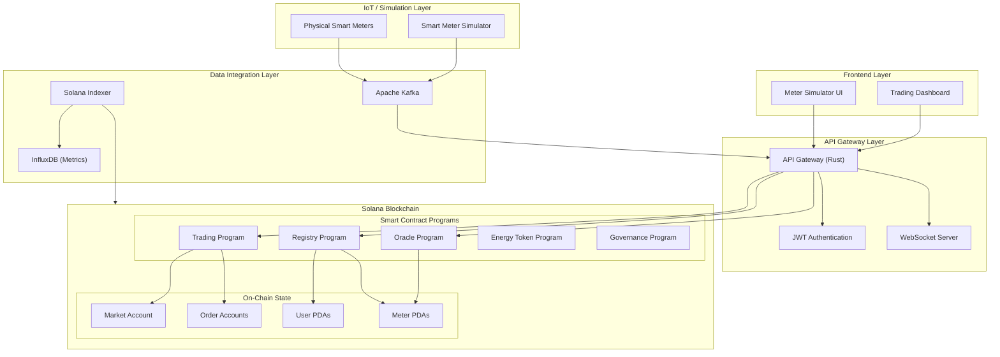
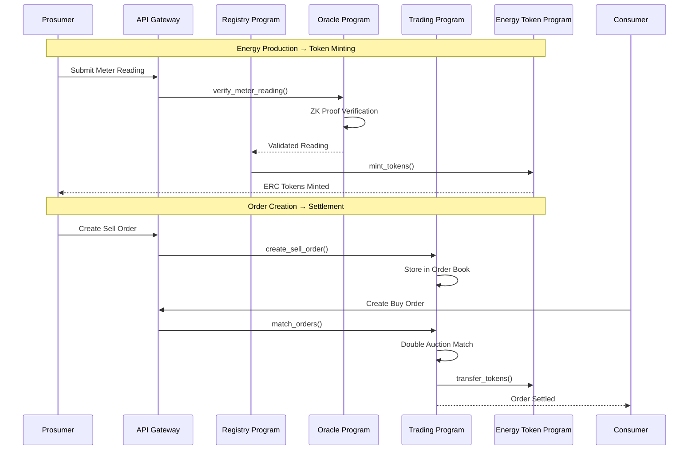
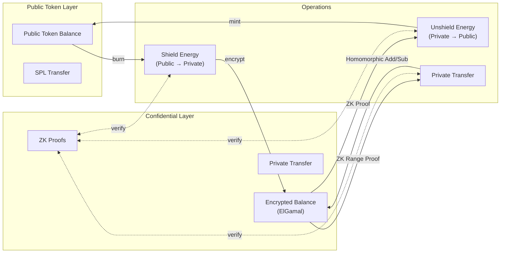
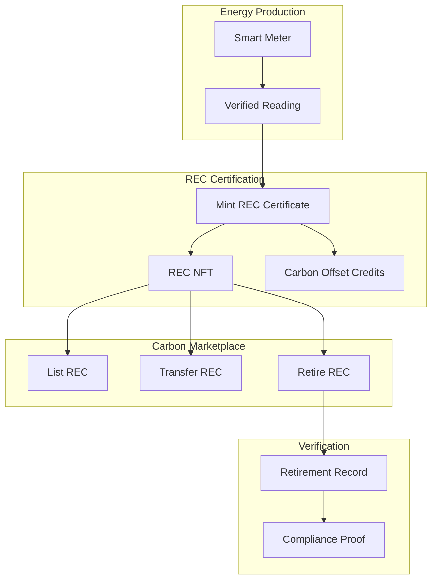
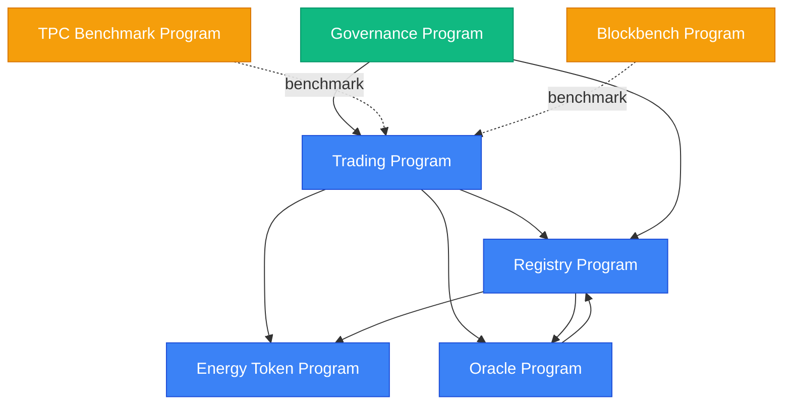
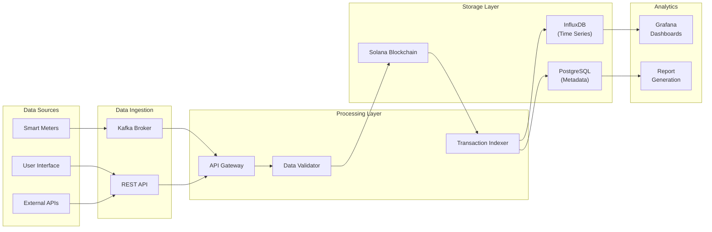

# GridTokenX System Architecture

This document provides architecture diagrams for the GridTokenX decentralized energy trading platform, suitable for thesis documentation.

## 1. High-Level System Architecture

## 2. Trading Flow Architecture

## 3. Confidential Trading Architecture

## 4. Carbon Marketplace Architecture

## 5. Program Dependencies

## 6. Data Flow Architecture

## Key Design Decisions

### 1. **PDA-Based State Management**
All user accounts, meters, and orders are stored as Program Derived Addresses (PDAs), enabling:
- Deterministic address derivation
- Cross-program invocation safety
- Rent exemption with known sizes

### 2. **Double Auction Matching**
The trading program implements a continuous double auction mechanism:
- Orders are matched when `bid_price >= ask_price`
- Settlement is atomic with token transfer
- MVCC conflict rate maintained below 2%

### 3. **ZK Proof Integration**
Confidential trading uses a layered approach:
- ElGamal encryption for balance privacy
- Range proofs for non-negative enforcement
- Transfer proofs for balance conservation

### 4. **Event-Driven Architecture**
All state changes emit Anchor events for:
- Real-time UI updates via WebSocket
- Transaction indexing for analytics
- Audit trail for compliance

---

*Generated for GridTokenX Thesis Documentation*
